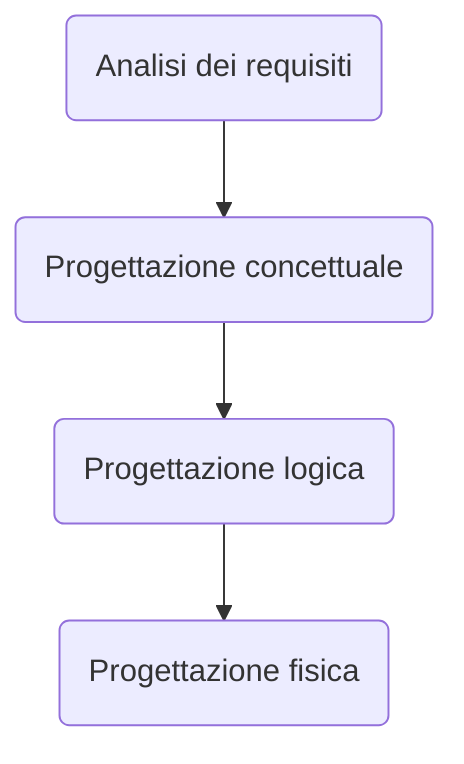

### Modelli informatici
> Un **modello astratto** è la rappresentazione formale di idee e conoscenze a un fenomeno

- Aspetti di un modello
	- Il modello rappresenta certi fatti
	- Rappresentazione data con un linguaggio formale
	- Modello <-- Risultato processo di interpretazione

#### Modellazione concettuale
- Cosa si modella?
	- Conoscenza concreta (fatti)
	- Conoscenza astratta (Struttura e vincoli sulla conoscenza concreta)
	- Conoscenza procedurale (operazioni base/degli utenti)
	- Comunicazioni (Come si comunicherà con il sistema informatico)
##### Conoscenza concreta
- Fatti specifici che si vogliono rappresentare
	- Entità con le loro proprietà
		- Ciò di cui interessa rappresentare i fatti
		- Le proprietà sono fatti che interessano perché descrivono caratteristiche di determinate entità
			- **Classificazione delle proprietà**
			- atomica o strutturata 
			- univoca / multivalore
			- totale / parziale
		- Ogni entità ha un tipo che ne specifica la natura, identifica proprietà e dominio relativo
			- Es. **Antonio** ha tipo *Persona* con proprietà:
				- Nome: *string*
				- Indirizzo: *string*
	- Collezioni di entità omogenee
		- Es. **Studenti**: insieme di tutti gli studenti nel dominio del corso
		- Spesso sono organizzate in una gerarchia di specializzazione/generalizzazione (si parla anche sottoclassi e superclassi)
			- Es. Nel DB la collezione *Utenti* può essere considerata una generalizzazione di *Studenti* e *Docenti*
			- Importanti caratteristiche di una gerarchia:
				- Ereditarietà (delle proprietà)
				- Inclusione (se la collezione C1 specializza C2, gli elementi di C1 sono un sottoinsieme degli elementi di C2)
	- Associazioni fra entità
		- Un fatto che correla due o più entità, stabilendo un legame logico tra loro
			- Es. L'utente *Utente* **HA IN PRESTITO** una copia della "Divina commedia"
		- Un'associazione R(X,Y) fra due collezioni di entità X e Y è un insieme di istanze di associazione tra elementi di X e Y, che varia in generale nel tempo.Il prodotto cartesiano X\*Y è detto dominio dell'associazione
		- Possiede le seguenti proprietà:
			- molteplicità o cardinalità
				- Un'associazione R(X,Y) è **univoca da X a Y** se per ogni elemento x di X esiste al più un elemento di Y che è associato ad X; se non vale, l'associazione è **multivalore da X a Y**
				- Cardinalità:
					- R(X,Y) è (1:N) se essa è **multivalore** da X a Y ed **univoca** da Y a X
					- R(X,Y) è (N:1) se essa è **univoca** da X a Y e **multivalore** da Y a X
					- R(X,Y) è (N:M) se essa è **multivalore** da X a Y e **multivalore** da Y a X
					- R(X,Y) è (1:1): se essa è **univoca** su da X a Y e **univoca** da Y a X
				- Es. Cardinalità:
					- *Frequenta*(Studenti, Corsi) ha molteplicità (N:M) 
					- *Insegna*(Professori, Corsi) ha molteplicità (1:N)
					- *SuperatoDa*(Esami, Studenti) ha molteplicità (N:1)
					- *Dirige*(Professori, Dipartimenti) ha molteplicità (1:1)
			- totalità
				- Un'associazione R(X,Y) è **totale da X a Y** se per ogni elemento x di X esiste almeno un elemento di Y che è associato ad X; se non vale, l'associazione è **parziale da X a Y**
##### Conoscenza astratta
- Vincoli di integrità statici
	- Definiscono delle condizioni sui valori della conoscenza concreta che devono essere soddisfatte indipendentemente da come evolve l'universo del discorso
- Vincoli di integrità statici