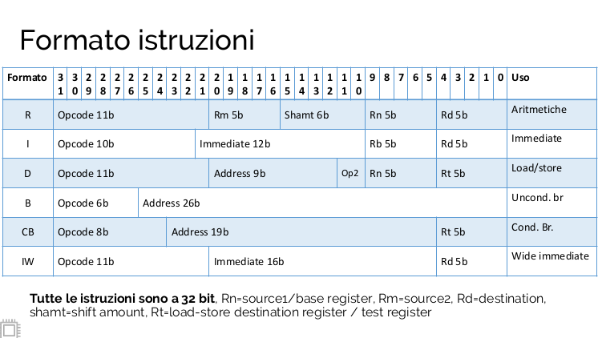

> Set di istruzioni di una CPU moderna presente in moltissimi dispositivi. ARM.
> assembly => permette di capire come funziona realmente un computer, aiuta a scrivere codice efficiente, oltre che essere utilissimo in campo IoT, CyberSecurity e debugging.
> ## ARMv8-A ISA: 3 in 1
> L-ARMv8-A supporta 3 istruction set:
> 1. A32(versione a 32 bit)
> 2. T32(modalitá Thumb)
> 3. A64(version a 64 bit, quella che useremo nel corso)
>
>L'istruction set A64 é utilizzato quando la CPU si trova nell'AArch64 execution state. A32 e T32 sono validi quando invece si trova in AArch32. La CPU ARM puó cambiare execution state dinamicamente.
>### Simple sequential Execution (SSE)
>Nella specifica architetturale ARM le istruzioni seguono il modello SSE.
>Il processore si comporta come se le istruzioni venissero caricate decodificate ed eseguite:
>- Una alla volta
>- Nell'ordine in cui appaiono in memoria
>
>### Simple Sequential Execution (SSE)
>In pratica, CPU ARM, carica 2 istruzioni alla volta e le esegue in modo talvolta parallelo
>
>## Registri in AArch64
>- 31 registri general purpose.
>- Ciascun registro puó esser usato come registro a 64 bit (chiamato x) oppure a 32 (w).
>- Nelle operazione, la scelta di x o w determina la dimensione dell'operazione>- 

>	add w0,w1,w2 // somma a 32bit
>	add x0,x1,x2 // somma a 64bit

>- Ulteriori 32 registri a 128 bit per le operazioni floating point e vettorizzate.
>- 32 registri a 128 bit chiamati V per operazioni SIMD
>- anche qua a seconda del nome, dipende la dimensione dell'operazione

>	fadd s0,s1,s2 // somma floating point a 32bit
>	fadd d0,d1,d2 // somma floating point a 64bit

>__Nota__: quando viene usato V, essi rappresentano vettori di numeri. Ad esempio effettuare la somma 64 bit di due numeri floating point contemporaneamente

>### Altri registri
>- XZR sempre letto come 0 e ignora le write
>- x28 o SP é usato come stack pointer
>- x29 o FP é usato come frame pointer
>- x30 o LR é usato per memorizzare l'indirizzo di ritorno di una funzione
>- PC, non é un registro general purpose e non puó essere usato direttamente nell istruzioni. Lo si puó leggere usando la pseudo istruzione ADR

> ### System registers
> L'architettura definisce anche una serie di registri di sistema, utilizzati per configurare la CPU o il sistema di memoria.
>
>Non possono essere usati direttamente nelle istruzioni ma possono essere letti o scritti dalle istruzioni MRS e MSR.

>Example:

>	MRS x0, SCTLR_EL1

>### APSR (Application Program Status Register)
>Contiene una copia dei cosiddetti condition codes dell'ALU:
>- N: asserted se il risultato dell'ultima operazione é negativo
>- Z: asserted se il risultato dell'ultima operazione é zero
>- V: asserted se c'é stato un overflow nell'ultima operazione
>- C: asserted se c'é stato un "riporto" (carry) nell'ultima operazione

>### Istruzioni logico-aritmetiche
><op\> {S} Rd, Rn, <operand2\>
>- S => opzionale, esegue l'operazione e setta i condition codes
>- Rd => destinazione
>- Rn => primo operando
>- <operand2\> => secondo operando, varia da registro a indirizzo, shift ecc.
>
>Esempio di istruzione 

>	ADD w0, w1, w0     // w0 = w1 + w0
>	ADDS x0, x1, x0    // x0 = x1 + x0 and set cond. Codes
>	ADD w0, w0, LSL #2 // w0 = w0 + (w0<<2)

>#### Barrel shifter
>La possibilitá di shiftare/ ruotare il secondo operando é una prerogativa di ARM> Utilissima per:
>- Moltiplicare e dividere per potenze di 2 prima di effettuare somme o altre operazioni
>- Accedere ad elementi di un array avendo un registro R1 che punta all'inizio dell'array e un altro registro R2 che contiene l'indice da accedere:
>	- addr = R1 + R2 << 2 (supponendo un array di int32)
>- LSL: logical left shift

>	|1|0|0|1|1|1|0|0|
>	|0|0|1|1|1|0|0|0|
>	|0|1|1|1|0|0|0|0| <-- shift di due a sinistra 

>- LSR: logical right shift

>	|1|0|0|1|1|1|0|0|
>	|0|1|0|0|1|1|1|0|
>	|0|0|1|0|0|1|1|1| <-- shift di due a destra 

>- ARS: Arithmetic right shift(shifta, controllando prima il segno)

>	|1|0|0|1|1|1|0|0|
>	|1|1|0|0|1|1|1|0|
>	|1|1|1|0|0|1|1|1| <-- shift di due a destra con segno
>	
>	|0|0|0|1|1|1|0|0|
>	|0|0|0|0|1|1|1|0|
>	|0|0|0|0|0|1|1|1| <-- shift di due a destra senza segno

>### Operazioni logico/aritmetiche principali
>ADD, SUB, AND
>EOR, ORR (esclusive inclusive or)
>MUL
>LSL, LSR (shift left/right)
>
>Le operazioni viste finora possono ammettere come secondo operando un valore immediato a 12bit.
>Nel caso mi serva un immediato piú grande, posso usare la MOVZ, che permette di caricare un immediato di 16bit shiftato di 0,16,32,48 bit in un registro, settando tutti gli altri bit a 0.
>Un esempio:

>	MOVZ X9, #255, LSL #16 // effettua l'operazione ma lascia invariati gli altri bit

>L’assemblatore ARM prevede la pseudo-istruzione:

>	MOV w<d\>, w<n\> // w<d\> = w<n\>
>	MOV x<d\>, x<n\> //x<d\> = x<n\>

>Che viene automaticamente convertita in:

>	ORR w<d\>, wzr, w<n\>
>	ORR x<d\>, xzr, x<n\>

> Altre istruzioni utili:

> 	SXT{B,H,W}: sign extend
> 	UXT{B,H,W}: zero extend

>### Caricare indirizzi nei registri
>	ADR x<d\>, label
>Carica  l'indirizzo di label nel registro x<d\>. La label deve trovarsi entro circa 1 MB dal PC perché l'indirizzo é specificato come offset dal PC.
>
>	ADRP x<d\>, label
>
>Carica l'indice della pagina da 4KB che contiene l'indirizzo di label. Label deve trovarsi entro circa 4GB dal PC. Se label é allineato a 4KB (ultimi 12 bit a zero) allora ADRP conterrá l'indirizzo esatto di label

>## Branches
>	B label
>Salta all'indirizzo indicato da label
>
>	BL label
>Salta all'indirizzo indicato da label e salva l'indirizzo dell'istruzione successiva nel registro x30
>
>	RET
>Salta all'indirizzo contenuto nel registro x30
>###### Salti non condizionati
>	BR x<m\>
>Salta all'indirizzo contenuto nel registro x<m\>
>
>	BLR x<m\>
>Salta all'indirizzo contenuto nel registro x<m\> e salva l'indirizzo dell'istruzione successiva nel registro x30.
>I salti non condizionati supportano un offset di circa 128MB
>###### Salti condizionati semplici
>	CBZ w<n\> | x<n\>, label
>Salta all'indirizzo label se w<n\> | x<n\> é uguale a zero
>
>	CBNZ w<n\> | x<n\>, label
>Salta all'indirizzo label se w<n\> | x<n\> é diverso da zero
>Label deve trovarsi a circa 1MB dal PC
>
>	B.<COND\> label
>Salta all'indirizzo label sulla base di una conditional mnemonics <COND\>. Esempi:
>
>	B.EQ label
>	B.NE label
>	B.LT label
>Il risultato del branch dipende dai condition codes (flags) della CPU (registro APSR)
>Come imposto i condition codes?
>L'istruzione
>
>	CMP w<n\> | x <n\>, w<n\> | x <n\>
>E' usata molto di frequente, ed é un alias per:
>
>	SUBS xzr, w<n\> | x <n\>, w<n\> | x <n\>

>#### signed/unsigned comparison
>	w22 = 1111 1111 11111 1111 1111 1111 1111 1111
>	w23 = 0000 0000 0000 0000 0000 0000 0000 0000
>	CMP w22, w23
>	B.LT label // < signed… risultato? taken
>	B.LO label // < unsigned… risultato? not taken
>	B.GT label // > signed… risultato? not taken
>	B.HI label // > unsigned… risultato? taken
>
>#### Array bound check
>Trattare i numeri con segno come se fossero senza segno é utile per verificare se 0 <= x < y 
>
>Numeri negativi trattati come unsigned si presentano come numeri molto grandi
>
>Quando tratto x e y come unsigned, x<y é true se x<y  e x\>0.
>Esempio
>x20 indice array
>x11 dimensione massima dell'array
>
>	CMP x20, x11
>	B.HS indexoutofbounds // branch taken se x20>=x11 o x20<0
>#### Conditional select
>
>	CSEL x<d\>, x<n\>, x<m\>, <COND\> 
>	
>Equivalente a:
>
>	if <COND\> then
>		x<d\> = x<n\>
>	else
>		x<d\> = x<m\>
>#### Conditional increment
>
>	CINC x<d\>, x<n\>, x<m\>, <COND\>
>Equivalente a:
>
>	if <COND\> then
>		x<d\> = x<n\> + 1
>	else
>		x<d\> = x<m\>
>
>#### CSEL/CINC
>Vantaggiose rispetto ai branch classici perché"
>- Richiedono minori instruzioni indipendentemente dall'outcome della condizione
>- Non sono salti, quindi non influenzano il fetch delle istruzioni successive e il branch prediction
>
>Andrebbero usate sempre se possibile (il compilatore C cerca di utilizzarle se il codice condizionale lo permette)
>#### Load/store
>Trasferimento valori MEM <-> Reg
>Sintassi generale
>
>Load reg <- MEM:
>
>	LDR<sign\><size\> <reg\>, [addr]
>Store reg -> MEM:
>
>	STR<sign\><size\> <reg\>,[addr]
>
>#### Dimensione
>La dimensione o size del trasferimento puó essere implicita(nome del registro) o esplicita mediante il campo <size\>
>
>	LDR w0, [addr] // carica 32 bit
>	LDR x0, [addr] // carica 64 bit
>	STRB w0, [addr] // memorizza il byte meno significativo di w0 all'indirizzo [addr]
>	STRH w0, [addr] // memorizza i 2 byte meno significativi di w0 all'indirizzo [addr]
>	STRW x0, [addr] // memorizza i 4 byte meno significativi di x0 all'indiririzzo [addr]
>
>E con le load? COsa fare con i bytes che restano?
>
>Unsigned load
>
>	LDRB w4, [addr]
>Signed load
>
>LDSRB w4, [addr]
>LDSRB x4, [addr]
>
>#### ARM addressing modes
>Cosa mettere nel campo [addr]?
>
>4 modi di indirizzamento possibili:
>1. Base register
>	- Utilizza un registro che contiene l'indirizzo da utilizzare
>2. Offset
>	- L'indirizzo da utilizzare viene ottenuto sommando un immediato al valore con in un registro, molto utile per gli array! LDR é un alias per LDUR
>3. Pre-index
>	- Questa volta offset viene sommato e scritto nel registro contenente l'indirizzo prima di accedere alla memoria
>4. Post-index
>	- Si accede alla memoria all'indirizzo indicato dal registro (come per base register). Si accede alla memoria all'indirizzo indicato dal registro. Dopo il caricamento l'offset é aggiunto al registro
>
>#### Altre Istruzioni
>- #### Syscalls
>
>		SVC #0	
>
>	- Supervisor call. Causa un'eccezione che porta la CPU in stato di esecuzione EL1. In pratica il controllo passa al kernel Linux che esegue una funzione particolare (syscall) in base al valore contenuto in x8. Il parametro immediato puó essere utilizzato per discriminare il tipo di servizio richiesto
>	
>- #### Conversione floating point/interi
>
>		FMOV d0, x0
>		FMOV x0, d0
>		SCVTF d0, x0
>		FCVTNS x0,d0	
>
>	- FMOV Copia valori da un registro floating point ad un registro intero o floating point, viceversa. La copia viene effettuata bit-a-bit senza arrotondamenti			
>	- CVT Copia valori da un registro floating point ad un registro floating point con arrotondamento all'intero piú vicino.
>#### RET vs RL
>Una funzione puó essere vista come un piccolo programma a sé stante:
>- Riceve dei dati in input
>- Fa qualcosa
>- Dá dei risultati in output
>
>Bisogna regolare chiamante e funzione chiamata. Queste regole sono chiamate Procedure Call Standard (PCS).
>
>##### ARM PCS
>I parametri sono passati nei registri x0,x1,....,x7. Se la funzione accetta piú di 8 parametri occorre usare lo stack.
>- x0 usato per passare il puntatore this
>- Se la funzione richiede interi a 32bit allora si utilizzeranno i registri w0,w1, ecc.
>
>
