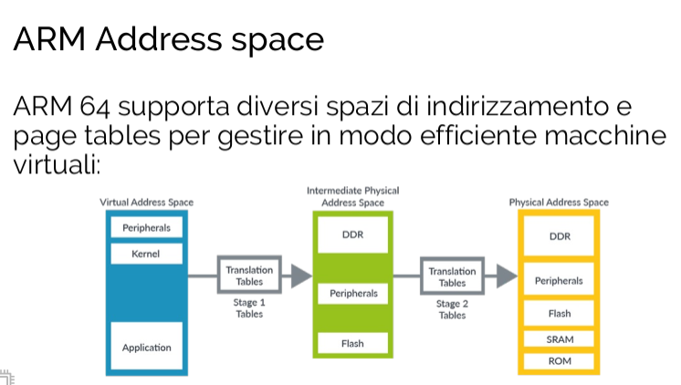
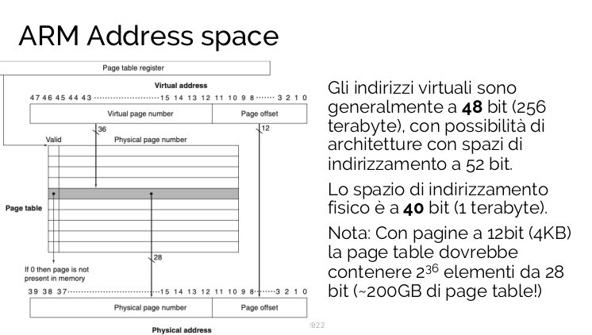

  I motivi dietro la creazione di memoria virtuale sono: 
  - Si vuole realizzare un maccanismo sicuro affinché la memoria RAM possa esser condivisa tra piú programmi in esecuzione. Un programma non deve poter accedere allo spazio di indirizzamento di un altro programma
  - Si vuole permettere ad un singolo programma di utilizzare piú memoria della RAM realmente disponibile

### Principio di funzionamento 
I programmi sono compilati rispetto ad uno spazio di indirizzamento virtuale, diverso da quello fisico. Il processore effettua, in cooperazione col SO, la traduzione tra indirizzo virtuale e indirizzo fisico.
Blocchi di memoria chiamati pagine, sono mappati da un insieme di indirizzi virtuali ad un insieme di indirizzi fisici.
Il processore lavora su indirizzi virtuali mentre la memoria viene acceduta usando indirizzi fisici. Le pagine fisiche possono essere condivise tra piú indirizzi virtuali diversi. Questo permette a programmi differenti di condividere codice o dati.

### Vantaggi
1. Illusione di avere piú memoria fisica di quella disponibile
	- Solo le parti attive dei programmi e dati, indirizzati rispetto ad uno spazio virtuale, sono presenti in memoria RAM
	- E' possibile che piú programmi, con codici e dati di dimensioni maggiori della memoria fisica, siano contemporaneamente in esecuzione
2. Protezione degli accessi
	- Garanzia che gli spazi di indirizzamento virtuali di programmi diversi siano effettivamente mappati su indirizzi fisici distinti
3. Semplifica il caricamento dei programmi per l'esecuzione attraverso la relocation. Un programma, utilizzando un suo spazio di indirizzamento virtuale, puó essere caricato ovunque in memoria, anche in regioni non contigue, senza ricompilazione.

## Memoria virtuale paginata
La memoria virtuale, é indicizzata tramite indirizzi virtuali, suddivisi in virtual page number e page offset.
La pagina fisica é divisa in un phisical page number e un page offset, quest'ultimo uguale al page offset delle pagine virtuali. Per arrivare alla memoria fisica,  si traduce virtual page number in physical page number.
La funzione non é biunivoca!

Come per la cache, puó succedere che la pagina non sia presente in RAM e si chiama page fault. Il miss penalty é enorme, quindi bisogna a tutti i costi ridurre i page faults.

Ricapitolando:
- Il mapping tra pagine virtuali e fisiche é completamente associativo.
- Viene utilizzata una politica di rimpiazzo delle pagine di tipo LRU.
- I page fault sono gestiti via software tramite l'intervento del SO:
	-  Tramite algoritmi di mapping e rimpiazzamento sofisticati
- Solo politica write-back, perché scrivere in memoria secondaria é molto costoso
- Al loading del processo viene creato su disco l'immagine delle varie pagine del programma e dei dati
- On demand le pagine saranno portate in memoria fisica quando avvengono dei page fault.
### Altri bit di stato
Oltre al bit valid sono presenti spesso altri bit:
- dirty bit, per indicare se una pagine é stata modificata e deve essere quindi ricopiata al livello di memoria inferiore quando viene rimpiazzata (write back)
- reference bit, per indicare se in un certo lasso di tempo la pagina é stata riferita. Il bit viene periodicamente azzerato e settato a 1 ogni volta che la pagina viene riferita. (utilizzato per implementare la politica LRU)
### Translation Lookaside Buffer
- Visto che la page table puó essere molto grande, e risiede in RAM, implementare un sistema di memoria virtuale implica aumentare il numero di accessi alla RAM
	- Un primo accesso per tradurre l'indirizzo virtuale in indirizzo fisico
	- Un secondo accesso per accedere ai dati veri e propri

... Ma ci aspettiamo una certa localitá spaziale e temporale anche nell'accesso alla page table!

I processori moderni utilizzano una «cache della page table» chiamata Translation Lookaside Buffer (TLB) o semplicemente «translation cache».

- La TLB contiene una porzione della page table (le ultime riferite)
- E' implementata in hardware, introducendo un overhead minimo in caso di hit
- La prima volta che una pagina viene riferita (page fault), viene copiata anche nella TLB per velocizzare gli accessi successivi
###### TLB miss
Nel caso si verifichi un miss nella TLB viene generata un eccezione che:
- Puó essere risolta se la pagina é presente nella page table
- Genera un page fault nel caso che non 

### Integrare Memoria virtuale, TLB e cache

Nel sistema di memoria virtuale dove si inserisce la cache?
Physically addressed cache: la cache lavora dopo la TLB e page table, su indirizzi fisici
Virtually addressed cache: la cache lavora su indirizzi virtuali, prima della TLB e page table
Virtually indexed but phisically tagged: approccio ibrido in cui la cache usa il TAG fisico (per evitare aliasing) ma indice virtuale

### Physically addressed cache
- Usa indirizzi fisici, quindi ogni accesos alla cache deve prima passare per la TLB (e page table in caso di TLB miss)
- Soluzione relativamente facile da implementare
- Non soggetta  ad aliasing tra programmi diversi che usano gli stessi indirizzi virtuali in un dato istante
#### Virtually addressed cache
- Usa indirizzi virtuali, quindi ogni cache hit non richiede alcun accesso alla TLB (e quindi non puó provocare né TLB mis né page fault)
- Soggetta ad aliasing se programmi diversi usano gli stessi indirizzi virtuali in un dato istante. Posisbile problema di protezione dei dati:
	- Due processi che usano lo stesso indirizzo virtuale sono indistinguibili nella cache quindi i dati possono essere letti/sovrascritti da entrambi i processi

L'index della cache viene calcolato dall'indirzzo virtuale ma il TAG é ottenuto dall'indirizzo fisico
- Comportamento simile a quello della cache physically tagged
- Aliasing non possibile
- Possono essere vantaggiose in termini di prestazioni
### Tipologie di miss
3 tipi diversi:
1. Miss certi(compulsory): miss che si verificano "a freddo" 
2. Miss di capacitá (capacity): spazio insufficiente per tenere tutti i blocchi del programma
3. Miss di conflitti (collisions): conflitto per una posizione

# SO, sistemi di gestione memoria e protezione
Il sistema operativo viene invocato per gestire due tipi di eccezioni:
- TLB miss
- Page fault

In risposta ad un eccezione/interruzione
- La CPU salta alla routine di gestione del SO
- Cambio modalitá di esecuzione: user mode -> supervisor (kernel) mode

###### Supervisor mode
Alcune operazioni possono essere effettuate dalla CPU solo se essa si trova in supervisor mode, che se disabilitata permette la protezione dell'esecuzione dei programmi, perché un programma in user mode:
- Non puó modificare il Page table register
- Non puó modificare le entry della TLB
- Non puó cambiare l'execution mode

Un programma in esecuzione in user mode puó passare volontariamente in supervisor mode, ma __solo__ invocando una system call:

### Caso: Eccezione solo TLB miss
- La pagina é presente in memoria ma non nella TLB
- L'eccezione puó essere risolta tramite la page table allocata in RAM
- Penalty simile al cache miss (RAM lookup)
- L'istruzione che ha causato l'eccezione TLB miss (lw, sw) deve essere rieseguita dopo aver caricato l'entry dalla page table
- Alcune architetture gestiscono TLB miss in hardware (penalty piccolo)
### TLB miss + page fault

- La pagina non é presente in memoria: l'entry corrispondente della page table é invalid.
- La pagina deve essere portata in memoria RAM dalla memoria secondaria (disco)
	-  Operazione di IO con un dispositivo esterno
	- Impensabile che la CPU rimanga in stallo attendendo che il fault venga risolto
- Di solito viene effettuato un context switch
- Quando il page fault é risolto si riprende l'esecuzione del programma che era stato bloccato

###### Context Switch
Operazione attraverso la quale il SO:
- Salva lo stato del programma in esecuzione
- Carica lo stato di un altro processo pronto per essere eseguito
- Riprende l'esecuzione del nuovo processo
- il context switch rimane comunque un operazione dispendiosa: la TLB, essendo unica, dovrebbe venir cancellata di tutte le entry del processo precedente per garantire sicurezza e far spazio alle entry del nuovo processo.

###### Page fault con rimpiazzamento pagina
Se la memoria fisica é piena bisogna risolvere il page fault rimpiazzando una pagina
- La pagina da rimuovere deve anche essere scritta in memoria secondaria se il bit dirty é asserted
- Visto che stiamo modificando la page table, occorre ripulire anche la TLB se l'entry corrispondente era presente

Il meccanismo della memoria virtuale impedisce a ciascun processo di accedere a porzioni di memoria fisica allocata a processi diversi:
TLB e PT non possono essere modificate da un processo in esecuzione in modalitá utente e il sistema operativo garantisce che ciascun processo abbia le proprie pagine fisiche (private) da utilizzare

## ASID
In alcune CPU come quelle ARM, l'indirizzo virtuale é esteso per contenere l'ID del task (processo) a cui appartiene quel blocco di memoria.

Questo Address Space ID, o ASID, é concatenato al tag in modo che un hit avvenga soltanto se si ha un match tra sia page number che process ID.

La cache non deve quindi essere esplicitamente svuotata in caso context switch

>
>
> Visto che solo una piccola parte dello spazio di indirizzamento é usata da ciascun programma, ARM usa un approccio gerarchico a 4 livelli per la Page table. Ciascuno step usa 9 bit per indirizzare il proprio livello della tabella fino a che ciascuno dei 36 bit che compongono il virtual page number é stato utilizzato.
> Ciascuna entry della Page table é composta da 8 bytes, e ciascuna tabella é da 2$^9$ = 512 elementi per un totale di 4KB per tabella. Il numero é scelto in modo che ciascuna delle 4 tabelle sia contenuta esattamente in una pagina di memoria. TTBR é il registro che punta alla tabella di livello 0