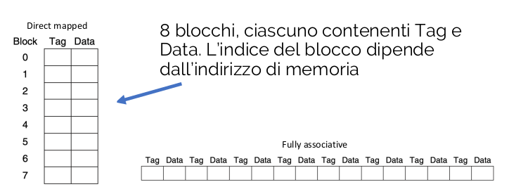
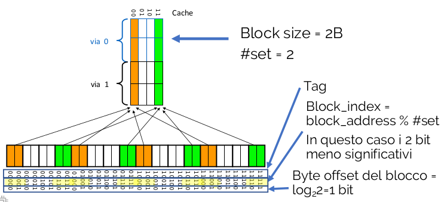

## Localitá

> Possiamo osservare che un programma non accede a tutto il suo codice con la stessa probabilitá
>
>Il principio di localitá afferma che i programmi accedono ad una porzione relativamente piccola dello spazio di indirizzamento in un certo istante temporale
>Ci sono due tipi di localitá:
>- Localitá spaziale: rispetto ad un certo dato, si tende a far riferimento ad altri dati di indirizzo vicino a quello corrente
>- Localitá temporale: rispetto ad un certo dato, si tende a far riferimento allo stesso dato entro un tempo breve

## Gerarchie di memoria
> - Puó essere composta da piú livelli
> - I livelli piú vicini alla CPU sono sottoinsiemi dei livelli sottostanti (contengono copie)
> - Il livello alla base contiene tutti i dati
> - I dati sono sempre copiati tra due livelli adiacenti alla volta
> L'unitá minima di informazione che puó essere o no presente in una gerarchia é detta __blocco__.
> Si ha un __hit__ nel caso i dati richiesti dalla CPU siano presenti in un blocco al livello superiore altrimenti si ha un __miss__.

>La frazione di accessi alla memoria con hit viene chiamato hit rate, con miss miss rate

>#### Hit time / miss penalty
>- Hit time é il tempo di accesso al livello superiore della gerarchia, comprendente anche l'overhead necessario a stabilire se il tentativo di accesso porterá ad un hit o a un miss
>- Miss penalty é il tempo necessario a sostituire un blocco a livello superiore con un blocco preso a livello inferiore e a passare tali dati alla CPU

>## Memoria cache
>Memoria posta tra CPU e RAM, sfrutta il principio di localitá degli accessi.
>### cache ad accesso diretto
>La funzione di mapping é semplice:
>\<address> mod \<# blocchi cache>
>se # blocchi cache é una potenza di 2, l'operazione modulo é equivalente a prendere i primi log$_2$ \<# blocchi cache> bit dall'indirizzo.

>## Direct mapped cache
>immaginiamo di avere 8 blocchi, ognuno da 1B. Tutti gli indirizzi con gli stessi 3 bit meno significativi finiscono nello stesso blocco.
>Solitamente i blocchi sono piú grandi di 1B. Indirizzi consecutivi che differiscono per n bit meno significativi finiscono nello stesso cache block.
>Questo indirizzamento viene fatto in due passaggi:
>1. Calcolo block address = address / block size
>2. Calcolo cache block index = block_address % \#cache blocks

> Come facciamo a distinguere tutti i blocchi di memoria se finiscono tutti nella stella locazione nella cache? Si memorizzano il block address insieme ai dati tramite il tag.
> tag = block address / \# cache blocks

>Come facciamo a sapere se un dato blocco della cache contiene effettivamente informazioni valide?
>Usando 1 bit di stato chiamato validation bit. 1=valido 0=non valido. Inizializzato ovviamente a 0.

>Supponendo ora di avere una cache con:
>- 64 blocchi
>- 16B di dimensione blocco
>
>1. Se l'indirizzo é di 27 bit, come é composto?
>2. Qual'é l'indice del blocco che contiene il byte all'indirizzo 1201?
>
>Inanzitutto calcoliamo l'index, che deve poter indirizzare ciascuno dei 64 blocchi:
>index_size = log$_2$ 64 = 6
>Ora serve calcolare il block_offset per indirizzare ogni singolo blocco, quindi 16B.
>block_size = log$_2$ 16 = 4
>Lo spazio per il tag sará quindi 27-6-4=17

> Ora bisogna trovare l'indirizzo corrispettivo 1201
> Indirizzo del blocco: 1201 / 16 = 75
> Offset all'interno del blocco: 1201 % 16 = 1
> Index = 75 % 64 = 11 (dodicesimo blocco)
> Tag = 75 / 64 = 1

>## Gestione dei conflitti
>Se il blocco da portare in cache deve essere sovrascritto su un altro blocco di dati giá presente in cache, cosa ne faccio del vecchio blocco?
>Se il blocco precedente era solo in lettura basta rimpiazziarlo, nel caso invece che fosse stato anche scritto occorre ricordare che esso rappresenta una copia dei dati presenti al livello inferiore. Occorre stabilire quindi politiche di coerenza tra livelli di memoria.
>
>#### Metodo 1: Write through
>Ogni scrittura nella cache implica anche una scrittura al livello sottostante. Il blocco viene rimpiazzato senza problemi, anche se abbiamo scritture molto lente con centinaia di cicli di clock consumati. Una soluzione per questo problema sarebbe l'uso di un __write buffer__ come memoria tampone per nascondere la latenza di accesso. Sostanzialmente il write buffer é scritto con i blocchi temporaneamente in attesa che siano scritti in memoria, in maniera __asincrona__, e finché non é pieno il buffer il processore puó proseguire senza attendere la scrittura.
>Il problema rimane che se la frequenza di scrittura in memoria delle write in confronto a quella di scrittura da parte del processore nelle write stesse é minore si ha comunque una scrittura lenta.
>#### Metodo 2: Write back
>Le scritture avvengono normalmente soltanto nella cache e solo quando un blocco deve essere rimpiazzato questo viene scritto anche al livello sottostante di memoria. in questo modo non abbiamo overhead in assenza di conflitti, anche se la scrittura nel caso ci siano é piú lenta, perché richiede la scrittura del blocco al livello inferiore

>## Hit e Miss
>##### Read-hit
>- Avviene come conseguenza di lw o istruction fetch
>- Accesso alla memoria con il massimo della velocitá
>##### Read-miss
>- il controllo deve metter in stallo la CPU fino al completamento della lettura per poi riprendere
>##### Write-hit
>- Avviene come conseguenza di sw
>- DIpende dalla politica
>	- write through: i dati sono scritti in cache e in memoria
>	- write back: i dati sono scritti soltanto nella cache. Viene segnalato che il blocco e stato modificato attraverso un bit "dirty" associato al blocco
>##### Write-miss
>- Write back:
>	- il controllo mette in stallo la CPU
>	- Lettura del blocco dalla memoria in cache (write allocate)
>	- Completamento dell’istruzione di store in cache
>- Write through
>	- Il controllo mette in stallo la CPU
>	- La scrittura avviene direttamente in memoria (lo step write allocate non viene effettuato
>
>### Modello semplificato
>Come cambia il calcolo delle prestazioni in presenza della cache?
>
>CPU time = (execution cycles + stall cycles) * cycle time
>
>stall cycles = IC * miss ratio * miss penalty
>
>miss ratio a sua volta distinto in:
>- Istruction miss ratio (dovuto al fetch)
>- Data miss ratio:
>	- Write miss ratio
>	- Read miss ratio

>⚠ Per aumentare le prestazioni possiamo:
>- Ridurre il miss penalty
>- Ridurre il miss ratio

# Cache associative
###### Cache diretta vs associativa
> Nella cache diretta ogni blocco di memoria é associato con un solo possibile blocco di cache
> - Una funzione mappa blocchi con indirizzi
>
>Una cache é __completamente associativa__ se ogni blocco di memoria puó essere associato con un blocco qualsiasi della cache
>- L'accesso non dipende dall'indirizzo, la ricerca nella cache viene effettuata scorrendo tutti i possibili blocchi (hw comparator)
>
>se immaginiamo 8 blocchi di cache, se sono mappati sono rappresentati incolonnati e con l'indice dei blocchi, se invece sono associativi sono rappresentati in fila con solo tag e data, senza indice.
>
> Per cercare un blocco nella cache fully associative richiesto occorre scorrere l'intera lista. Poco efficiente se il numero di blocchi é grande. Compromesso: associativitá su insiemi.
> ## 2-way set associative
> La cache viene organizzata in insiemi da due blocchi (vie) ciascuno.
> - La scelta dell'insieme avviene con una funzione di mapping, come nella cache diretta
> - La scelta della via avviene invece con una ricerca come nella cache completamente associativa
>
>Possiamo avere anche la 4 o 8-way associative, che semplicemente ha 4/8 blocchi per ciascun insieme.
>#### Funzionamento
>Solitamente numero di blocchi e numero di insiemi multipli di 2.
>Nuova funzione di mapping:
>block address = address / block size
>INDEX = block address % \#set
>
>L'INDEX é usato per determinare il set da usare, dobbiamo controllare tutti i tag associati ai vari blocchi del set per individuare il blocco specifico.
>
>#### Gestione dei miss
>In caso di miss é necesario sostituire il blocco
>- Nella cache diretta la funzione di mapping ci dice in modo non ambiguo quale blocco sostituire
>- Nella cache associativa, dove l'INDEX individua un insieme di blocchi, abbiamo due casi:
> 	 - Se nell'insieme c'é un blocco libero, lo usiamo per risolvere il miss
> 	 - Se tutti i blocchi sono occupati dobbiamo scegliere il blocco da sostituire per risolvere il miss
> #### Politiche di rimpiazzamento blocchi
> - Casuale, viene scelto un blocco qualsiasi senza un ordine specifico
> - Least Recently Used (LRU)
> 	- Si rimpiazza il blocco che é stato usato meno di recente
> 	- Vengono utilizzati bit aggiuntivi per memorizzare da quanto tempo un blocco non viene acceduto.
> 
> ## GEMM
> Moltiplicazione tra matrici, il modo piú semplice per accedervi, ma puó essere ottimizzata?
> Immaginiamo tre matrici MxN => 4x3, 3x4, 3x3 => A + B = C.
> ```cpp
> for( i=0; i<Ma; ++i )
for( j=0; j<Nb; ++j )
for( k=0; k<Na; ++k)
C[ i*Nb + j ] += A[ i * Na + k ] * B[ k * Nb + j ]
>```
 Questa sarebbe la implementazione base della moltiplicazione. Possiamo renderla piú efficace invertendo Na e Nb nel secondo e terzo for.


