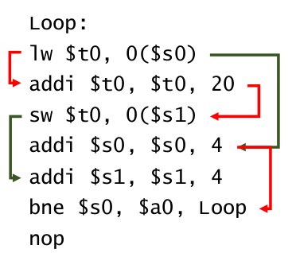
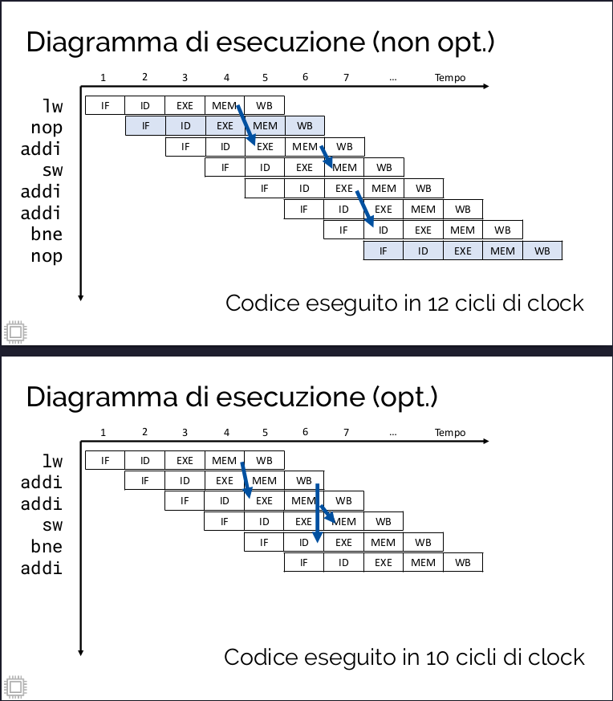

```
Loop:
lw $t0, 0($s0)
addi $t0, $t0, 20
sw $t0, 0($s1)
addi $s0, $s0, 4
addi $s1, $s1, 4
bne $s0, $a0, Loop
nop
```
> dal seguente codice, dobbiamo individuare un'istruzione da spostare nel delay slot, e poi ridurre gli stalli.

>Assumiamo che abbiamo sia il forwarding che i register file ottimizzati

> Passo numero uno -> individuare le dipendenze di tipo RAW

```js
Loop:
lw $t0, 0($s0)
addi $t0, $t0, 20  // dipende dalla lw
sw $t0, 0($s1)     // dipende dalla addi precedente
addi $s0, $s0, 4
addi $s1, $s1, 4
bne $s0, $a0, Loop // dipende dalla seconda addi (riga 4)
nop
```

>Ora bisogna trovare le dipendenze di tipo WAR

```js
Loop:
lw $t0, 0($s0)
addi $t0, $t0, 20  // dipende dalla lw
sw $t0, 0($s1)     // dipende dalla addi precedente
addi $s0, $s0, 4   // dipende WAR da lw
addi $s1, $s1, 4   // dipende WAR da sw
bne $s0, $a0, Loop // dipende dalla seconda addi (riga 4)
nop
```

>Rosso dipendenze RAW verde WAR
>

>Bisonga ora spostare un istruzione senza modificare l'ordine di esecuzione stabilito dalle dipendenze

```js
Loop:
lw $t0, 0($s0)
addi $t0, $t0, 20 
sw $t0, 0($s1)   
addi $s0, $s0, 4  
bne $s0, $a0, Loop
addi $s1, $s1, 4    
```

>Abbiamo spostando la terza addi, essendo che nessun'altra istruzione dipende da essa.

>Ora bisogna calcolare gli stalli. Notiamo due cose dal codice mips:

```js
Loop:
lw $t0, 0($s0)
addi $t0, $t0, 20
sw $t0, 0($s1)
addi $s0, $s0, 4
bne $s0, $a0, Loop
addi $s1, $s1, 4
```

>1. l'istruzione addi $t0, $t0, 20 dipende dalla lw e necessita del valore in $t0 al terzo ciclo, ma la lw lo scrive al 4 ciclo (rivedi teoria per maggiore chiarezza).
>2. il branch bne invece, necessita del valore in $s0 al secondo ciclo, ma l'istruzione addi $s0, $s0, 4 lo produce al terzo ciclo.
>
>Il codice ottimizzato risultante é quindi:

```js
Loop:
lw $t0, 0($s0)
nop
addi $t0, $t0, 20
sw $t0, 0($s1)
addi $s0, $s0, 4
nop
bne $s0, $a0, Loop
addi $s1, $s1, 4
```

