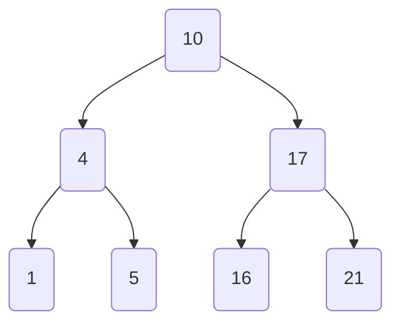
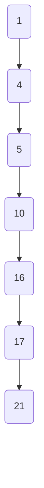
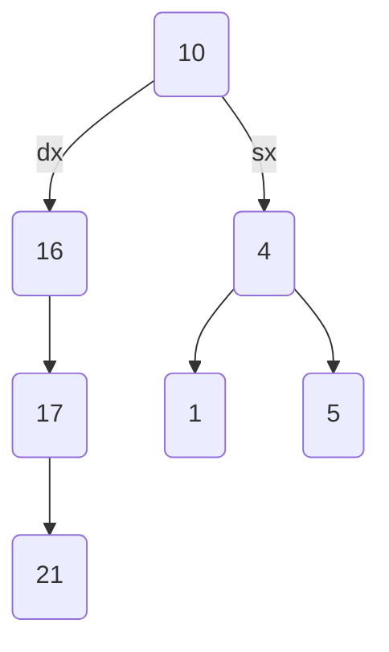

![[Pasted image 20231215104555.png]]
Definizione di albero binario completo:
- Un albero binario completo consiste in un albero in cui ogni nodo ha al più due figli, ed ogni livello risulti riempito completamente, ad eccezione al massimo dell'ultimo. Tutti i nodi dell'ultimo livello inoltre devono essere posizionati più a sinistra possibile. Quest'ultima proprietà accerta che la struttura sia bilanciata

Bisogna ora definire prima la struct del nodo 
```cpp
struct Node {
	int key;
	Node* left;
	Node* right;
}

typedef Node* Pnode;
```
Immaginiamo ora di avere già la classe per l'albero da analizzare **tree**, e che la funziona **tree.getRoot()** ritorni il nodo radice. La funzione si chiama **tCheckComplete(Pnode u)** e ritorna 1 o 0 in base all'esito della funzione stessa. 

```cpp
int numNodeCalculator(Pnode u){
	if(u == nullptr) return 0; // ho finito di scorrere

	// cerco sia a destra che a sinistra
	int left = heightCalculator(u->left);
	int right = heightCalculator(u->right);

	// ritorno la somma dei nodi sotto il nodo in cui mi trovo
	return 1 + left + right;
}

int tCheckCompleteAux(Pnode u, int index, int tot){
	if(u == nullptr) return true; // controllo se ho finito il ramo da scorrere
	if(index >= tot) return false; // controllo se sono out-of-index

	return tCheckCompleteAux(u->left,2*index+1,tot) && tCheckCompleteAux(u->right, 2*index+2, tot);
}

int tCheckComplete(Pnode u){
	// caso base == albero vuoto
	if(u == nullptr){
		return 1;
	}

	// calcolo il numero di nodi totale
	int tot = numNodeCalculator(u);
	
	int index = 0; // we start from root with value 0
	
	// Il fulcro dell'algoritmo, si basa tutto sull'index!!
	return tCheckCompleteAux(u->left,2*index+1,tot) && tCheckCompleteAux(u->right, 2*index+2, tot);
}
```
Nel codice sopra riportato la complessità nel caso peggiore risulta essere **O(n)** per il semplice fatto che **devo scorrere tutti i nodi dell'albero**, cosa che faccio sempre per esempio nel caso in cui l'albero è effettivamente un albero binario completo.
![[Pasted image 20231215123209.png]]

L'albero può avere altezza minima *hmin* pari a 2 

L'albero può avere altezza massima *hmax* pari a 6


L'albero può essere tra le due precedenti altezze in tre modi distinti


questo è un esempio
![[Pasted image 20231217102413.png]]
- Per la prima funzione $T(n) = 4T(n/2)+n$ :
	- $T(n) = 4T(n/2)+n$ con $a=4$ e $b=2$ ed $f(n) = n$ 
	- $n^{log_b a}=n^{log_24}=n^2$ 
	- Vedendo che $f(n) < n^2$ e quindi $f(n)$ non influenza la complessità, $T(n) = \theta(n^2)$ 
- Per la seconda funzione $T(n) = 4T(n/2)+n^2$ :
	- Basandoci sui calcoli del punto precedente, abbiamo che $f(n) = (n^2 lg^k n)$ e sostituendo a $k$ il numero $0$ la funzione risulta essere $f(n) = n^2$. 
	- Vedendo che $f(n) = n^2$, allora $T(n) = \theta(n^2lgn)$ 
- Per la terza funzione $T(n) = 4T(n/2)+n^3$
	- Basandoci sui calcoli del primo punto abbiamo che $f(n) = (n^{2+1})$ dove $\epsilon=1$, quindi siamo all'interno della terza casistica del master teorem dove troviamo la funzione funzione di $\omega(n^{log_ba+\epsilon})=f(n)$ e la regular condition è rispettata perchè $4(n^3/2) \leq cn^3$ per $c=\frac{4}{2}$. 
	- Essendo verificata la regular condition la soluzione è $T(n) = \theta(n^3)$ 