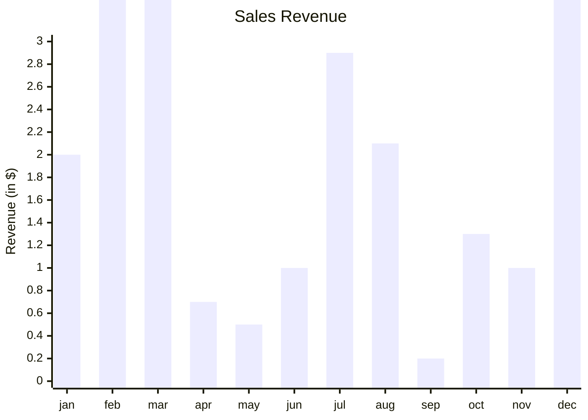

Ecco una tabella con alcune derivate prime comuni:

$$
\begin{array}{|c|c|}
\hline
\text{Funzione} & \text{Derivata Prima} \\
\hline
f(x) = k & f'(x) = 0 \\
f(x) = x^n & f'(x) = nx^{n-1} \\
f(x) = e^x & f'(x) = e^x \\
f(x) = \ln(x) & f'(x) = \frac{1}{x} \\
f(x) = \sin(x) & f'(x) = \cos(x) \\
f(x) = \cos(x) & f'(x) = -\sin(x) \\
f(x) = \tan(x) & f'(x) = \sec^2(x) \\
f(x) = \sec(x) & f'(x) = \sec(x)\tan(x) \\
f(x) = \csc(x) & f'(x) = -\csc(x)\cot(x) \\
f(x) = \cot(x) & f'(x) = -\csc^2(x) \\
f(x) = \sqrt{x} & f'(x) = \frac{1}{2\sqrt{x}} \\
\hline
\end{array}
\
$$


Questa è solo una selezione di derivate prime comuni. Esistono molte altre funzioni e regole di derivazione, ma queste sono tra le più utilizzate.
Legenda argomenti:
- Concetti di base
- Stima puntuale
- Stima intervallare
- Verifica d'ipotesi
- Dipendenza
	- Come usare informazioni di una variabile per prevederne un'altra
- Popolazione: tutte le unità (statistiche) di interesse 
- Parametro: una caratteristica numerica della popolazione di interesse θ 
- Censimento: osservazione di tutte le unità della popolazione per valutare θ 
- Campione: sottoinsieme delle popolazione utilizzato per stimare θ quando il censimento non è opportuno 
- Statistica: una qualsiasi funzione dei dati censuari o campionari 
- Stimatore: statistica $\hat{θ}$ utilizzata per ricostruire θ 
- Stima: valore dello stimatore corrispondente al particolare campione osservato

Tipi di Errori 
- Errori campionari: inevitabili 
	- dovuti al fatto che osserviamo solo un campione dei dati 
	- diminuiscono al crescere della dimensione campionaria se lo stimatore $\hat{θ}$  è ‘ragionevole’ 
- Errori non campionari: evitabili 
	- dovuti ad una sbagliata costruzione del campione o all’utilizzo di uno stimatore non appropriato 
	- possono non diminuire al crescere della dimensione campionaria
	- Per evitare questo tipo di errori il metodo più efficace è estrarre le unità campionarie **CASUALMENTE** dalla popolazione
		- Esistono diversi tipi per estrarre casualmente chiamati **disegni di campionamento** (es. campione casuale semplice)

### Disegno campione casuale semplice
In questo campionamento le unità sono estratte:
- Indipendentemente l'una dall'altra
- Tutte con la stessa probabilità di essere selezionate
- Le osservazioni sono variabili casuali indipendenti e identicamente distribuite

### Dati campionari
Consideriamo l'insieme dei campioni casuali di dimensione $n$
![[Pasted image 20240215091448.png]](Insieme dei campioni)
Esempio: campione casuale dei tempi di elaborazione (CPU) di 30 processi (jobs) in secondi
![[Pasted image 20240215091138.png]]
L’obiettivo è usare i dati campionari per ricostruire alcuni parametri della popolazione

$(x_1,...,x_n)$
$\vartheta=E(x_1)$ 
$\hat{\vartheta}=\bar{X}\rightarrow$ Stimatore
Voglio stimare il tempo medio di un processo, per farlo lancio il processo 30 volte $n=30$ e poi effettuo l'analisi per arrivare alle *realizzazioni delle variabili casuali* (ogni volta che faccio l'analisi avrò diversi campioni come risultato)

##### Statistiche campionarie
Statistiche che misurano la posizione:
- Media campionaria
- Mediana campionaria
- Quantili, percentili, quartili
Statistiche che misurano la variabilità:
- Varianza campionaria e deviazione standard
- Scarto interquartile
Statistiche $\rightarrow$ variabili casuali quando calcolate su un campione casuale di dati

Esempio di caso di studio: tempo necessario per concludere un processo nel 90% dei casi

output funzione: 
- Numero se riferito al singolo campione
- Variabili casuali se opero sull'insieme di campioni

##### Media campionaria
Supponiamo che le osservazioni $X_i$ siano variabili $i.i.d$ con valore atteso $E[X] = \mu$ e varianza $Var[X] = \sigma^2$ 
La media campionaria
![[Pasted image 20240215092326.png]]
 è uno stimatore della media di popolazione.
 La media campionaria dei tempi della CPU(esempio sopra)  è $\hat{x} = 48.23$
 $x$ = particolare valore numerico osservato della media campionaria
 $X$ = variabile casuale campionaria

##### Stimatori e stime
Uno stimatore è non distorto se
$E(\hat{\theta}) = \theta$  per tutti i valori di $\theta$
La distorsione di $\hat{\theta}$ è
$Bias(\hat{\theta})=E(\hat{\theta}) - \theta$ 
Uno stimatore non distorto è:
- Uno stimatore corretto in media, ovvero uno stimatore che in media non sottostima o sovrastima il parametro
La media campionaria è uno stimatore non distorto della popolazione, infatti
![[Pasted image 20240215093042.png]]
(Il valore atteso è un operatore lineare)
$E(\hat{\mu}) = \mu$ 
**CONSISTENZA**:
Uno stimatore è consistente se al crescere della dimensione campionaria $n$ il suo errore campionario converge a zero
![[Pasted image 20240215093429.png]]
ovvero
![[Pasted image 20240215093438.png]]
La media campionaria è uno stimatore consistente della media di popolazione
![[Pasted image 20240215093713.png]]
![[Pasted image 20240215093724.png]](l'ultimo punto indica la probabilità che sia vero o meno il valore con cui si sta operando)
$Var(A+B)= Var(A)+Var(B)+2Cov(A,B)$
$Var(cA+dB)= c^2Var(A)+d^2Var(B)\frac{+}{}2cdCov(A,B)$

##### Calcolare la consistenza di stimatori distorti
come verificare che uno stimatore sia non distorto?
Lo stimatore deve:
- Asintoticamente essere non distorto
  ![[Pasted image 20240215094652.png]]
- La sua varianza svanisce asintoticamente (lo stimatore si avvicina alla quantità di interesse)
  ![[Pasted image 20240215094713.png]]

 Normalità asintotica
 ![[Pasted image 20240215095015.png]]
 ![[Pasted image 20240215100140.png]](Nella foto precedente il grafico rappresenta un campione doppiamente modale dei tempi della CPU, notiamo però come si possa comunque ricavare una distribuzione normale)

**VALORI ANORMALI**
La media ha il difetto di essere sensibile alle osservazioni estreme (Non è robusto)
![[Pasted image 20240215091138.png]]
![[Pasted image 20240215100416.png]]

**MEDIANA**
La mediana campionaria stima la mediana di popolazione, è una misura di posizione molto meno sensibile alle osservazioni estreme rispetto alla media.
Essa suddivide la distribuzione della variabile casuale $X$ in due parti uguali, ovvero
![[Pasted image 20240215100825.png]]
La mediana campionaria $\bar{M}$ è
- Inferiore al più a metà dei dati campionari
- Superiore al più a metà dei dati campionari
![[Pasted image 20240215101159.png]]
**Calcolo della media campionaria**
1. Si ordinano le ordinazioni dalla più piccola alla più grande
	1. Se n è dispari allora $\hat{M}$ è l'osservazione del campione ordinato di posizione $(n + 1)/2$
	2. Se n è dispari allora $\hat{M}$ è un qualsiasi valore nell'intervallo fra le osservazioni di posizione $n/2$ e $(n + 2)/2$ 

**Quantili percentili e quartili**
Il *quantile di ordine p* è tale che:
![[Pasted image 20240220110341.png]]
Il *quantile di ordine p campionario* invece è:
- maggiore al più del $100p\%$ delle osservazioni
- minore al più del $100(1-p)\%$ delle osservazioni

il *percentile di ordine $\gamma$* corrisponde al quartile di ordine 0.01$\gamma$ 
Primo Secondo e Terzo quartile corrispondo al 25-esimo 50-esimo e 75-esimo percentile

	secondo quartile <==> mediana

quanto la media è precisa? Lo si calcola con la 
**Varianza e deviazione standard campionarie**
La varianza è definita come:
![[Pasted image 20240220111207.png]]
![[Pasted image 20240220111625.png]]

Varianza ancora più sensibile per via dei casi anomali, si preferisce di solito usare il valore assoluto al posto del quadrato

La deviazione standard campionaria invece è definita come:
![[Pasted image 20240220111235.png]]

Meglio usare la deviazione standard avendo dei valori preferibili (ricordiamo che la varianza è al quadrato, nell'esempio sopra dei processi meglio $\underline{secondi}$  o secondi$^2$??)

![[Pasted image 20240220111207.png]]
$\uparrow$ Notiamo $1/n-1$ per proprio $n-1$? Per assicurare la non distorsione con campioni piccoli, altrimenti si può dividere per $n$.
![[Pasted image 20240220113607.png]]
![[Pasted image 20240220113748.png]]
![[Pasted image 20240220115315.png]]
![[Pasted image 20240220115812.png]]
![[Pasted image 20240220115822.png]]
**Precisione e Accuratezza**

- Accuratezza: stimatore è poco distorto
- Preciso: stimatore è poco variabile

Entrambe sono combinate nell'errore quadratico medio
![[Pasted image 20240220115738.png]]

**Valori anomali**
Una regola empirica suggerisce che i valori anomali sono osservazioni:
1. Inferiori a $\hat{\mathcal{Q_1}} - 1.5\hat{\mathcal{IQR}}$
2. Superiori a $\hat{\mathcal{Q_3}} + 1.5\hat{\mathcal{IQR}}$

Questi limiti vengono utilizzati perché se i dati fossero normalmente distribuiti allora meno dell'$1\%$ delle osservazioni possono essere così ESTREME da non rispettarli

Cosa fare dei valori anomali?

1. Capire cosa lo rende così estremo (potrebbe essere utile per trovare un errore)
2. Rimuoverlo del dataset se
	1. Corrispondono ad errori
	2. Corrispondono ad osservazioni che provengono da un'altra popolazione

### Sintesi Grafiche
L'utilizzo di grafici per visualizzare i dati, fondamentale nelle applicazioni della Statistica

I grafici vengono usati per individuare:
- Un modello probabilistico per descrivere i dati 
- Un metodo statistico per analizzare i dati 
- Osservazioni anomale (outliers) 
- Fonti di eterogeneità 
- Particolari andamenti (patterns) o tendenze (trend) 
- Relazioni fra due o più variabili

Nel corso ci soffermiamo su tre tipi di grafici:
- Istogrammi
- Grafici a scatola
- Grafici a dispersione

#### Istogrammi
Gli istogrammi servono per visualizzare la **forma di distribuzione**

- Costituiti da rettangoli adiacenti 
- Considereremo istogrammi formati da intervalli della stessa ampiezza
	- **Istogrammi di frequenza**
	- **Istogrammi di frequenza relativa**
****
Se le osservazioni provengono da variabili continue al cresce della dimensione campionaria gli istogrammi covergeranno alla funzione di densità della variabile
![[Pasted image 20240222094832.png]]
******
![[Pasted image 20240222095025.png]]
****

****
**Importante la scelta degli intervalli, aspetto critico nella costruzione di un istrogramma**. Una cattiva scelta degli intervalli non permette di apprendere nulla circa la distribuzione dei dati


![[Pasted image 20240222095151.png]]
#### Grafici a scatola (con i baffi!)
Esempio di grafico a scatola
![[Pasted image 20240222095249.png]]

Noto anche come **boxplot** è probabilmente la più efficace rappresentazione grafica di un insieme di dati numerici

costruito con:
- Minimo
- Primo quartile
- Mediana
- Terzo Quartile
- Massimo

I 'Baffi' si estendono
- Dalla scatola al minimo
- Dalla scatola al massimo

Sempre che massimo e minimo non siano anomalmente distanti dal centro della distribuzione.

![[Pasted image 20240222095525.png]]

#### Grafici a dispersione
![[Pasted image 20240222100518.png]]

## Stima
supponiamo che i dati vengano da una variabile casuale la cui distribuzione dipende da un parametro ignoto $\theta$ 
Terminologia: i dati sono generati da un modello statistico indicizzato da un parametro $\theta$ ignoto appartenente allo spazio parametrico Θ ⊂ $R^k$
il modello statistico è:
- Caso discreto, una classe di funzione di probabilità $Pr(x;\theta)$
- Nel caso continuo una classe di densità $f(x;\theta)$
(esempio di discrete continue assieme, la pioggia. discreta: quando piove, continua: quanto piove)

> in POISSON, la media campionaria e la varianza sono sia uguali che stimatori consistenti e non distorti per la funzione di POISSON.

##### Come decidere la stima: metodo dei momenti
Consiste nel confrontare **momenti di popolazione** con i **momenti campionari**
momenti: 
- ![[Pasted image 20240305112648.png]]
$\hat{\mu_k}=M_k$ 
momenti centrali: 
- ![[Pasted image 20240305112901.png]]
$\mu'_1=E(x-\mu)=0$
$\mu'_1=E(x-\mu)^2=\sigma^2$
![[Pasted image 20240305113338.png]]
![[Pasted image 20240305113650.png]]
![[Pasted image 20240305114025.png]]
##### Come decidere la stima: metodo della massima verosimiglianza
Lo stimatore di massima verosimiglianza è quel valore del parametro $\theta$ che massimizza la funzione di verosimiglianza ('likelihood')

La funzione è proporzionale alla probabilità di osservare ciò che è stato effettivamente osservato:
- Nel caso discreto la funzione è proporzionale alla funzione di probabilità congiunta dei dati
	- ![[Pasted image 20240305114232.png]]
	- Che in un campione casuale semplice diventa
		- ![[Pasted image 20240305114302.png]]
- log-verosimiglianza
		$l(\lambda)=\sum_i(lg(e)^{-\lambda}+lg(\lambda)^{x_i}$ 
		= $-n\lambda+\sum_ix_ilg(\lambda)$ 
		= $-n\lambda+\sum_ix_i\lambda^{x_i}$
		= $-n\lambda+\sum_ix_i$
		= $-\frac{1}{\lambda^2}\sum_ix_i$
		ovvero
		![[Pasted image 20240307094856.png]]
		![[Pasted image 20240307094131.png]]
Nel caso continuo, la probabilità di osservare esattamente un certo valore $x$ è $Pr(X = x) = 0$ Per un valore ‘piccolo’ h abbiamo che:
![[Pasted image 20240307094226.png]]
![[Pasted image 20240307094239.png]]
Nel caso continuo, il metodo della massima verosimiglianza massimizza la probabilità di osservare dei valori vicini ciò che è stato effettivamente osservato 
$$L(θ) ∝ f (x1, . . . , xn ; θ)$$ Nel caso di un campione casuale abbiamo
$$L(θ) ∝ \Pi^n_{i=1} f (xi ; θ)$$
##### Problemi regolari di stima
Lo stimatore di massima verosimiglianza gode di importanti proprietà che valgono sotto delle 'opportune assunzioni di regolarità'.
## TO do problemi di stima


##### Errori standard
Niente meno della sd dello stimatore.
Servono a misurare la precisione degli stimatori.
- accuratezza opposto di distorsione
- precisione opposto di variabilità

sotto **assunzioni** lo stimatore di massima verosimiglianza è
- **asintoticamente non distorto** E(ˆθ) → θ, per n → ∞
- consistente  $\hat{θ} \rightarrow^p θ$, per n → ∞
- **asintoticamente normale** con distribuzione limite $\hat{θ} ≈ N {θ, I(θ)^{−1}},$ per n ‘sufficientemente grande’ dove I(θ) è l’informazione attesa di Fisher

##### Informazione attesa di Fisher
![[Pasted image 20240312105211.png]]
Nel caso di un campione casuale semplice (così si ha che l'informazione del campione è pari a n volte l'informazione contenuta in una singola osservazione) abbiamo
![[Pasted image 20240312105231.png]]

##### Attesa osservata
![[Pasted image 20240312105447.png]]

##### Errore standard dello stimatore di massima verosimiglianza
![[Pasted image 20240312110035.png]]
### Efficienza
Lo stimatore di massima verosimiglianza gode di una importante proprietà di ottimalità

diseguaglianza di Cramer identifica il limite inferiore della varianza di uno stimatore $\hat{\theta}$ non distorto di $\theta$
![[Pasted image 20240312110347.png]]


Consideriamo un campione casuale semplice da una variabile casuale di Poisson di parametro $\lambda$
lo stimatore $\hat{\lambda}=\bar{X}$ è uno stimatore efficiente di $\lambda$
Infatti la varianza di $\hat{\lambda}$ è:
![[Pasted image 20240312110236.png]]
questo calcolo, è vero? Bisogna controllare
- Log verosimiglianza
	- ![[Pasted image 20240312110514.png]]
	- le due derivate risultanti sono
		- ![[Pasted image 20240312110532.png]]
	- trovo l'informazione attesa
		- ![[Pasted image 20240312110601.png]]
	- la cui inversa risulta essere la varianza, appunto, di $\hat{\lambda}$


Esempio
![[Pasted image 20240314093047.png]]
![[Pasted image 20240314093055.png]]
![[Pasted image 20240314093104.png]]
$\uparrow$ in questa slide possiamo anche scrivere la seconda riga come

$$\frac{1}{p^2}np+\frac{1}{(1-p)^2}(n-np)$$
$$\frac{np}{p^2}+\frac{(n-np)}{(1-p)^2}$$
$$\frac{n}{p}+\frac{n}{(1-p)}$$
$$\frac{n}{p(1-p)}$$

![[Pasted image 20240314093114.png]]

### Invarianza
proprietà dello stimatore:
![[Pasted image 20240314094550.png]]

Supponiamo che il numero di utenti che si collegano ad un server in un istante di tempo si distribuisca come una variabile di Poisson di parametro $\lambda$

La stima di massima verosimiglianza di $\lambda$ è $\hat{\lambda}=\bar{X}$

CI interessa stimare la probabilità che il numero di utenti superi un certo livello critico $c$

Quindi il nostro **parametro di interesse** è
- ![[Pasted image 20240314094828.png]]

![[Pasted image 20240314094847.png]]

Immaginiamo che la soglia critica sia c=75 utenti contemporanei

In un campione casuale di 25 istanti la media campionaria di utenti contemporanei è ![[Pasted image 20240314094946.png]]

La stima di massima verosimiglianza è $\hat{\lambda}=62.7$
![[Pasted image 20240314095025.png]]
in R:
```r
> 1 - ppois(75, lambda = 62.7)
```


Nella gran parte delle applicazioni di interesse la dimensione del parametro è maggiore di uno:
![[Pasted image 20240314095217.png]]
![[Pasted image 20240314095234.png]]

## Unità 3
- Stima intervallare vista nella lezione che ho perso
	- Intervallo di confidenza

### Livelli di confidenza approssimati
#### Campioni di grandi dimensioni
- ![[Pasted image 20240402110013.png]]
#### 