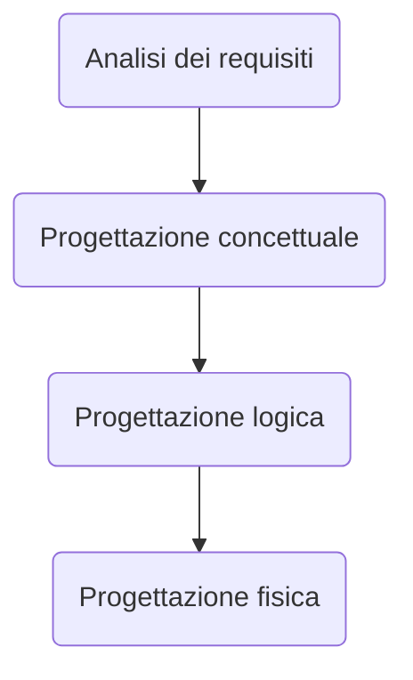

### Modelli informatici
> Un **modello astratto** è la rappresentazione formale di idee e conoscenze a un fenomeno

- Aspetti di un modello
	- Il modello rappresenta certi fatti
	- Rappresentazione data con un linguaggio formale
	- Modello <-- Risultato processo di interpretazione


#### Modellazione concettuale
- Cosa si modella?
	- Conoscenza concreta (fatti)
	- Conoscenza astratta (Struttura e vincoli sulla conoscenza concreta)
	- Conoscenza procedurale (operazioni base/degli utenti)
	- Comunicazioni (Come si comunicherà con il sistema informatico)
##### Conoscenza concreta
- Fatti specifici che si vogliono rappresentare
	- Entità con le loro proprietà
		- Ciò di cui interessa rappresentare i fatti
		- Le proprietà sono fatti che interessano perché descrivono caratteristiche di determinate entità
			- **Classificazione delle proprietà**
			- atomica o strutturata 
			- univoca / multivalore
			- totale / parziale
		- Ogni entità ha un tipo che ne specifica la natura, identifica proprietà e dominio relativo
			- Es. **Antonio** ha tipo *Persona* con proprietà:
				- Nome: *string*
				- Indirizzo: *string*
	- Collezioni di entità omogenee
		- Es. **Studenti**: insieme di tutti gli studenti nel dominio del corso
		- Spesso sono organizzate in una gerarchia di specializzazione/generalizzazione (si parla anche sottoclassi e superclassi)
			- Es. Nel DB la collezione *Utenti* può essere considerata una generalizzazione di *Studenti* e *Docenti*
			- Importanti caratteristiche di una gerarchia:
				- Ereditarietà (delle proprietà)
				- Inclusione (se la collezione C1 specializza C2, gli elementi di C1 sono un sottoinsieme degli elementi di C2)
	- Associazioni fra entità
		- Un fatto che correla due o più entità, stabilendo un legame logico tra loro
			- Es. L'utente *Utente* **HA IN PRESTITO** una copia della "Divina commedia"
		- Un'associazione R(X,Y) fra due collezioni di entità X e Y è un insieme di istanze di associazione tra elementi di X e Y, che varia in generale nel tempo.Il prodotto cartesiano X\*Y è detto dominio dell'associazione
		- Possiede le seguenti proprietà:
			- molteplicità o cardinalità
				- Un'associazione R(X,Y) è **univoca da X a Y** se per ogni elemento x di X esiste al più un elemento di Y che è associato ad X; se non vale, l'associazione è **multivalore da X a Y**
				- Cardinalità:
					- R(X,Y) è (1:N) se essa è **multivalore** da X a Y ed **univoca** da Y a X
					- R(X,Y) è (N:1) se essa è **univoca** da X a Y e **multivalore** da Y a X
					- R(X,Y) è (N:M) se essa è **multivalore** da X a Y e **multivalore** da Y a X
					- R(X,Y) è (1:1): se essa è **univoca** su da X a Y e **univoca** da Y a X
				- Es. Cardinalità:
					- *Frequenta*(Studenti, Corsi) ha molteplicità (N:M) 
					- *Insegna*(Professori, Corsi) ha molteplicità (1:N)
					- *SuperatoDa*(Esami, Studenti) ha molteplicità (N:1)
					- *Dirige*(Professori, Dipartimenti) ha molteplicità (1:1)
			- totalità
				- Un'associazione R(X,Y) è **totale da X a Y** se per ogni elemento x di X esiste almeno un elemento di Y che è associato ad X; se non vale, l'associazione è **parziale da X a Y**
##### Conoscenza astratta
- Vincoli di integrità statici
	- Definiscono delle condizioni sui valori della conoscenza concreta che devono essere soddisfatte indipendentemente da come evolve l'universo del discorso
- Vincoli di integrità dinamici
	- Definiscono delle condizioni sul modo in cui la conoscenza concreta può evolvere nel tempo
- Fatti derivabili
	- Arrivano da altre fonti, come l'età di una persona, la quale si ricava per differenza fra l'anno attuale e il suo anno di nascita

#### Modello dei dati a oggetti
> Un modello dei dati è un insieme di meccanismi di astrazione per descrivere la struttura della conoscenza concreta (schema). Uno schema verrà dato usando una notazione grafica, variante dei cosiddetti diagrammi ER
> **TERMINOLOGIA**:
> - entità ==> oggetto
> - tipo entità ==> tipo oggetto
> - collezione ==> classe
> - associazione ==> associazione/relazione

- Ad ogni entità del dominio corrisponde un oggetto, composto da stato(variabili/costanti) comportamento(metodi) e identità, capace di rispondere a richieste chiamate messaggi, restituendo valori memorizzati nello stato o calcolati tramite procedura locale
- **CLASSI**: insieme di oggetti dello stesso tipo, modificabile con operatori per includere o estrarre elementi dall'insieme, associabile a vincoli di integrità ![[Pasted image 20231119103954.png]]
- Gli attributi(Nome, Cognome, ...) possono essere: 
	- Primitivi (*int, real, bool, date, string*)
	- Non primitivi
- Le associazioni:
	- Possono avere proprietà
	- Possono essere **Ricorsive**
	- Associazioni n-arie
![[Pasted image 20231119104253.png]]
- Esempio di associazione:![[Pasted image 20231119104327.png]]
- Ereditarietà:
	- Permette di definire un tipo di oggetto a partire da un altro "per differenza", come aggiunta di attributi e/o ridefinizione di attributi esistenti
	- Normalmente si usa solo per definire sottotipi
	- ![[Pasted image 20231119104721.png]]
- Questo principio di eredità si manifesta appunto anche nelle definizioni delle classi![[Pasted image 20231119104858.png]]
- Vincoli su sottoclassi:
![[Pasted image 20231119105325.png]]![[Pasted image 20231119105338.png]]

### DESCRIZIONE DI UN CASO, ESEMPIO SLIDE 2.ModelliAle
![[Pasted image 20231119105512.png]]![[Pasted image 20231119105521.png]]![[Pasted image 20231119105538.png]]![[Pasted image 20231119105635.png]]![[Pasted image 20231119105549.png]]![[Pasted image 20231119105656.png]]
#### EXTRA
![[Pasted image 20231119105825.png]]
### Progettazione Logica
- Collezioni come relazioni
- Associazioni tramite chiavi
- Vincoli di integrità
	- Chiavi
		- Superchiave (sottoinsieme di attributi)
		- Chiave (superchiave minimale)
		- Chiave primaria (una delle chiavi, lunghezza minima)
			- Relazioni a classi radice ==> attributo univoco o artificiale
			- Relazioni a sottoclassi ==> chiave della superclasse
			- Relazioni per associazioni N:M ==> concatenazione delle chiavi esterne
		- Indicate con <\<CK>>, valori non nulli
	- Chiavi esterne
		- Può essere nulla solo in caso di associazione parziale
	- Valori non nulli
		- Si possono imporre
### Schemi a oggetti -> Schemi relazionali
- Trasformazione per passi:
	- Associazioni molti a uno/uno a uno
	- Associazioni molti a molti
	- Gerarchie di inclusione
	- Identificazione chiavi primarie
	- Attributi multivalore
	- Attributi composti
![[Pasted image 20231119154238.png]]![[Pasted image 20231119154300.png]]![[Pasted image 20231119154313.png]]![[Pasted image 20231119154326.png]]![[Pasted image 20231119154400.png]]![[Pasted image 20231119154418.png]]![[Pasted image 20231119154432.png]]![[Pasted image 20231119154444.png]]![[Pasted image 20231119154514.png]]
### Algebra Relazionale


### Operatori insiemistici ed espressioni regolari
- Prestare molta attenzione al tipo, se le operazioni vengono fatte tra tipi diversi, esse non sono possibili
- Operazioni:
	- **UNION**
	- **INTERSECT**
	- **EXCEPT** (Differenza)
- Esempi:
	- **SELECT** Nome, Cognome, Matricola **FROM** Studenti **WHERE** Provincia='VE' **UNION** **SELECT** Nome, Cognome, Matricola **FROM** Studenti **JOIN** Esami **ON** Matricola=Candidato **WHERE** Voto>28
	- **SELECT** Matricola **FROM** Studenti **EXCEPT** **SELECT** Tutor **AS** Matricola **FROM** Studenti
	- Posso usare EXCEPT **ALL**, in questo modo i duplicati non vengono rimossi
	- **IS** per verificare che sia il valore **NULL**, non voglio usare l'uguale, torna unknown!!
	- **SELECT** Nome, Cognome, Matricola **FROM** Studenti **JOIN** Esami **ON** Matricola=Candidato **WHERE** Voto = 18 **INTERSECT ALL** **SELECT** Nome, Cognome, Matricola **FROM** Studenti **JOIN** Esami **ON** Matricola=Candidato **WHERE** Voto=30 
	  
	  (Restituisce il minimo tra le due **SELECT**, le due query)
	-  **SELECT DISTINCT** Nome, Cognome, Matricola **FROM** Studenti **JOIN** Esami **ON** Matricola = Candidato **JOIN** Esami **ON** Matricola = Candidato **WHERE** Voto = 18 **AND** Voto = 30 (Serve per forza la doppia join, sto usando i valori dentro la doppia condizione, non posso farlo sempre sulla stessa tabella, corrisponde ai valori doppi )
	- **SELECT** Nome, Cognome, Matricola **FROM** Studenti **WHERE** Nome **LIKE** 'A_%'
		- % = 0 o più caratteri possibili
		- _ = un carattere qualsiasi 
		- A = lettera iniziale
		- **LIKE** = operatore per eseguire il controllo a stringa
	- **SELECT** Nome, Cognome, Matricola **FROM** Studenti **WHERE** Nome **LIKE** 'A_%' **SELECT** Nome, Cognome, Matricola **FROM** Studenti **WHERE** Nome **LIKE** 'A%i' **OR** Nome **LIKE** 'A%a'

- Esempi di query
	- Studenti che vivono nella stessa provincia dello studente con matricola 71346, escluso lo studente stesso
```sql
SELECT * 
FROM Studenti 
WHERE Provincia = (SELECT Provincia 
					FROM Studenti 
					WHERE** Matricola='71346') 
	AND** Matricola <> '71346'
```

```sql
SELECT altri.* 
FROM Studenti s JOIN Studenti altri USING(Provincia) 
WHERE s.Matricola = 71346 AND
	altri.Matricola <> '71346'
```

- Query studenti con almeno un voto > 27
```sql
SELECT *
FROM Studenti s
WHERE EXISTS(SELECT 
			FROM Esami e
			WHERE e.voto > 27 AND e.Candidato = s.Matricola)
```

```sql
SELECT DISTINCT s.* --  distinct necessario per evitare ripetizioni
FROM Studenti s JOIN Esami e ON s.Matricola = e.Candidato
WHERE e.voto > 27
```

```sql
Exp Comp ANY (SottoSelect)
-- True quando un valore v restituito dalla sottoselect è in relazioni Comp con Exp
-- False se tutti i valori sono != NULL e non esiste un valore v tale che Exp Comp v sia vera
-- In particolare è false se sottoselect è vuota
-- È UNKNOWN se nella sottoselect ci sono valori NULL e per tutti i valori diversi da NULL e per tutti i valori v != NULL ExpComp è false

Exp Comp ALL (SottoSelect)
-- È true se tutti i valori della sottoselect sono != NULL e per ogni v del risultato della sottoselect Exp Comp v è vera
-- Se la sottoselect è vuota Exmp Comp rispetto ad essa è vera
-- È false se esiste un v risultato della sottoselect tale che Exp Comp v è false
-- È UNKNOWN se nella sottoselect ci sono valori NULL e per tutti i valori v != NULL Exp Comp v è true
```

- Gli Studenti che hanno preso solo 30 == Studenti dove non esiste un voto diverso da 30
```sql
SELECT *
FROM Studenti s
WHERE NOT EXISTS (SELECT *
				 FROM Esami e
				 WHERE e.Candidato = s.Matricola AND e.voto <> 30) -- diverso 30

-- Posso sostituire EXISTS con =ANY

SELECT *
FROM Studenti s
WHERE NOT(s.Matricola =ANY (SELECT *
				 FROM Esami e
				 WHERE e.voto <> 30)) -- diverso 30

SELECT *
FROM Studenti s
WHERE Matricola <> ALL(SELECT Candidato
					   FROM Esami 
					   WHERE voti <> 30)

```

- GROUP BY
```sql
SELECT s.Matricola
FROM Studenti s JOIN Esami e ON s.Matricola = e.Candidato
GROUP BY s.Matricola
HAVING MIN(e.Voto) = 30
```

- Per ogni materia, trovare il nome della materia e il voto medio degli esami in quella materia
```sql
SELECT
FROM Esami
GROUP BY Materia
HAVING Count(*) > 3
```

