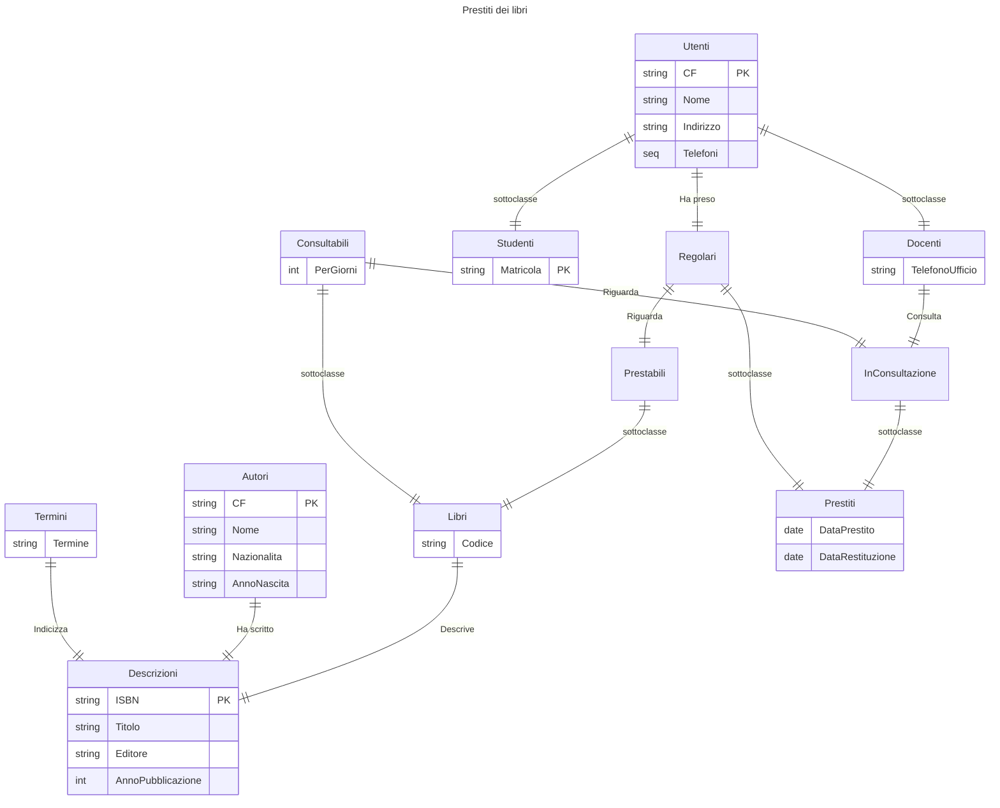
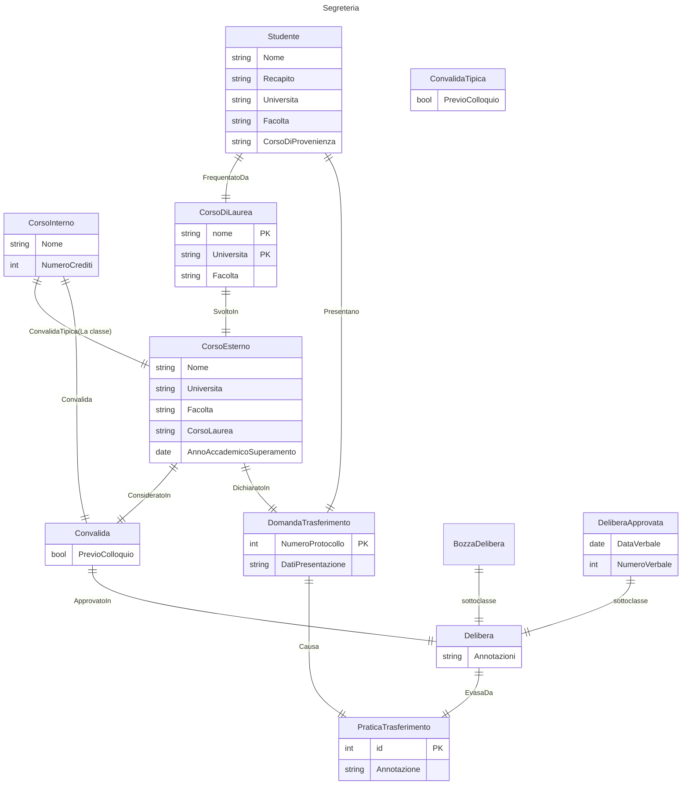

| Value (left) | Value (right) | Meaning                       |
| ------------ | ------------- | ----------------------------- |
| `\|o`        | `o\|`         | Zero or one                   |
| `\|`         | `\|`          | Exactly one                   |
| `}o`         | `o{`          | Zero or more (no upper limit) |
| `}\|`        | `\|{`         | One or more (no upper limit)  |
| `PK`         | `FK`          | primary key/ foreign key      |

