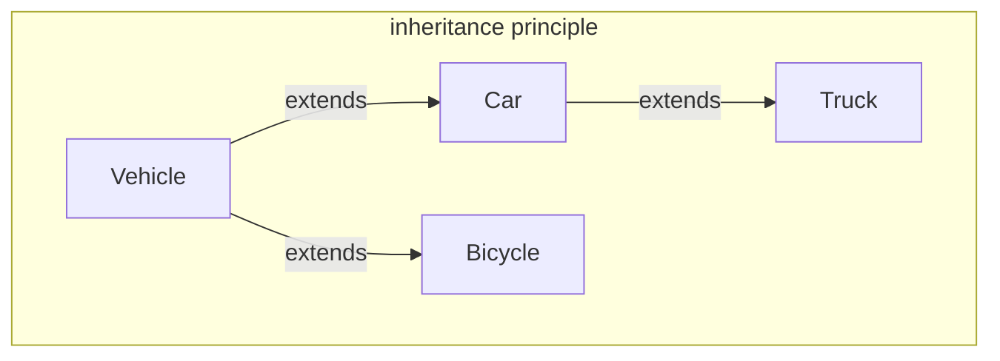

## Encapsulation

The idea behind encapsulation is to create a good organization structure behind the code of classes and methods in order to perform as well as possible without occur in issues of data access. You need to ask yourself how and where put the data that you use for your class, who use the data/methods in order to perform inside the code ecc. 

The other concept is that in Java, which is an object oriented programming language, you shouldn't think at the code as an unique block, but as a separated smaller units, all for a better and easier maintenance of the code.

## Information Hiding
That concept follow the problem of: how can i hide the implementation of class and methods to the final user? In order to do that, you need to provide some mechanism to hide components. In that way, the user doesn't need to see how the implementation works, he needs just to watch the interface provided. This approach brings to various benefits as:
1. The dependencies between different components are minimized
2. A user can see only the components that were intended to be the interface of the piece of the software, and not its implementation details, so that he needs just to explore the interface components in order to understand how the code could be use
3. We can change the code behind the components without the need to consider how it is used.

To perform the information hiding Java provides the access modifiers:

| | same class |  same package |  subclasses | Everywhere | 
-------------:|----------------:|------------:|--------------:|--------------:|
public  | 🤝 | 🤝| 🤝| 🤝|
protected | 🤝 | 🤝| 🤝| ✋|
\<default\> | 🤝 | 🤝| ✋| ✋|
private | 🤝 | ✋| ✋| ✋|

💡 Usually the variable inside a class are all private, but it could depends by the implementation inside the code. For example:

```java
class A {
	private int private_field;
	int foo(A a){
		return this.private_field + a.private_field;
	}
}
```

Has you can see in the snipped code the private modifier is correctly executed 'cause it applies at class level

### Getters and Setters
To access at the fields inside a class, if it's private, there are hoc methods that allow to read and write fields values called Getters and Setters.
For example:

```java
class FuelTank { 
	public FuelType getFuelType() { 
		return this.type; 
	} 
	
	public double getAmount() { // Getter 
		return this.amount; 
	} 
	
	public void emptyTank() { // Setter
		this.amount = 0; 
	}
}
```


## Comments as Documentation

Java, for a better comprehension of the code, gives at programmers a special comment syntax to describe the code: as
- `@author`: to specify who wrote the class
- `@since` : to specify since which version of the software the class has been present
- `@version`: to specify the current version of the class
- `@param <name>`: to document a specific method parameter
- `@return`: to specify what a method return
- `@requires`: to specify what a method need in input in order to perform correctly
- `@ensure`: to specify what a method should return

## Artifacts
An artifact is the result of the compilation and build of a program. An artifact usually encapsulates several packages together, it can be downloaded and installed. The idea of such an artifact is that a developer might load it inside his/her Java application, and use our classes as a library. The Java Development Kit for example, provides a utility (jar.exe) that allows to pack together several .class files into a unique jar archive. A jar file is nothing else than a zipped file containing all the .class file obtained by the compilation of our source code, all the resource files, and a manifest file (file with information about the code like the version of the jar, its vendor, Creator ecc.). 
## Contracts

A contract in Java is the agreement between user and programmer about what the programmers has the right of receiving in input from the user, and his obligation to providing back the results of the computation as specified by the capsule APIs (e.g., method signature) and the documentation provided. 

An example could be:
```java
class Car{
	void refuel(Fueltank tank){ ... }
	void accelerate(double a){ ... }
	void fullBrake(){ ... }
	void brake(double amount){ ... }
}
```

The interface of this class establishes a contract where the client has a class Car with four methods available. each method defines what it requires and what it ensures. We might see the name of the method as a part of the contract, so for instance we might infer that after we invoke method `fullBrake` on a `Car`, the `Car` is not moving ahead anymore.

## Overriding and Overloading

Overloading means that the same class defines several methods with the same name but different signatures. This is possible since when calling the method the runtime environment will be able to decide exactly what method to execute.

Overloading example:

```java
public class Vehicle { 
	public void accelerate(double a) { 
		if(a>0) 
			this.speed += a; 
	} 
	
	public void accelerate(String a) { 
		if(a>0) 
			this.speed += Double.valueOf(a); 
	} 
}
```

The signatures are different, look at the parameters passed. The meaning of overloading is to have the same function with different implementation based on the source code.

we talk about override instead  when a class implements a method with the same signature of another method already implemented in a super class. Remember that overriding inside the same class is not possible, it is just between a child class and its super class.

## Abstract
In Java is a keyword that allows one to define a method without providing its implementation. However, if a class contain abstract methods cannot be instantiated, as otherwise the abstract method is invoked in the object instance of the class. Therefore, if a class contains at least one abstract method, then the class itself must be abstract. A class extending an abstract class, can either override all the abstract methods or be abstract.

Here is an example:

```java
public abstract class Vehicle { 
	protected double speed; 
	public abstract void accelerate(double a); 
} 

public class Car extends Vehicle { 
	public void accelerate(double amount) { 
		double fuelConsumed = amount*fuelType.getLitresPerKmH()); 
		if(fuelConsumed < fuel) { 
			this.speed += amount; 
			fuel = fuel - fuelConsumed; 
		} else { 
			this.speed += fuel / fuelType.getLitresPerKmH(); 
			fuel = 0; 
		} 
	}
}

public class Bicycle extends Vehicle { 
	public void accelerate(double a) { 
		if(a>0) this.speed += a;
	} 
}
```

## Final
Final is a keyword for declare a class, a field or a method without let someone change it after it's declare. In the case of methods, it doesn't let operation like overriding, while talking about classes it doesn't let a class to be extended. This is usually used in classes just when our class contains the ultimate implementation of the object we want to represent

```java
// Use of final in Java

final int numero = 10; // field

public final void accelerate(double amount) { ... } // method

public final class Bicycle extends Vehicle { ... } // class
```

## Aggregation and inheritance
  
Inheritance and aggregation are fundamental concepts in object-oriented programming (OOP) used to model relationships between objects in Java. They represent different ways to establish connections between classes. Here's a breakdown of each:

**Inheritance**

- Represents an "is-a" relationship. A subclass inherits attributes and methods from its parent class.
- Subclass becomes a specialized version of the parent class, extending its functionality.
- Follows the Liskov Substitution Principle, meaning a subclass object should be interchangeable with a parent class object without affecting program correctness.

**Aggregation**

- Represents a "has-a" relationship. A class contains an object of another class as a member variable.
- Establishes a looser coupling between objects compared to inheritance.
- The containing object can access the member object's attributes and methods.
- Lifetime of the member object is independent of the containing object in most cases (unlike composition, a stronger form of aggregation).

**Choosing Between Inheritance and Aggregation**

- Use inheritance when the subclass truly "is-a" type of the parent class and shares most functionalities.
- Use aggregation for a "has-a" relationship where the containing object can work independently of the member object.

**They can be used together:**

Inheritance and aggregation can coexist. A subclass can inherit from a parent class and also have member objects of other classes.

Here's an example:

```java
class Car {
  public void drive() {
    // ...
  }
}

class Engine {
  public void start() {
    // ...
  }
}

class SportsCar extends Car { // Inheritance
  private Engine engine; // Aggregation

  public SportsCar(Engine engine) {
    this.engine = engine;
  }

  @Override
  public void drive() {
    engine.start(); // Accessing member object's method
    super.drive(); // Calling inherited method
  }
}

```

In this example, `SportsCar` inherits from `Car` and also has an `Engine` object as a member variable. It demonstrates both inheritance ("is-a Car") and aggregation ("has-a Engine").

## Subtyping
It's the principle of have a class that provides the same components of the super classes, maybe redefining their behavior, and it potentially adds some more components.

**The substitution principle**

It simply states that if a class C1 exposes an interface that is wider than C2, then we can have instances of C1 wherever an instance of C2 is expected. For wider we mean that the interface of C1 defines all the fields and methods of C2, plus something else.

```java
public class Race { 
/** 
* 
* @param v1 the first vehicle 
* @param v2 the second vehicle 
* @param length the length of the race 
* @return the id of the winner of the race, or -1 
* 
*/ 

public static int race(Vehicle v1, Vehicle v2, double length) { 
	v1.fullBrake(); 
	v2.fullBrake(); 
	double distancev1 = 0, distancev2 = 0; 
	while(distancev1 < length && distancev2 < length) { 
		v1.accelerate(Math.random()*10.0); 
		v2.accelerate(Math.random()*10.0); 
		distancev1 += v1.getSpeed(); 
		distancev2 += v2.getSpeed(); 
	} 
	
	if(distancev1 >= length) { 
		if(distancev2 >= length) 
			return -1; 
		else 
			return 1; 
	} else 
		return 2; 
	} 
}
```

```java
Car myCar = new Car(0, new FuelType("diesel", 1.4, 0.01)); Bicycle myBicycle = new Bicycle(10); 
Truck myTruck = new Truck(0, diesel); 
myCar.refuel(new FuelTank(diesel, 2)); 
myTruck.refuel(new FuelTank(diesel, 3)); 
Race.race(myBicycle, myCar, 100); 
Race.race(myBicycle, myTruck, 100);
```

This .race() method is a perfect example of what wider means. As you can see, the methods expect as parameter two vehicles, but when we call it from the `Race` object, we pass it a `Bicycle` and a `Car/Truck`. That is possible for the principle of subtyping and inheritance.



## Polymorphism
It is defined as "the quality or state of existing in or assuming different forms". Such a concept is applied to several different areas, but in computer science, it means that the same symbol might represent different implementation based on a specific execution of a program. The subtype relation enables polymorphism, in fact when our code invockes a method, the static type checker validates that the static type of the expression used as receiver of the invocation contains the invoked method. Instead at runtime our code might receive a subclass of the static type we declared, and such subclass might override the method we are invoking, redefining its implementation and behavior

**Static and Dynamic type**

inside our programs we have two distinct types: static type, declared or inferred by the compiler, and a dynamic type, the concrete type of the expression when the program is running.
Remember that the dynamic type is always the same type or a subtype of the static type.

One might want to check the dynamic type of an expression, and cast a variable to some given types. Java supports this through
- `<expression> instanceof <type>`
- `(<type>) <expression>`

For instance, let's imagine that we want to refuel a Car before starting the race, and race methods receives two vehicles as parameter, than can be car or not. We can add this functionality as follows

```java
public static int race(Vehicle v1, Vehicle v2, double length) { 
	v1.fullBrake(); 
	v2.fullBrake(); 
	
	if(v1 instanceof Car){
		Car c = (Car) v1;
		c.refuel(new FuelTank( ... ));
	}
	
	if(v2 instanceof Car){
		Car d = (Car) v2;
		d.refuel(new FuelTank( ... ));
	}
	
	double distancev1 = 0, distancev2 = 0; 
	while(distancev1 < length && distancev2 < length) { 
		v1.accelerate(Math.random()*10.0); 
		v2.accelerate(Math.random()*10.0); 
		distancev1 += v1.getSpeed(); 
		distancev2 += v2.getSpeed(); 
	} 
	
	if(distancev1 >= length) { 
		if(distancev2 >= length) 
			return -1; 
		else 
			return 1; 
	} else 
		return 2; 
	} 
}
```

- 💡Which method would be called if the casting is `Car c = (Car) v1;` and you pass a `Car` subclass? The method `refuel` of `Car` or the overridden by the subclass would be called?
	- *Spoiler: The subclass's method*

## Interfaces
It defines a list of public method signatures without providing an implementation for them. Like classes, it is declared in a Java file, it belongs to a package, and it defines a type we can use in our program. For instance, we can define an interface called `Loadable` that contains the methods that allow us to load and unload Trucks.

```java
package it.unive.dais.po1.vehicles;

public interface Loadable {
	public void chargeLoad(double amount);
	public double unload();
}
```

Classes can implement interfaces, as much as we want, while they can extend just one class. When a class implements an interface, it needs either to implement either all the method defined in the interface, or few or none of the methods, but then it must be declared as **abstract**.

Java 8 added support for implementing a part of interfaces. In particular, implementations of methods in interfaces are called default implementations. One can define a method in an interface with the keyword default, and he/she then provides the implementation of the method. If you define a field inside an interface, it will be automatically a static and final, therefore they cannot be assigned. A solution is to use a field with methods getter and setter outside the interface, inside the class that implements the interface.

For example
```java
interface Loadable { 
	double getLoad();
	void setLoad(double l); 
	
	default public void chargeLoad(double amount) { 
		if(amount>0.0) 
			this.setLoad(this.getLoad() + amount); 
	} 
	
	default public double unload() { 
		double value = this.getLoad(); 
		this.setLoad(0.0); 
		return value; 
	}
}
```

```java
public class HorseCat extends Vehicle implements Loadable {
	private double loadedCharge;
	public double getLoad() {
		return loadedCharge;
	}
	
	public void setLoad(double l){
		this.loadedCharge = l;
	}
}

public class Truck extends Car implements Loadable {
	private double loadedCharge;
	public double getLoad() {
		return loadedCharge;
	}
	
	public void setLoad(double l){
		this.loadedCharge = l;
	}
}
```

That is not the most secure in term of code security, but is the best that we have for now. The methods getter and setter are public, and therefore external code might read and write this field.

An interface can extend other interfaces with the keyboard **extends**.

**Abstract classes or interfaces? The hard choice**

There is no general or fixed rule that can be applied to any context. The experience will show what are the benefits of one choice or the other. However, generally speaking, ***if what we are defining describes a property or some aspects of the class, then this should be an interface. If instead it represent the main entity of the class, then this should be a class*** in order to define not only the functionalities but also the state of the objects.

## Method dispatching

We need to study how we decide what implementation of the method is executed, that is, how the method call is dispatched. This is exactly the goal of this section.

**Static dispatching**