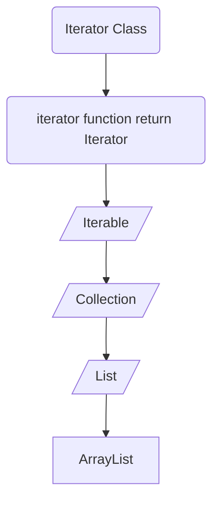

]
```java
public class Main {
	
	int x = 3; // dichiarazione
		x = 5; // assegnamento
		// Assegnamento == modifica, non inizializzazione
		// di una variabile
		
	public Main(){
		System.out.println("ciao");
	}
	
	public static int f(int n){
		return n + 1;
	} // tecnicamente è un metodo, non una funzione
	
	public int g(int n){
		return n + 1;
	}
	
	public static void main(String[] args) {
		int x = f(10);
		// garbage collector cancella poi l'oggetto
		int y = new Main().g(13); 
		// senza cancellazione
		Main o = new Main();
		int y = o.g(13);
		// esplode
		// il nome di una variabile dice dove, non cosa
		Main o; 
		int y = o.g(7);
	}
}
```

```java
package it.unive.dais.po2.misc;

public class Main {
	class Zoo {
		public static class Animal {
			protected int weight;
			
			public Animal(int w) { this.weight = w; }
			
			public void eat(Animal a) { 
				this.weight += a.weight; 
			}
		}
	}
	
	static class Dog extends Animal { // sottoclasse
		private boolean pedgree;
	
		public Dog(boolean pedgree, int w){
			this.pedgree = pedgree;
			super(w);
		}
		
		public void bark() {
			System.out.println("bau!");
		}
		@Override
		//Subsumption
		// viene chiamata questa funzione da pluto,
		// anche se è un animale, non un cane
		public void eat(Animal a){ 
			this.weight += a.weight * 2; 
		}
	}
	
	public static void main(String[] args){
		Dog fido = new Dog(false, 30);
		Dog gigio = fido;
		Animal pluto = new Dog(true, 40); // polimorfismo
		gigio.bark(); 
		// non funziona
		// pluto è animal, anche se possiede il metodo
		pluto.bark(); 
		// Dynamic dispatching, chiama override
		// non hai perdita di informazioni a runtime
		pluto.eat(fido); 
		gigio.eat(gigio);
	}
}
```
Implementare == Estendere
### Documentazione di Java
Link per la documentazione: https://docs.oracle.com/en/java/javase/17/docs/api/

SottoInterfacce disponibili dalla libreria:
![[Pasted image 20240215110506.png]]
Sotto classi che implementano l'interfaccia
![[Pasted image 20240215110616.png]]
Funzioni della interfaccia/classe di riferimento:
![[Pasted image 20240215110633.png]]
Descrizione funzioni:
![[Pasted image 20240215110810.png]]
A cosa serve la keyword default?
- Implementazione di default, disponibile da java 11
```java
public class Misc1 {
	// Interfaccia ==  Classe astratta
	public interface I { // Interfaccia 
		void a();
		void b();
		default void c(){
			a();
			b();
		}
	}
	
	public static abstract class J { // Classe astratta
		public abstract void a();
		public abstract void b();
		public void c(){
			a();
			b();
		}
	}
	
	public static class C implements I {
		@Override 
		public void a() {
		
		}
		
		@Override
		public void b() {
		
		}
	}
	
	public static void main(String[] args){
		I o = new C();
	}
}
```
Interfaccia valida? Si


```java
import java.util.ArrayList;

public class Misc2 {
	public static void main(String[] args){
		// No subsumption
		// costruttore vuoto/di default
		// vuoto se implementato dal programmatore 
		// senza parametri in input
		ArrayList<Integer> l = new ArrayList<Integer>();
		// add ereditato da Collection
		l.add(21);
		l.add(2);
		l.add(456);
		
		List<Integer> g = new ArrayList<Integer>();
		// con Collection non funziona
		// la classe non ha set(), List e ArrayList
		// invece si
		g.add(21);
		g.add(2);
		g.add(456);
		g.set(2,987);
		
		// ciclo for classico
		for(int i=0; i < g.size(); i++){
			int n = g.get(i);
			System.out.println(n);
		}
		
		// ciclo con iteratore
		Iterator<Integer> it = g.iterator();
		while (it.hasNext()){
			int n = it.next();
			System.out.println(n);	
		}
		
		// con subsumption
		Collection<Integer> m = new ArrayList<Integer>();
		m.add(21);
		m.add(2);
		m.add(456);	
	}
}
```
- type parameter
	- void f(int n) { ... }
- type argument
	- f(7)

```java
// Iterable.java

package tinyjdk;

// ogni file contiene una sola classe
// al massimo sono nested una dentro l'altra
public interface Iterable<T> { // <T> = parameter
	Iterator<T> iterator();
}
```

```java
// Iterator.java

package tinyjdk;

public interface Iterator<T> {
	boolean hasNext();
	T next(); // ritorna un oggetto generico
}
```

- Ipotizzando di non voler usare i *Generics* all'interno di Collection.java, dovremmo programmare usando la classe *Object*, ed essa permette si di poter aggiungere tramite la add qualunque cosa che prende in input, elevando tutto ciò che riceve appunto, ad *Object*, ma il problema si pone quando bisogna gettare, facendo un subcast della classe e rischiando errori dovuti ad esso. Per questo, si usano i *Generics*, che bloccano ad un certo type  

```java
// Collection.java

package tinyjdk;

// ogni file contiene una sola classe
// al massimo sono nested una dentro l'altra
public interface Collection<T> extends Iterable<T>{
	
	void add(T x);
	
	default void addAll(Collection<T> c){ 
		Iterator<T> it = c.iterator();
		while (it.hasNext()){
			add(it.next())
		}
	}
	
	void clear();
	
	default boolean contains(T x){
		Iterator<T> it = iterator();
		while(it.hasNext()){
			T e = it.next();
			if(e.equals(x))
				return true;
		}
		return false;
	}
	
	boolean isEmpty();
	
	void remove(T x);
	
	int size();
}
```

```java
//List.java

package tinyjdk;

public interface List<T> extends Collection<T> {
	// serve throws o da errore in ArrayList
	// se voglio farla checked, anche se in
	// questa funzione, non serve
	// T get(int i) throws IndexOutOfBoundException;
	T get(int i); 
	
	T set(int i, T x);
	
	void add(int i, T x);
	
	T remove(int i);
}
```

```java
// ArrayList.java

package tinyjdk;

public class ArrayLilst<T> implements List<T> {
	private Object[] a;
	private int sz;
	
	public ArrayList(){
		// limitazione del linguaggio, non posso
		// scrivere T[10], ritorna errore
		this.a = new Object[10];
		sz = 0;
	}
	
	public ArrayList(int i){
		// non implementato
	}
	
	
	// static nested iterator --> non entra in virtual table
	private static class StaticMyIterator<T> implements Iterator<T>{
		private int pos = 0;
		private ArrayList<T> enclosing;
		
		public StaticMyIterator(ArrayList<T> a){
			this.enclosing = a;
		}
		
		@Override
		public boolean hasNext(){
			return this.pos < enclosing.size();
		}
		
		@Override
		public T next(){
			return enclosing.get(pos++);
		}
	}
	
	// non static nested iterator
	private class MyIterator implements Iterator<T> {
		private int pos = 0;
		
		@Override
		public boolean hasNext() { 
			return pos < ArrayList.this.size(); 
		}
		@Override
		public T next() { return get(pos++); }	
	}
	
	@Override
	public Iterator<T> iterator(){
		
		//anonymous class
		return new MyIterator<T>(){
			private int pos = 0;
			
			public boolean hasNext(){ return pos < size; }
			
			public T next(){ return get(pos++); }
		};
	}
	@Override
	public void add(T x){
		if(sz >= a.length){
			Object[] old = a;
			a = new Object[a.length * 2];
			for(int i=0; i < old.length; i++){
				a[i] = old[i];
			}
		}
		a[sz++] = x;
	}
	
	@Override
	public void clear(){
		sz = 0; // non disalloco, tanto non mi interessa
	}
	
	
	public int size(){
		return sz;
	}
	@Override
	public T get(int i){
		if(i < sz)
			return (T) a[i];
		
		// Eccezione unchecked
		throw new RuntimeException(
			String.format(
				"ArrayList.get(): index %d out of bounds %d",
				i,
				sz
			)
		);
		
		// Eccezione checked
		throw new IndexOutOfBoundsException(String.format
		                                ("Arraylist.get():
		                                 index %d out of
		                                 bound %d" i, sz));
	}
	
	@Override
	public T set(int i, T x){
		if(i < sz){
			T old = get(i);
			
			a[i] = x;
			return old;
		}
		
		// unchecked exception
		throw new RuntimeException(
			String.format(
				"ArrayList.get(): index %d out of bounds %d",
				i,
				sz
			)
		);
	}
	
	@Override
	public boolean isEmpty(){
		return sz == 0;
	}
	
	public void add(int i, T x){
	
	}
	
	public void add(T x){
	
	}
	
	boolean equals(Object o){
		if(o instanceof ArrayList){
			//...
		}
		
		return false;
	}
	
	public void remove(T x){
		for(int i = 0; i < size(); ++i){
			T o = get(i);
			if(o.equals(x)){
				for(int j = i; j <size() - 1; ++j ){
					set(j, get(j + 1));
				}
				--sz;
			}
		}
	}
}
```

- Annotazione **@Override**: utile solo al programmatore per avvertirlo in caso essa non sia effettivamente una override

```java
// Main.java

package tinyjdk;

public class Main {
	public static void main(String[] args){
		List<Integer> l = new ArrayList<>();
		f(l);
	}
}
```

- Eccezione, Checked o Unchecked?
	- Checked, se l'esito con errore è molto probabile, come fosse una seconda scelta della funzione
	- Unchecked, quando accade di rado
- Nel caso della get(), meglio unchecked
- Meglio creare comunque anche se con padre diverso una classe specifica per il nostro errore?
	- Non è necessario, servono più in fase di debug, ma non è un suggerimento di stile

```java

@override
public T get(int i){
	// meglio trovare un alternativa? No
	// ottima mantenibilità del codice
	if(i < 0 || i >= sz)
		throws new RuntimeException(String.format("Errore, nella .get, out of bound"));
	Node n = head;
	// se aggiungo la guardia n != null, n.data da
	// warning per un possibile null pointer, perché?
	for(; i > 0; --i) 
		n = n.next;
	return n.data;
}

public T set(int i, T x){
	if(i < 0 || i >= sz)
		throws new RuntimeException(String.format("Errore, nella .get, out of bound"));
	Node n = head;
	// se aggiungo la guardia n != null, n.data da
	// warning per un possibile null pointer, perché?
	for(; i > 0; --i) 
		n = n.next;
	T old = n.data;
	n.data = x;
	return old;
}
```

il codice è doppio, usiamo le funzioni!!

```java
package tinyjdk;

public class LinkedList<T> implements List<T>{
	
	protected class Node{
		public T data;
		public Node next;
		
		public Node(T data, Node next){
			this.data = data;
			this.next = next;
		}
	}
	// privata, nessuno deve sapere come tratto il dato
	// meglio mettere la classe node protected, anche la testa.
	// La testa, se private, 
	
	protected Node head;
	
	// se vogliamo essere 'aperti al mondo', anche sz va 
	// messo protected, per possibili estensioni future,
	// come un aggiunta in coda
	
	// private non si usa spesso, perché potrebbe 
	// rovinare il principio dell'ereditarietà.
	
	// private int sz;
	protected int sz; 
	
	public LinkedList(){
		this.head = null;
		sz = 0;
	}
	
	public void add(T x){
		if(head == null){
			head = new Node(x, null);
		} else {
			Node n = head;
			while(n.next != null){
				n = n.next;
			}
			n.next = new Node(x, null);
		}
		sz++;
	}
	
	public void clear(){
		head = null;
		sz = 0;
		/*
			garbage collector si prende tutto
			perché gli elementi in coda hanno ancora
			reference type.
			
			sarebbe meglio però mettere tutto a null.
		*/
	}
	
	public void size(){
		return sz;
	}
	
	@override
	public Iterator<T> iterator(){
		return new  Iterator<T>() {
			private Node n = head;
			
			@override
			public boolean hasNext(){
				return n != null;
			}
			
			@override
			public T next(){
				T r = n.data;
				n = n.next;
				return r;
			}
		}
	}
	
	protected Node getNode(int i){
		if(i < 0 || i >= sz)
			throws new RuntimeException(String.format("Errore, nella .get, out of bound"));
		Node n = head;
		for(; i > 0; --i) 
			n = n.next;
		return n;
	}
	
	@override
	public T get(int i){
		return getNode(i).data;
	}
	
	public T set(int i, T x){
	/*
		if(i < 0 || i >= sz)
			throws new RuntimeException(String.format("Errore, nella .get, out of bound"));
		Node n = getNode(i);
		// se aggiungo la guardia n != null, n.data da
		// warning per un possibile null pointer, perché?
		for(; i > 0; --i) 
			n = n.next;
		T old = n.data;
		n.data = x;
		return old;
	*/
		// Il codice sopra è brutto molto meglio così
		Node n = getNode(i);
		T old = n.data;
		n.data = x;
		return old;
	}
	
	// questa funzione non include campi specifici e 
	// chiama metodi che hanno tutte le collection
	// quindi posso inserirla nella interfaccia
	// (se guardo è identica a quella in ArrayList)
	// public boolean contains(T x){
	//	Iterator<T> it = iterator();
	//	while(it.hasNext()){
	//		T e = it.next();
	//		if(e.equals(x))
	//			return true;
	//	}
	//	return false;
	//  }
	
	public void remove(T x){
		Node n = head;
		if(head != null){
			if(n.data.equals(x)){
				n = n.next;
			} else {
				while(n.next != null){
					if(n.next.data.equals(x)){
						n.next = n.next.next;
						return;
					}
				}
			}
		}
	}
}
```

```java
package tinyjdk

public interface Set<T> extends Collection<T>{
	
}
```

```java
package tinyjdk

public class StructuralSet<T> implements Set<T> {
	
	//sostanzialmente uno stub per Arraylist
	
	private List<T> l = new ArrayList<>();
	
	@Override
	public void add(T x){
		if(!l.contains(x))
			l.add(x);
	}
	
	@Override
	public void clear(){
		l.clear();
	}
	
	public boolean isEmpty(){
		return l.isEmpty();
	}
	
	public void remove(T x){
		l.remove(x);
	}
	
	public Iterator<T> iterator(){
		
	}
}
```

```java
package tinyjdk

public static class IndexOutOfBoundsException extends Exception{
		public IndexOutOfBoundsException(string msg){
			super(msg);
		}
	}
```

```java
package tinyjdk
//Metodo globale -> non preferibile
public class ArrayListIterator<T> implements Iterator<T> {
        
        private int pos = 0;
        private ArrayList<T> enclosing;
        
        public ArrayListIterator(ArrayList<T> a) {
            this.enclosing = a;
        }
        @Override
        public boolean hasNext() {
            return this.pos < enclosing.size();
        }
        @Override
        public T next() {
            return enclosing.get(pos++);
        }

}
```
## Eccezioni Checked e Unchecked
* Le eccezioni **unchecked** non hanno bisogno della keyword `throws`ne del costrutto `try{...}catch{...}`,  tuttavia potrebbero non essere raccolte.
* Al contrario le eccezioni **checked** ne hanno bisogno e devono essere propagate gerarchicamente.
* Se l'anomalia *non è frequente* meglio scegliere un'**eccezione unchecked**.
* Se l'anomalia *è frequente* ed è ritenuta un *secondo possibile esito del codice* megio scegliere un **eccezione checked**.
## Virtual Table e Dynamic Dispatching
Alla creazione di un campo in Java  (prima della chiamata al costruttore), questo viene inizializzato a  `NULL`, se è un **reference type**, a 0 se è un **int**.
Di conseguenza quando viene chiamato il costruttore, c'è già della memoria allocata (8 Byte per i pointer, 4 per gli int), il compilatore sa quanto allocare sulla base della sommatoria dei campi della classe.
Viene inoltre creata una tabella, detta **Virtual Table**, che contiene pointer ai metodi della classe, i quali puntano alla prima istruzione dei corrispondenti metodi. Ciò avviene perché quando una classe istanziata viene passata a qualcos'altro si crea **subsumpion**, e di conseguenza alla chiamata di un metodo della classe si può recuperare quest'ultimo dalla virtual table della stessa. Grazie all'uso delle virtual table Java implementa il **Dynamic Dispatching**. Quando viene creato un oggetto, viene prima allocato lo spazio necessario per i campi ed in seguito la virtual table, che contiene anche i metodi sottoposti ad **Override**.

## Anonymous Class

```java
(...)new Iterator<T>() {
		
		private int pos = 0;	
		
		@Override
		public boolean hasNext(){
			return pos < size;
		}
		
		@Override
		public T next(){
			return get(pos++);
		}
	}
```

Un codice è formato da:  
* **statement**: porzioni di codice formate da una o più righe e delimitati dalle graffe.  $\to$ (inizializzazioni, dichiarazioni, `return`, `if`, `do`, `for`, `throw` ...).
* **espressioni**: computano qualcosa, come fra le tonde dell'`if`  $\to$ (`(n < 8)`, `(n - 8)`...).

Il codice riportato è una **classe anonima**, ovvero un' **espressione**. La classe anonima permette di istanziare al momento un nuovo oggetto. La keyword `new` viene riutilizzata, in quanto quello che lancia non è un costruttore. Il nome anonymous class è sbagliato perché quello che abbiamo davanti è un **anonymous object**. Il nuovo oggetto viene subsunto ad `Iterator`, pertanto, nel caso in cui venga creato un nuovo metodo nella classe anonima, questo non può essere utilizzato. Dalla classe anonima si può accedere ai campi istanziati nello scope del metodo che la chiama (cioè *la classe porta con sé lo scope in cui è stata definita* $\to$ **chiusura**):

Esempio di class anonima realistico:

```java
new Thread(new Runnable() {
    @Override
    public void run() {
        System.out.println("Sono un nuovo thread!");
    }
}).start();
```

In questo esempio, la classe anonima estende l'interfaccia `Runnable` e sovrascrive il metodo `run` per definire il comportamento del thread. Poiché la classe è necessaria solo per questo thread specifico, viene dichiarata e istanziata anonimamente all'interno dell'argomento del costruttore Thread.

In generale le anonymous class:
- *Possono estendere una classe esistente o implementare un'interfaccia.*
- *Vengono tipicamente utilizzate per oggetti di breve durata*
- *Possono accedere a variabili locali finali o effettivamente finali dall'ambito di inclusione*
- *Non possono accedere a variabili locali non finali dall'ambito di inclusione.*

```java
public Iterator<T> iterator(){
	
	int pos = 0;
	
	return new Iterator<T>() {
		
		@Override
		public boolean hasNext(){
			return pos < size;
		}
		
		@Override
		public T next(){
			return get(pos++);
		}
	};
}
```

## Metodi == e equals
* `==`: se i due elementi sono **reference type** controlla i puntatori, se **value type** fa un vero confronto, è **polimorfo** e **omogeneo** (funziona con due oggetti dello stesso tipo),
* `equals`: è un metodo della classe `Object` reso standard, è **polimorfo per subtype** ed è **eterogeneo**. In genere si usa `equals` per fare una deep copy. $\to$ *è un semplice metodo*.

```java
// ARRAYLIST2

package tinyjdk;

public class ArraList2<T> extends AbstractCollection<T> implements List<T>{
	// implementa remove, add, ecc dalle altre classi,
	// ma sz non funziona, deve essere messo private!!
}
```