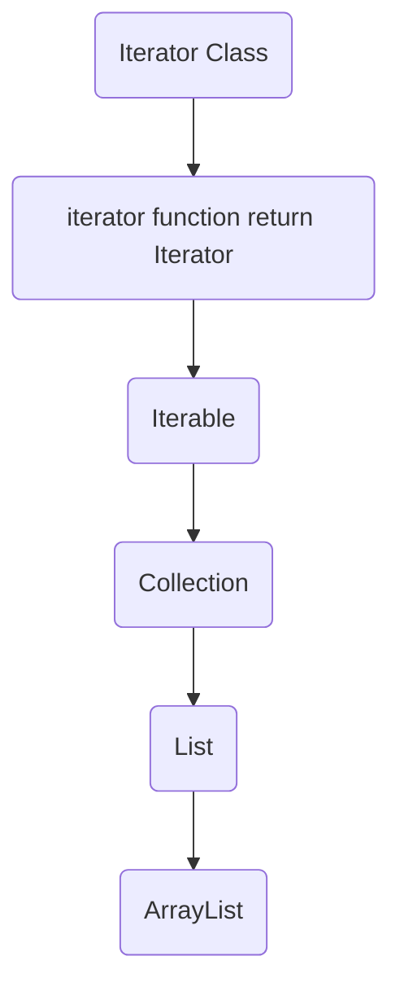

```java
public class Main {
	
	int x = 3; // dichiarazione
		x = 5; // assegnamento
		// Assegnamento == modifica, non inizializzazione
		// di una variabile
		
	public Main(){
		System.out.println("ciao");
	}
	
	public static int f(int n){
		return n + 1;
	} // tecnicamente è un metodo, non una funzione
	
	public int g(int n){
		return n + 1;
	}
	
	public static void main(String[] args) {
		int x = f(10);
		// garbage collector cancella poi l'oggetto
		int y = new Main().g(13); 
		// senza cancellazione
		Main o = new Main();
		int y = o.g(13);
		// esplode
		// il nome di una variabile dice dove, non cosa
		Main o; 
		int y = o.g(7);
	}
}
```

```java
package it.unive.dais.po2.misc;

public class Main {
	class Zoo {
		public static class Animal {
			protected int weight;
			
			public Animal(int w) { this.weight = w; }
			
			public void eat(Animal a) { 
				this.weight += a.weight; 
			}
		}
	}
	
	static class Dog extends Animal { // sottoclasse
		private boolean pedgree;
	
		public Dog(boolean pedgree, int w){
			this.pedgree = pedgree;
			super(w);
		}
		
		public void bark() {
			System.out.println("bau!");
		}
		@Override
		//Subsumption
		// viene chiamata questa funzione da pluto,
		// anche se è un animale, non un cane
		public void eat(Animal a){ 
			this.weight += a.weight * 2; 
		}
	}
	
	public static void main(String[] args){
		Dog fido = new Dog(false, 30);
		Dog gigio = fido;
		Animal pluto = new Dog(true, 40); // polimorfismo
		gigio.bark(); 
		// non funziona
		// pluto è animal, anche se possiede il metodo
		pluto.bark(); 
		// Dynamic dispatching, chiama override
		// non hai perdita di informazioni a runtime
		pluto.eat(fido); 
		gigio.eat(gigio);
	}
}
```

Implementare == Estendere
### Documentazione di Java
Link per la documentazione: https://docs.oracle.com/en/java/javase/17/docs/api/

SottoInterfacce disponibili dalla libreria:
![[Pasted image 20240215110506.png]]
Sotto classi che implementano l'interfaccia
![[Pasted image 20240215110616.png]]
Funzioni della interfaccia/classe di riferimento:
![[Pasted image 20240215110633.png]]
Descrizione funzioni:
![[Pasted image 20240215110810.png]]
A cosa serve la keyword default?
- Implementazione di default, disponibile da java 11

```java
public class Misc1 {
	// Interfaccia ==  Classe astratta
	public interface I { // Interfaccia 
		void a();
		void b();
		default void c(){
			a();
			b();
		}
	}
	
	public static abstract class J { // Classe astratta
		public abstract void a();
		public abstract void b();
		public void c(){
			a();
			b();
		}
	}
	
	public static class C implements I {
		@Override 
		public void a() {
		
		}
		
		@Override
		public void b() {
		
		}
	}
	
	public static void main(String[] args){
		I o = new C();
	}
}
```
Interfaccia valida? Si


```java
import java.util.ArrayList;

public class Misc2 {
	public static void main(String[] args){
		// No subsumption
		// costruttore vuoto/di default
		// vuoto se implementato dal programmatore 
		// senza parametri in input
		ArrayList<Integer> l = new ArrayList<Integer>();
		// add ereditato da Collection
		l.add(21);
		l.add(2);
		l.add(456);
		
		List<Integer> g = new ArrayList<Integer>();
		// con Collection non funziona
		// la classe non ha set(), List e ArrayList
		// invece si
		g.add(21);
		g.add(2);
		g.add(456);
		g.set(2,987);
		
		// ciclo for classico
		for(int i=0; i < g.size(); i++){
			int n = g.get(i);
			System.out.println(n);
		}
		
		// ciclo con iteratore
		Iterator<Integer> it = g.iterator();
		while (it.hasNext()){
			int n = it.next();
			System.out.println(n);	
		}
		
		// con subsumption
		Collection<Integer> m = new ArrayList<Integer>();
		m.add(21);
		m.add(2);
		m.add(456);	
	}
}
```