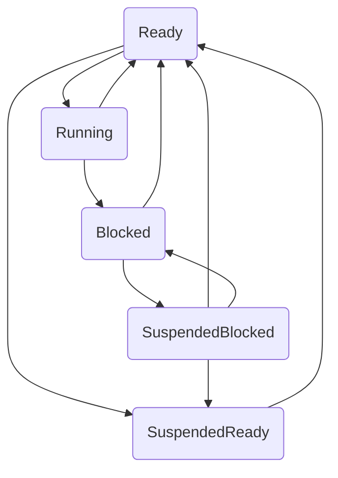
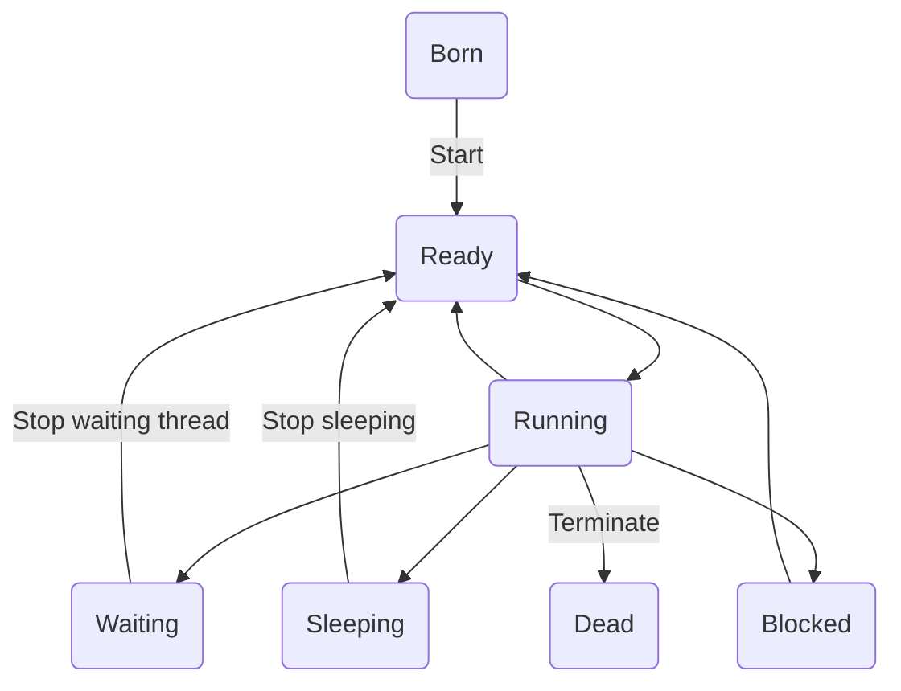
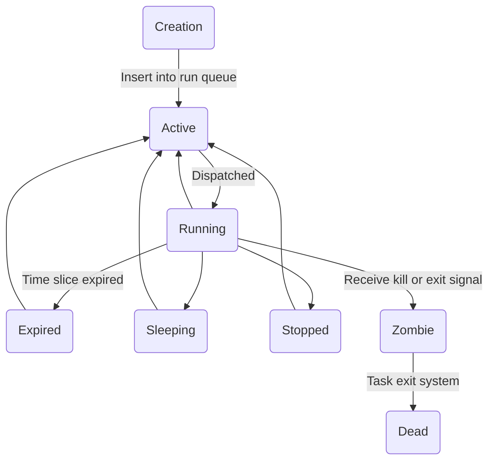
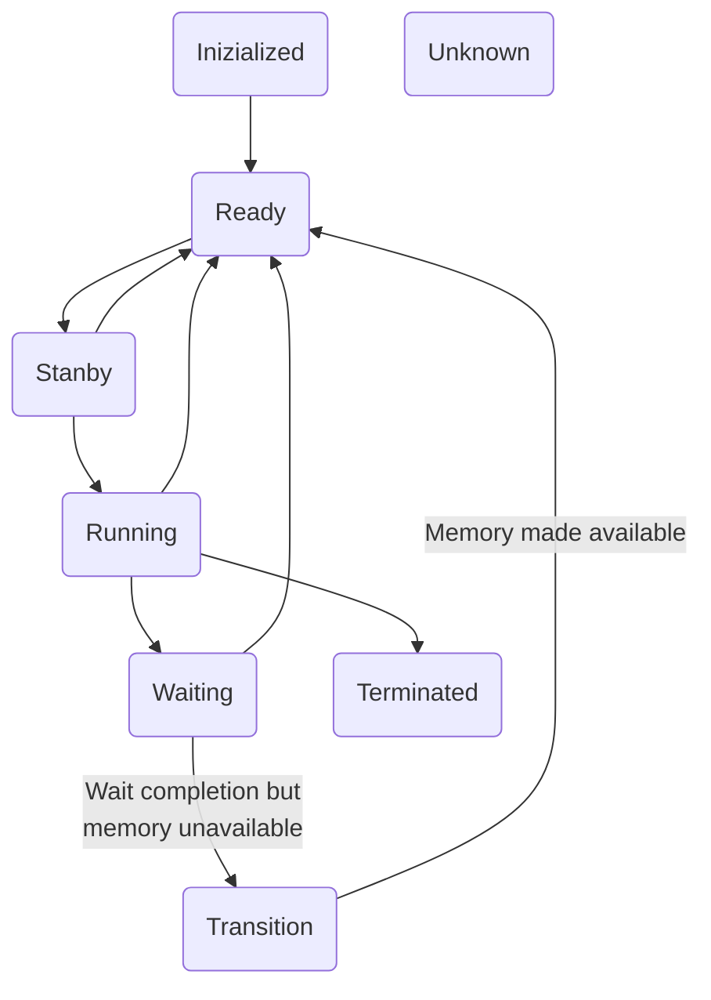

### Definizione di sistema operativo:
> Un sistema operativo é il software che permette alle applicazioni di interagire con l'hardware. il software che ne contiene i componenti principali é chiamato kernel.
> I sistemi operativi sono principalmente gestori di risorse. Gestiscono le risorse hardware come processori e memorie, ma anche le applicazioni ed altri astrattismi software fisicamente in realtá inesistenti. Funge anche da macchina astratta, semplificando a livello di interfaccia utente le azioni eseguite dalla macchina.
### Storia dei sistemi operativi:

- -> Anni '40
	- I primi calcolatori non avevano un SO
	- Programmatori costretti a caricare i programmi in **linguaggio macchina** usando interruttori meccanici
	- Si utilizzavano **schede forate** per caricare i vari programmi
	- Introduzione del linguaggio macchina
	  
- -> '50
	- General Motors realizza il **primo SO** per i computer **IBM 701**
		- I sistemi di questi anni eseguivano un solo job alla volta, spesso in esecuzione per ore o anche giorni
		- Noti anche come macchine **batch-system single-stream** per via dei dati salvati in nastri/dischi ed erano suddivisi in gruppi/lotti
		- Il programmatore é comunque costretto a controllare direttamente le risorse di sistema, vincolanti per la creazione dei programmi, che dovevano essere piccoli
- -> '60
	- Sempre macchina batch ma piú performanti
	- Inclusione delle prime periferiche come lettori e perforatori di schede
	- SO migliorati, ora mentre un job occupa il processore gli altri possono sfruttare le periferiche
	- Sistemi **MULTIPROGRAMMAZIONE**, ovvero sistemi che gestivano job diversi nello stesso tempo. Questo permetteva l'utilizzo concorrente di CPU e periferiche
	- Il principale obbiettivo di questi sistemi é la condivisione di risorse
	- Gli utenti interattivi ora dispongono di un terminale per poter interagire con i job durante l'esecuzione
	- Necessitá di ridurre i tempi di risposta data la presenza degli utenti interattivi, nascita dei sistemi **timesharing** e **realtime** 
	- Primi esempi di **debug**, dati i tempi ridotti tra invio del job e il suo completamento.(Utente poteva inviare al volo il programma, che tornava gli errori di sintassi, correggere gli errori e ripetere il ciclo fino ad avere un programma privo di errori, per poi occuparsi di quelli run-time)
- -> '70
	- Sistemi multiprogrammati supportano ora tutti i tipi di elaborazioni esistenti
	- I sistemi sperimentali del decennio precedente ora sono solidi prodotti commerciali
	- Crescono i **problemi legati alla sicurezza**, facendo si cresca anche l'importanza della **crittografia**
- -> '80
	- Primi personal computer (Personal IBM e Macintosh)
	- Creazione delle GUI per facilitare l'interfaccia utente
	- Primi esempi di comunicazione con elaborazione distribuita, modello client/server

- -> '90
	- Alla fine del decennio precedente un tipico personal computer era in grado di eseguire diverse centinaia di milioni di istruzioni al secondo
	- Crollo del costo della tecnologia ---> **incremento** numero **pc** nelle case
	- La creazione del **WWW** accrebbe la diffusione dell'elaborazione distribuita. L'elaborazione distribuita é diventata una realtá comune tra personal computer
	- SO ora possiede come **standard il supporto al networking**
	- Tecnologie ad oggetti. Gli **OOOS** hanno oggetti come rappresentazione dei componenti del SO e risorse del sistema. I concetti della programmazione orientata agli oggetti, come l'ereditarietá e le interfacce, sono stati sfruttati per creare sistemi operativi modulari piú facili da estendere e avere una manutenzione semplificata
	- **Open Source**. Il movimento Open Source nasce in contrasto al software commerciale di quel tempo, tutto codice venduto solo come oggetto, ovvero senza codice sorgente perché giá compilato, per nascondere segreti industriali/programmazione. Grazie a questo movimento abbiamo la nascita di molte tecnologie gratuite e con codice sorgente reso pubblico come Web Server Apache e Linux. nasce la GNU, tollkit linux libero usato da Linus Torvald per la creazione del primo Linux.
	- **OSI**. Organizzazione nata per la protezione del codice open source e per promuovere i benefici della programmazione open source.
- ->'2000
	- Diffusione dei dispositivi **cellulari** come tablet e smartphone
	- Sistemi distribuiti e **cloud computing**
	- Nascita dei **middleware** per collegare due diverse applicazioni
	- Parallelismo spinto, piú processori sulla stessa macchina per eseguire piú operazioni in contemporanea
#### Qualche nozione in piú
- ---> in piú: Piattaforme:
	- general-purpose
	- embedded
	- real-time
		- soft
		- hard
	- mission-critical
	- business-critical
	- virtual machine
### Storia di Internet e del World Wide Web
> Verso la fine degli anni '60 l'ARPA mise a punto un progetto per collegare in rete i sistemi di elaborazione di una dozzina di universitá e centri di ricerca da essi finanziati. Realizzó in poco tempo la "nonna di Internet" ovvero ARPAnet. Forniva principalmente e-mail come forma di comunicazione. ARPAnet funzionava senza un controllo centralizzato, in modo che se una parte della rete fosse divenuta non funzionante, il resto della rete sarebbe comunque rimasto in grado di scambiare i dati.
> Il WWW nasce dalla fusione del funzionamento della ARPAnet con la tecnologia sviluppata da Tim Berners-Lee del CERN, la quale permetteva di condividere documenti testuali con collegamenti ipertestuali all'interno. Per permettere questa tecnologia egli inventó HTML e il protocollo HTTP, gettando le basi per quello che oggi é conosciuto come WWW
### Componenti SO
>I sistemi operativi si sono evoluti negli anni per gestire al meglio il reparto hardware, con conseguente ottimizzazione delle prestazioni delle varie componenti. 
>Il software che contiene i componenti principali del SO é detto kernel. I tipici componenti di un SO sono:
>- scheduler: determina quando e quanto ogni singolo processo sará in esecuzione
>- gestore memoria: determina quando e quanta memoria allocare ai processi
>- gestore I/O: gestisce le richieste di I/O da e verso l'HW
>- gestore interprocess communication (IPC): process communication
>- gestore del file system: organizza raccolte di dati e fornisce interfaccia per accedervi
>
>Quasi tutti i SO oggi offrono supporto ad un ambiente multiprogrammato in cui piú applicazioni sono eseguibili concorrentemente.
>Carattestitiche
>- Efficienza
>- Robustezza
>- Sicurezza e protezione
>- Estensibilità
>- Scalabilità
>- Portabilità
>- Interattività
>- Usabilità
#### Architettura di un SO
- Architettura monolitica
	- Piú vecchia e comune. Ogni componente fa parte del kernel, permettendo la comunicazione diretta tra di essi. Ció rende il sistema molto efficiente, ma risulta spesso difficile isolare fonti di errore, oltre che essere molto piú esposti a danni derivanti da codice errato o dannoso, essendo tutti i componenti raggruppati nel kernel
- Architettura a strati
	- Tenta di risolvere i problemi della monolitica raggruppando i componenti tra di loro in base alla loro funzione. Ogni strato comunica solo con quello immediatamente superiore o inferiore. Ció permette modifiche ad uno strato senza dover per forza influenzare gli altri strati. Ogni componente nasconde il modo in cui compie il proprio lavoro e fornisce un interfaccia standard per richiedere il servizio. Gli strati hanno comunque accesso al sistema, aumentando le vulnerabilitá, e data la struttura organizzativa,una richiesta per essere servita potrebbe dover passare per molti strati, riducendo quindi le prestazioni
- Architettura microkernel
	- Fornisce solo un piccolo numero di servizi nel tentativo di mantenere il kernel piccolo e scalabile. Questi servizi riguardano in genere la gestione a basso livello del sistema, IPC e cooperazione tra processi. La maggior parte dei componenti del SO, come per esempio lo scheduler, sono eseguiti al di fuori dello spazio del kernel. Risulta essere molto scalabile, portatile ed espandibile, ma data la comunicazione che deve essere presente tra i moduli abbiamo un calo di prestazioni del sistema
- Architettura di rete e distribuiti
	- SO che permette di accedere a risorse presenti su altri computer in rete. In questa architettura bisogna prestare molta attenzione alle problematiche di gestione dei dati e delle comunicazioni tra computer. Un sistema distribuito é un singolo SO in grado di gestire risorse distribuite su piú sistemi di elaborazione. Sono molto difficili da realizzare e richiedono algoritmi complessi per condivisione e comunicazione dei dati tra processi
### Componenti HW

> Le componenti hardware per essere chiamate da un processo dispongono di un componente software chiamato driver che si occupa di gestire le varie chiamate. Il driver avendo forti dipendenze in base al dispositivo HW chiamato, deve essere prima installato sulla macchina. Per inserire un driver nel SO ci sono diversi metodi, il piú utilizzato oggi é noto come plug-and-play che permette di installare il driver senza riavviare la macchina.
#### Schede Madri:
- Per permettere ai dispositivi indipendenti di comunicare tra loro, i PC sono dotati di una o piú schede a circuito stampato o PCB. Essa fornisce alcuni slot per connetterci altri componenti come la memoria centrale o la cpu. In genere dispongono di un circuito integrato chiamato BIOS che memorizza le istruzioni di base per l'inizializzazione e gestione dell'hardware. Dispongono spesso di altri chip che fungono da controller, per le cose piú disparate, dalla gestione del sistema RAID a quella del trasferimento di dati tramite bus.
##### CPU: 
- Cervello del PC, esegue un flusso di istruzioni in linguaggio macchina. I processori dei computer possono essere di diverso tipo. Le istruzioni che esso esegue sono definite all'interno di un istruction set, differente in base al processore. Le istruzioni hanno una dimensione che puó anch'essa differire in base all'architettura. Da essa dipende anche la quantitá di dati elaborabile contemporaneamente. Alcuni componenti sono comuni a tutti i processori moderni, come l'unitá di caricamento delle istruzioni, il revisore dei salti, i registri, le memorie cache, ecc.
- Cache L1,L2  contenute all'interno della cpu, permettendo un rapido accesso alle istruzioni piú usate
- I registri invece sono memorie ad alta velocitá situate nel processore che contengono dati per utilizzo immediato. I dati vanno memorizzati nei registri prima che un processore possa operare su di loro. Memorizzare le istruzioni in un qualunque tipo di memoria piú lenta sarebbe inefficiente, in quanto il processore rimarrebbe inutilizzato durante l'attesa dei dati. Esistono registri dedicati all'esecuzione dei programmi. Questi di solito vengono chiamati general-purpose. Altri tipi di registri, chiamati di controllo, memorizzano specifiche informazioni sul sistema, come il contatore del programma in esecuzione, o program counter, utilizzato per sapere l'indirizzo di memoria della prossima istruzione da eseguire. Alcuni registri sono poi visibili al programmatore come il program counter, lo stack pointer o il Program status word. Se ci troviamo nel momento in cui un operazione viene fatta in modalitá utente ma necessita dei permessi che solo la mod. nucleo offre, viene attivata la cosiddetta chiamata di sistema, dove un istruzione TRAP cambia la modalitá da utente a nucleo.
- Il tempo nei calcolatori é spesso misurato in cicli, chiamati clock. Essi fungono da direttori all'interno dell'intero sistema, determinando la frequenza con cui le operazioni vengono fatte.
- CPU pipeline VS CPU superscalare:
	- La CPU pipeline si occupa di dividere l'istruzione da eseguire in fasi, in modo da poter eseguire piú istruzioni contemporaneamente.
	- La CPU superscalare si occupa di eseguire piú operazioni contemporaneamente ma in modo piú avanzato rispetto alla pipeline, andando ad eseguire le istruzioni anche in base alle dipendenze, opportunitá, raggiungendo un maggiore numero di istruzioni per ciclo, anche se richiedono complessitá aggiuntiva rispetto alle pipeline
#### Gerarchie di memoria:
- Le memorie, in base alla loro grandezza e velocitá di accesso, vengono inserite in una gerarchia, che é organizzata come segue"
	- Registri (1ns, <1kB)
	- Cache (2ns, 4MB)
	- Memoria centrale (10ns, 1-8GB)
	- Disco magnetico (10ms, 1-4TB)
#### Memoria Centrale:
- Consiste in memoria ad accesso casuale volatile, nota come RAM. Essa poi si divide in due sottocategorie, la DRAM e la SRAM, la prima dove é presente un circuito di refresh che periodicamente rilegge i dati che altrimenti andrebbero persi(invia un impulso), la seconda che invece non necessita di refresh. Esistono altri tipi di memoria, anche non volatile, come le ROM, EEPROM (una ROM peró riprogrammabile) e la CMOS.
#### Memoria Secondaria:
- Le memorie principali non sono adatte alla memorizzazione di grandi quantitá di dati, essendo dalla capacitá limitata e volatili. Gli elaboratori usano quindi dispositivi di memorizzazione secondari, capaci di mantenere salvato il dato anche in assenza di alimentazione. Sono comunque decisamente piú lente per quanto riguarda l'accesso al dato, motivo per cui non possono essere utilizzate come memorie principali. Oggigiorno le tecnologie piú diffuse di memoria secondaria sono i HDD SSD. Altre unitá secondarie rimovibili come i DVD, CD, memorie flash, permettono di facilitare operazioni come il backup e il trasferimento di dati
#### Accesso diretto alla memoria (DMA):
- Tipo di accesso alla memoria fatto dal I/O in memoria, che permette di trasferire interi blocchi di dati mentre il processore continua ad eseguire istruzioni software. Un canale DMA utilizza un controller I/O per gestire il trasferimento. Per comunicare al processore l'avvenuto trasferimento invia un segnale d'interruzione al termine dell'operazione. La tecnica descritta é compatibile con diverse architetture di bus.

#### Dispositivi periferici:
- Qui rientrano tutti i dispositivi hardware che non sono strettamente necessari per il calcolatore al fine di eseguire istruzioni software. Ne fanno parte tastiere, mouse, stampanti, schede di rete o dispositivi di memorizzazione. Generalmente si collegano tramite cavo USB, che funge sia da canale di comunicazione sia da alimentatore.
- La gestione dei dispositivi I/O avviene tramite busy waiting, interrupt o DMA.
	- Busy waiting
		- Si richiede tramite system call l'accesso al dispositivo, che il kernel elabora in una procedura per il driver appropriato. Il driver allora comincia la chiamata al dispositivo ed entra in un loop continuo in cui chiede al dispositivo I/O se ha finito l'operazione. Questo metodo blocca la CPU fino a che il dispositivo non ha finito.
	- Interrupt
		- Metodo piú complesso. Qui viene effettuata la chiamata al dispositivo che viene inviata al controller del dispositivo(driver), il quale avvia e conclude l'operazione di I/O. Quando l'operazione si conclude, il controller invia un segnale di interrupt all'interrupt controller. Se questo risulta libero, invia subito alla CPU un segnale tramite un pin per avvertirla dell'arrivo di un interrupt, per poi inviare al processore il numero del dispositivo, cosí da avvisare quale dispositivo ha appena finito l'operazione.
	- DMA
		- HW speciale che controlla il flusso di dati tra memoria e controller senza CPU intervention. Esso comunque avvisa tramite interrupt quando ha finito

- Dato il forte avanzamento tecnologico, l'utilizzo di un singolo bus per il trasferimento dei dati non era piú ottimale, per questo sono stati inseriti dei bus aggiuntivi per dispositivi I/O piú veloci e per il traffico dati CPU-to-memory.

#### Sistemi Operativi
> Sistemi operativi pensati per alto livello di astrazione, occorre definire speciali requisiti di progetto e supporto hw
> - Grande memoria principale
> - HW per usi speciali
> - Grande numero di processi
- Sistemi integrati, caratterizzati da un insieme limitato di risorse specializzate. Forniscono funzionalitá per vari tipi di dispositivi come telefoni cellulari e PDA
- SO per mainframe, grandi capacitá di I/O, per servizi batch, time-sharing, transazioni
- SO per server, gestione di molti utenti, per servizi di archiviazione, web server, ISP
- SO per multiprocessore, computer parallei, multiprocessi, coerenza nella connessione
- SO per PC, multiprogrammazione, un utente
- SO per palmari(pda), molte app al loro interno, attenzione per sensori, fotocamera, CPU multicore
- SO integrati(embedded), per il controllo di dispositivi, accezzione eccezionale dei dispositivi
- SO per sensori
- SO real-time, ovvero con processi in scadenza, soft o hard
- SO smart-card, ovvero pagamento elettronico, trasporto, amministrativi
 
- Esempi SO:
	- Batch 
	- Interattivi in time sharing (es. Unix) 
	- Per P.C. (es. Windows, Mac OSX, Linux) 
	- Real-time (es. telefonia, sistemi di controllo) 
	- Multimedia (es. video on demand) 
	- Transazionali (es. operazioni brevi, banche dati) 
	- Per dispositivi mobili (es. smartphone, PDA, tablet) 
	- Embedded (integrati, elettrodomestici, automazione)
### Processi
#### Modello
- Immaginiamo una macchina che sta eseguendo 4 programmi contemporaneamente. Questi 4 processi agiscono indipendenti uno dall'altro (concetto di multiprogrammazione), ovviamente é peró presente solo un vero e proprio program counter, quindi quando un processo é in esecuzione, il suo program counter logico viene caricato in quello reale. Da qui si puó poi accedere al vero indirizzo di memoria.
- I SO forniscono servizi per i processi:
	- Creazione
		- La creazione di un processo avviene quando: 
			- si inizializza il sistema 
			- dopo una chiamata di sistema di creazione 
			- dopo una richiesta di utente di creazione 
			- per servire batch jobs. 
		I processi possono essere attivi(foreground) o agenti in background(daemon).
		- Per creare un Processo:
			- In UNIX si usa la fork
				- Si crea un clone del processo chiamante
				- I due processi condividono l'immagine di memoria, ambiente e file aperti
				- Il processo figlio di solito esegue execve per cambiare la propria immagine ed eseguire un nuovo programma
			- In Windows si usa la CreateProcess
				- Una sola chiamata di Win32, con 10 parametri
				- Win32 ha oltre 100 altre funzioni per gestire e sincronizzare i processi
			- Dopo la creazione di un nuovo processo, sia UNIX che Windows, il processo padre e figlio hanno spazi di indirizzi separati. In ambiente UNIX il figlio e il padre condividono memoria non scrivibile dal figlio, oppure siamo in una condivisione copy-on-write, ovvero i due processi condividono la stessa memoria, fino a che uno dei due non tenta di effettuare una modifica. In questo momento allora viene creata una copia delle pagine di memoria fisica e assegnata al processo che vuole eseguire una modifica, mentre l'altro processo continua ad operare sugli stessi indirizzi di prima. I sistemi Windows invece creano da subito un figlio con uno spazio separato
	- Chiusura
		- Un processo prima o poi deve concludere il suo ciclo di vita. Solitamente succede quando si ha: 
			- Uscita normale volontaria
			- Uscita per errore volontaria
			- Errore critico non volontario
			- Uscita forzata da un altro processo, non volontaria
		- La chiamata in ambiente UNIX si chiama exit mentre in ambiente Windows si chiama ExitProcess
		- Quando peró abbiamo una uscita forzata da un altro processo, é quest'ultimo che effettua una chiamata kill o TerminateProcess per terminare un altro processo
	- Gerarchia dei processi
		- Presente solo sui sistemi UNIX (Window gestisce i processi creati da altri processi dando al padre un token speciale usabile per controllare il processo figlio)
		- In UNIX ogni processo e tutti i suoi figli sono raggruppati in gruppi. Quando un utente invia un segnale dalla tastiera (es. Ctrl-C), il segnale viene inviato a tutti i processi appartenenti al gruppo associato alla tastiera. Poi, ogni processo gestisce il segnale individualmente. Un altro esempio di gerarchia in sistemi UNIX é che tutti i processi sono discendenti da un processo padre speciale, creato all'avvio della macchina, chiamato *init*. Da esso, partono tutti i processi.
	- Distribuzione
	- Sospensione
		- Rimuovere il processo dalla contesa per il tempo sul processore senza distruggerlo
		- Utile per effettuare controlli di sicurezza
		- Puó essere richiesta dal processo stesso come da un altro
		- Due stati di sospensione che sono *suspendedready* e *suspendedblocked*
		- Per uscire dallo stato di sospeso deve essere riavviato da un altro processo
	- Ripresa
	- Modifica prioritá
	- Risveglio
	- Dispatching
		- Assegnare un processore per il primo processo della lista pronta
	- IPC
#### Stati di un processo
- Un processo si sposta attraverso una successione di stati:
	- Stato Running
		- Processo in esecuzione
	- Stato Ready
		- Processo pronto per l'esecuzione
	- Stato Blocked
		- Processo in attesa di qualche evento prima di poter proseguire
	- Stato Sospeso
		- Processo rimosso dalla contesa per il tempo sul processore senza distruggerlo, utile per rilevare problemi alla sicurezza

#### PCB
- Process Control Blocks, descrive un processo. Tipicamente contiene informazioni come:
	- PID
	- Stato del processo
	- Contatore
	- Stack pointer
	- Proritá
	- Diritti
	- Puntatore al padre
	- Puntatore ai processi figli
	- Puntatore per localizzare dati ed istruzioni del processo in memoria
	- Puntatore alle risorse allocate
- Il SO mantiene i puntatori ai PCB di ogni processo in una tabella di sistema o una tabella di processo per utente, permettendone un rapido accesso. Quando un processo termina, il SO si occupa di rimuovere il processo dalla tabella e liberare tutte le risorse
- Il processore usa il PCB per effettuare il context switching, ovvero per cambiare il processo in esecuzione, salvando il "contesto" di esecuzione del processo in stato *running* nel PCB assegnato e caricare il nuovo da un processo *ready*. Tutto questo avviene in maniera trasparente ai processi.

#### Interrupt
- Abilitano il software a rispondere ai segnali hardware. Puó essere inizializzato da un processo in esecuzione tramite la *trap*. In questo caso sono sincrone con le operazioni del processo. Possono anche essere avviate da qualche evento che non per forza é correlato a qualche processo. In questo caso sono asincroni con le operazioni del processo. Si ha un basso overhead. Si potrebbe anche usare il Polling, ma risulta molto meno efficiente, avendo un alto overhead in base alla complessitá.
- Vengono gestiti in maniera semplice dalla CPU. Appena riceve un interrupt, conclude l'esecuzione dell'istruzione corrente per poi interrompere il processo, esegue la funzione di interrupt di gestione del kernel, il gestore di interrupt determina come dovrebbe rispondere (i gestori sono salvati in un array di puntatori chiamato interrupt vector), per poi al termine della chiamata, ritornare all'esecuzione del processo.
- Esistono sia gli interrupts che le eccezioni. quest'ultime al contrario degli interrupts indicano che si é verificato un errore, sia hardware che come risultato di un'istruzione software, non un evento o il cambiamento di stato di dispositivo esterno(cosa che invece fa l'interrupt).
- Gli interrupt si dividono in:
	- I/O(Variazione di stato hw)
	- Timer(interrupt ad intervalli periodici, usati per gestire tempo o monitorare prestazioni)
	- Interruzione per comunicazione interprocessor(processo deve inviare messaggio ad altri processi)
	
	Mentre le eccezioni si dividono in:
	- Fault(durante esecuzione codice macchina, varie casistiche come la divisione per zero)
	- Trap(eccezioni come overflow o breakpoint)
	- Abort(quando viene identificato un errore che non permette di recuperare l'esecuzione del processo)

#### Segnali
- Inviati al processo per avvisarlo dell'occorrenza di un evento
	- Esso puó ricevere, ignorare o mascherare il segnale

#### Message Passing
- Interprocess communication basata su scambi di messaggi
	- I messaggi possono essere trasferiti in una direzione alla volta
	- Lo scambio puó essere bidirezionale
	- I messaggi possono essere bloccanti o non bloccanti (invia di conferma del messaggio o meno)
	- L'implementazione comune é la pipe (regione di memoria protetta dal SO, buffer usato per lo scambio di dati)
- Nei sistemi distribuiti, i messaggi hanno bisogno di conferma dal destinatario, ci sono routine di timeout con ritrasmissione dei messaggi, i messaggi sono passati tra sistemi tramite porte numerate che permettono di denominare il riferimento del messaggio(capire che protocollo si sta usando), ed infine bisogna garantire l'autenticazione tra i due dispositivi comunicanti, grosso problema della sicurezza

#### Chiamate di sistema
- Usate dai processi per interagire con il SO
	- fork (creazione di un processo figlio)
	- exec (caricamento da file delle istruzioni e dati di un processo)
	- wait (attesa di terminazione del processo figlio)
	- signal (specifica un gestore di segnalazione per un dato segnale)
	- exit (termina il processo chiamante)
	- nice (modifica la prioritá)
### Thread
- Creati per semplificare il modello dei processi, per poter scambiare finalmente dati tra entitá parallele, per avere un aumento delle prestazioni, una maggiore semplicitá nel creare e distruggere dei processi figli, miglior adattamento ai sistemi multiprocessore.
- I thread condividono con il proprio processo spazio di indirizzamento, file aperti ed altre informazioni, con invece registri, stack, maschere dei segnali locali per ognuno di essi
- Si chiamano anche lightweight processes
- Quando creato, il thread non richiede al SO di inizializzare le risorse condivise, riducendo l'overhead di creazione e terminazione dei thread
- Come i processi, essi si muovono tra stati discreti
- A differenza dei processi, non viene creata una copia delle risorse a partire dal processo padre, inoltre non necessitano di sicurezza, essendo tutti provenienti dallo stesso processo e di conseguenza dallo stesso utente, il quale ha presumibilmente creato i thread per cooperare e non concorrere uno con l'altro. Inoltre, essi condividono dati/file globali, cosa che i processi figli non possono fare.

#### Stati di un thread
- Analoghi per alcuni a quelli del processo: Ready, Running, Blocked.
- Altri stati dei thread:
	- [ ] Born
	- [x] Ready
	- [x] Running
	- [ ] Dead (quando il processo viene completato)
	- [x] Blocked (bloccato da un evento I/O)
	- [ ] Waiting (bloccato da un altro thread)
	- [ ] Sleeping (bloccato per un tempo prefissato)

- Possiamo quindi dire che thread e processi hanno operazioni in comune:
	- Creazione
	- Exit
	- Sospensione
	- Recupero
	- Sleep
	- Risveglio

#### Standard e Modelli di Thread
- Per poter creare thread ad alta portabilità, IEEE ha stabilito uno standard per essi, il 1003.1c. Il pacchetto si chiama Pthread. Esso è in prevalenza usato su Unix, e lo standard definisce oltre 60 chiamate di sistema. È possibile dividere i thread in due modelli, quello utente e quello kernel, senza dimenticare che però esistono anche gli ibridi.
- Modello livello utente (Mapping molti-a-uno, SO associa tutti i threads di un processo ad un unico contesto)
	- Vantaggio di poter essere implementato senza che il sistema supporti effettivamente i threads, essendo il pacchetto installato solo ad user-level
	- Svantaggio di non essere visto come processo multi-thread ma solo come un singolo thread da parte del nucleo, oltre a poter presentare un calo di prestazioni se un thread ha problemi di I/O
	- Non può essere schedulato su più processori in una sola volta
	- Ogni thread dispone della propria tabella, analoga a quella dei processi kernel, con la differenza che dentro ci sono solo le pre-thread information, come stack pointer, program counter, register, state.
	- Cambio di contesto molto veloce
- Modello livello kernel (Mapping uno-a-uno, ogni thread ha il proprio contesto)
	- Vantaggio di scalabilità, interattività tra processi
	- Svantaggio di overhead dovuti al cambio di contesto e ridotta portabilità dovuta alle API specifici per il SO in uso
	- Grazie allo scheduler ora è possibile fermare il thread senza per forza dover bloccare l'intero processo
	- Il kernel dispone sia della tabella dei thread che di quella dei processi
- Modello ibrido (Mapping molti-a-molti)
	- Tramite il pooling dei thread, si riduce l'overhead. Ogni nuovo thread viene eseguito da un thread worker. Tutto ciò permette maggiori prestazioni in ambienti dove i thread sono spesso creati/distrutti
	- Con questa tecnica, il kernel si deve preoccupare solo dei thread a livello kernel, e quindi li schedula. Alcuni kernel thread avranno collegati degli user thread, creati distrutti e schedulati come nel modello utente.
- Un problema molto importante nei thread è collegato al fatto che le variabili globali, essendo accessibili a tutti i thread, possono generare errori all'interno del codice. Per risolvere questa problematica esistono due approcci: o si vieta l'utilizzo delle variabili globali, o se ne crea una copia per ogni thread
- I sistemi UNIX utilizzano lo stesso tipo di descrittore per processi e thread. Per poter distinguere chi viene chiamato, i processi figli vengono fatti usando la **fork** mentre i thread usando la **clone**, funzione che accetta argomenti per specificare quali risorse condividere

- I sistemi Windows contengono i programmi, gli handle e i thread con cui condividono risorse. Il thread esegue un pezzo di codice del processo nel contesto del processo, utilizzando le risorse del processo, esso contiene il runtime stack, lo stato dei registri, attributi vari utili al processo. Si parla di PEB (Process Environment Block) e TEB (Thread Environment Block). Windows raggruppa i processi in job per una migliore gestione delle risorse per tutti i thread. I thread possono essere anche dei **fiber**, un particolare tipo di thread utente leggero di Windows. Esso viene eseguito nel contesto del thread che lo crea, e viene creato a livello utente, quindi non ci sarà organizzazione da parte dello scheduler per esso, essa è responsabilità del programma utente. I thread possono diventare fiber, ed i fiber possono essere creati indipendentemente dai thread. Si parla di una relazione molti-a-molti, ma di regola un thread è associabile ad un insieme di fiber. Windows fornisce ad ogni processo un pool di thread che si compongono di un numero di thread worker, che sono thread livello kernel che eseguono funzioni previste dal thread utente. È prevista la Thread pool in Windows grazie a Win32, una coda di task da eseguire. I thread pool appena liberi prendono un task da eseguire dalla coda. Tutto ciò evita overhead di creazione/distruzione dei thread. Se si bloccano i thread non possono essere riassegnati ad un altro task.

### Scheduling dei processi
- Lo scheduling ha lo scopo di migliorare le prestazioni del dispositivo, impostando delle regole su come gestire i processi da eseguire. Queste regole sono chiamate Politica di scheduling. Essa decide quale processo viene eseguito in un dato istante. Diverse sono le politiche in base agli obbiettivi del SO:
	- Massimizzare il throughput
	- Minimizzare turnaround
	- Prevenire starvation
	- Massimizzare uso del processore
- Tre obbiettivi comuni in tutti gli scheduler:
	- Equità (CPU in modo equo a tutti)
	- Predicibilità (la politica dichiarata deve essere attuata)
	- Bilanciamento (impegnare tutte le parti del sistema)
Diversi obbiettivi per 
- Sistemi Batch 
	- **Throughput** massimizzare il numero di processi serviti per unità di tempo 
	- **Tempo di turnaround** minimizzare il tempo totale di residenza nel sistema 
	- **Utilizzo della CPU** massimizzare l’uso del processore 
- Sistemi Interattivi 
	- **Tempo di risposta** minimizzare 
	- **Adeguatezza** alle richieste e aspettative degli utenti 
- Sistemi Real-time 
	- **Scadenze** rispettarle 
	- **Prevedibilità** mantenere la qualità del servizio
- Si parla poi di nonpreemptive o preemptive (**PRELAZIONE IN ITALIANO**) se il sistema di scheduling può o meno togliere dal processore un processo in esecuzione, fondamentale nei sistemi interattivi, dato che poterlo fare comporta un miglioramento del tempo di risposta
#### Priorità
- Statica
	- La priorità di un processo non cambia, facile da implementare ma non reattiva a variazioni dell'ambiente
- Dinamica
	- Reattiva ai cambiamenti, Richiede maggior overhead, ma favorisce una certa interattività
#### Livelli di Scheduling
- Alto livello
	- Determina quale job può competere per le risorse, opera a livello di multiprogrammazione
- Livello intermedio
	- Determina quali processi possono competere per l'uso del processore, risponde alle fluttuazioni di carico del sistema
- Basso Livello
	- Assegna le priorità, ed i processori ai processi
#### Algoritmi di scheduling
- Decidono quando e quanto porre in esecuzione ogni processo
- Fa scelte basandosi su:
	- Prelazione
	- Priorità
	- Tempo di esecuzione
	- Tempo al completamento
	- Equità
- **SCHEDULING FIRST IN FIRST OUT**
	- Il più semplice
	- Processi gestiti per tempo di arrivo
	- Raramente usato
- **SHORTEST JOB FIRST**
	- Seleziona il processo con il minor tempo di esecuzione
	- Possibile varianza del tempo di attesa
	- Basandosi sulla stima del tempo per completare l'esecuzione, non è ottimale
	- Non sempre adatto ai moderni sistemi interattivi
- **SHORTEST REMAINING TIME FIRST**
	- Versione con prelazione di SJF
	- Varianza del tempo di risposta molto grande
	- Teoricamente ottimo per il tempo medio di attesa, in pratica non sempre ottimale, overhead di cambio di contesto può diventare significativo, e alcuni processi non concludersi subito per via della prelazione
- **ROUND ROBIN**
	- Basato su FIFO, con prelazione, esegue i processi per un tempo limitato, quanto di tempo
	- Richiede di tenere molti processi in memoria per diminuire l'overhead
	- Spesso utilizzato come parte di algoritmi più complessi
	- Facile da implementare
	- #### Dimensione del quanto 
		- Determina il tempo di risposta alle richieste interattive 
		- Dimensione del quanto molto grande 
			- Processi eseguiti per lungo tempo 
			- Degenera nella FIFO 
		- Dimensione del quanto molto piccola 
			- Il sistema passa più tempo nel cambio di contesto che nell’esecuzione di processi 
		- Dimensione del quanto media 
			- Abbastanza a lungo per processi interattivi per fare richieste I/O 
			- I processi batch ancora ottengono maggior la parte del tempo del processore
- #### A Priorità
	- I processi di classi a maggiore priorità sono eseguiti prima. La priorità può essere fissa o variabile, ovvero dinamica, basata sui tempi o astratta. 
	- Esiste una versione mescolata al RR, dove si esegue RR all'interno di classe con priorità , ma si ha una potenziale attesa infinita
- #### Selfish RR
	- Aumenta la priorità con l'età di processo
	- Due code, processi in attesa e processi attivo
	- Un processo entra nella coda di attesa, invecchiando e aumentando di priorità. Quando raggiunge la stessa priorità dei processi pronti, si sposta nella coda degli attivi e viene applicato il RR 
	- Si evitano ritardi irragionevoli dei processi
- #### Highest Response Ratio Next (HRRN)
	- Migliora lo scheduling SJF
	- Senza prelazione
	- Tiene conto di quanto un processo rimane in attesa, in modo da evitare un attesa infinita
- #### Multiple Queues with Feedback
	- Diversi processi con diverse priorità
	- I processi che arrivano entrano nella lista con il più alto livello e sono eseguiti con priorità maggiore  rispetto ai processi nelle code inferiori
	- I processi lunghi scendo a livelli più bassi più volte, fornendo magggiore priorità ai processi brevi e I/O bound
	- I processi in ogni coda sono serviti utilizzando FIFO o RR. Quando un processo entra in una coda più alta forza la prelazione sui processi in esecuzione
- #### Scheduling Fair Share (FSS)
	- Controlla l'accesso degli utenti alle risorse, dando importanze diverse tra gruppi di utenti, e dividendo i processi da eseguire per gli utenti nella macchina.
	- Equità tra gruppi di utenti
	- Risorse distribuite secondo la proporzione delle risorse già assegnata ad ogni gruppo
	- I gruppi che non soddisfano gli obiettivi della utlizzazione delle risorse ottengono priorità maggiore
- #### Scheduling a scadenza
	- Processi completati entro un tempo stabilito. Usato quando i risulati dei processi sarebbero inutili se non consegnati in tempo
	- Difficile da implementare, necessita di conoscere i requisiti delle risorse in anticipo, comporta un notevole overhead, ed il servizio ad altri processi possono degradare
- #### Real-time scheduling
	- Statico
		- Basso overhead
		- Adatto ai sistemi hard
		- Scheduling Rate-monotonic (RM)
			- Priorità del processo aumenta in maniera monotica
			- RR, con prelazione e priorità
			- Favorisce i processi eseguiti spesso
	- Dinamico
		- Overhead maggiore
		- Adatto ai sistemi soft
		- Sceduling EDF con prelazione + Minimum-laxity-first (rapporto tempo rimanente di esecuzione e tempo di scadenza del processo)
### Gerarchie di memoria
#### Strategie di gestione della memoria
- Strategie di fetch
	- A richiesta o a previsione
	- Decide quando spostare la prossima sezione di programma e dati
- Strategie di posizionamento
	- Decide dove inserire i dati e programmi in memoria centrale
	- Best-fit, first-fit, worst-fit
- Strategie di sostituzione
	- Decide quali dati o programmi da rimuovere dalla memoria principale per creare spazio quando necessario
#### Allocazione di memoria contigua vs non contigua
- Contigua
	- Un programma deve essere memorizzato come un unico blocco di indirizzi contigui
	- Può essere impossibile trovare un blocco abbastanza grande
	- basso overhead
- Non contigua
	- Il programma è diviso in blocchi chiamati segmenti
	- Ogni segmento può essere allocato in diverse parti della memoria
	- Piú overhead, più processi in contemporanea in memoria, più semplice trovare buchi per inserire il segmento di codice
#### Allocazione mono utente
- L'utente ha il controllo dell'intero sistema
- Assenza di modello di astrazione della memoria
- Le risorse non hanno bisogno di essere condivise 
- Il programmatore scrive il codice per gestione di risorse
- Hanno inventato IOCS, Input Output Control System

#### Overlay
- Tecnica di programmazione per superare i limiti di allocazione contigua
	- Il programma è diviso in sezioni logiche
	- Si memorizzano soltanto le sezioni attive al momento
	- Difficile organizzazione 
	- Complica la modifica ai programmi
#### Multiprogrammazione a partizioni fisse
- Le richieste I/O possono vincolare per lungo tempo la CPU, la multiprogrammazione risulta una soluzione ad essa
	- Richiede più processi in memoria contemporaneamente
	- Il processo che non usa attivamente la CPU dovrebbe rilasciarla ad altri
- ###### Partizione fissa
	- Ogni processo attivo riceve un blocco di memoria fissa della memoria
	- Illusione di simultaneità
	- Maggior richiesta di memoria
	- Svantaggio di un maggior overhead, una volta anche si presentavano problemi di rilocazione, risolti con compilatori rilocanti, frammentazione interna
	- Protezione avviene tra SO e processo/processo e altri processi (boundary registers)
- ###### Partizione variabile
	- Ogni processo attivo viene inserito in memoria dove può essere contenuto
	- Impossibile si verifichi la frammentazione interna, ma possibile frammentazione esterna, risolvibile tramite coalescenza (blocchi liberi adiacenti combinati in uno) o compattazione (memoria libera riorganizzata in un unico blocco contiguo, overhead significativo)
- ###### Strategie di posizionamento in memoria
	- First-fit (inserimento nel primo posto libero), variante next-fit
	- Worst-fit (allocazione in modo da lasciare il maggior spazio inutilizzato possibile)
	- Best-fit (allocazione che lascia il minimo spazio inutilizzato, comporta un maggior overhead)
- ###### Swapping di memoria
	- Solo il processo in esecuzione è in memoria principale, gli altri vengono caricati temporaneamente in memoria secondaria, questo permette di avere tutta la memoria disponibile ma comporta un altissimo overhead al cambio di contesto. Soluzione migliore se si caricano più processi in memoria primaria assieme.

### File System
- Il più alto livello di gerarchia dei dati è un file system (insieme di file) o un db (insieme di dati)
- Volume ==> un'unità di memorizzazione dei dati
	- Fisico: singolo dispositivo di memoria
	- Logico: anche più di un dispositivo 
- ###### File
	 -  Un insieme di dati denominati manipolabili come una unità per operazioni come:
		- Open
		- Close
		- Create
		- Destroy
		- Copy
		- Rename
		- List
	- Caratteristiche di un file:
		- Locazione
		- Accessibilità 
		- Tipo
		- Volatilità
		- Attività
	- I file possono includere più record
		- fisico (unità di informazione sul dispositivo di memoria)
		- logico (Insieme di dati trattati dal software come una unità logica)
	- Il File System:
		- Organizza i file e gestisce l'accesso ai dati
		- Gestisce la memoria ausiliaria
		- Gestisce i meccanismi di integrità dei dati
		- Gestisce i metodi di accesso
		- Principalmente operano nella memoria su disco, secondaria
		- Dovrebbe essere indipendente dal dispositivo
		- Dovrebbe gestire guasti e sicurezza
		- Dovrebbe fornire funzionalità di backup e ripristino per prevenire la perdita accidentale o malevola di informazioni
		- Può fornire funzionalità di crittografia e de-crittografia per rendere più sicure le informazioni
- ###### Directories
	- File contenenti i nomi e le posizioni degli altri file nel file system, con lo scopo di organizzare e individuare i file rapidamente
	- Tipi di organizzazione:
		- A singolo livello, piatto
			- Più semplice, tutti i file in un' unica directory
			- Non ci possono essere file con lo stesso nome 
			- Ricerca di file di tipo lineare
		- Gerarchico
			- Una root indica dove sul dispositivo di archiviazione inizia la directory principale. Punta alle varie directory, ognuna delle quali contiene una riga per ciascuno dei suoi file
			- I nomi dei file possono ripetersi tra directory diverse
			- Il nome di un file è di solito formato dalla pathname (percorso da directory radice al file singolo)
	- Working directory
		- Semplifica la navigazione
		- Permette agli utenti di specificare un pathname che non inizia nella directory radice
		- Cammino assoluto ==> working dir + cammino relativo
	- Link
		- Una entry di directory che fa riferimento a un file di dati o una directory situata in una directory diversa
		- Facilita la condivisione dei dati e può rendere più facile agli utenti accedere aifile situati in tutta la struttura delle directory di un file system
		- soft link: entry che contiene il pathname per un altro file
			- Salvataggio della posizione logica, non occorre aggiornare in caso di spostamento dei file
		- hard link: entry che specifica la posizione del file sul dispositivo fisico di memoria
			- Salvataggio della posizione fisica, occorre aggiornare in caso di spostamento
	- Operazioni
		- Create
		- Delete
		- Opendir
		- Closedir
		- Readdir
		- Rename
		- Link
		- Unlink
- ###### Metadata
	- Informazione che protegge l'integrità dei file system
	- Non possono essere modificate direttamente dagli utenti
	- Molti File System creano un super-blocco per memorizzare le informazioni critiche che proteggono l'integrità del file system. Un super blocco può contenere
		- L'identificatore di sistema di file
		- La posizione di blocchi liberi del dispositivo di memorizzazione
		- Posizione delle directory radice
		- Tempo dell'ultima modifica
	- Per ridurre il rischio di perdita di dati, la maggior parte dei file system distribuiscono le copie ridondanti del super-blocco in tutto il dispositivo di memorizzazione
	- L'operazione open restituisce un descrittore di file
		- Un indice non negativo alla tabella dei file aperti
		- Da qui, l'accesso al file viene fatto attraverso il descrittore di file
		- Per un rapido accesso, spesso la tabella dei file contiene blocchi di controllo e i file, ovvero alcuni attributi di file come il nome simbolico, posizione, dati di controllo del file.
	- L'operazione Mount combina più file system in un unico spazio dei nomi in modo che possano essere riferiti da una singola directory radice. Assegna una directory, chiamato il punto di mount, nel file system nativo alla radice del file system montato
	- Il file system gestisce le directory con tabelle di mount, contenenti informazioni sulla posizione dei punti di mount e dei dispositivi ai quali puntano
	- Quando il file system nativo incontra un punto di montaggio, usa la tabella di mount per determinare il dispositivo e il tipo di file system montato
	- Gli utenti possono creare così soft link ai file nei file system montati
	- Non possono gli utenti creare hard links tra i file systems