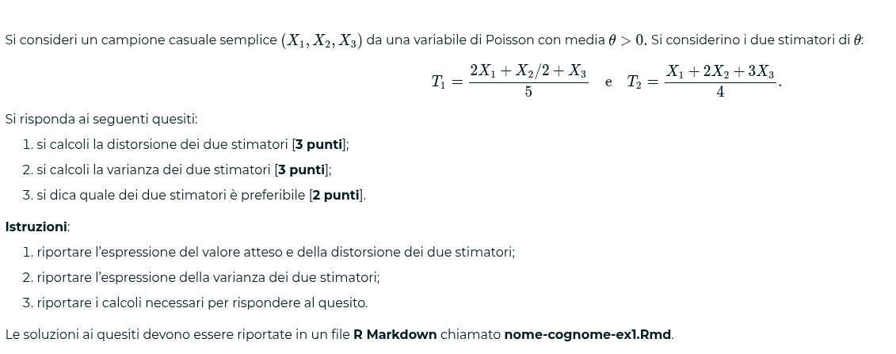
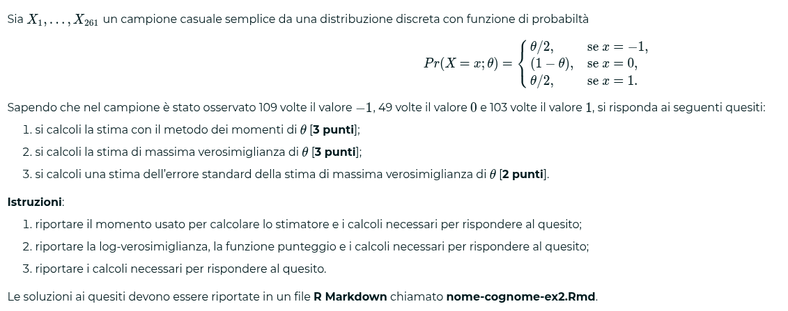
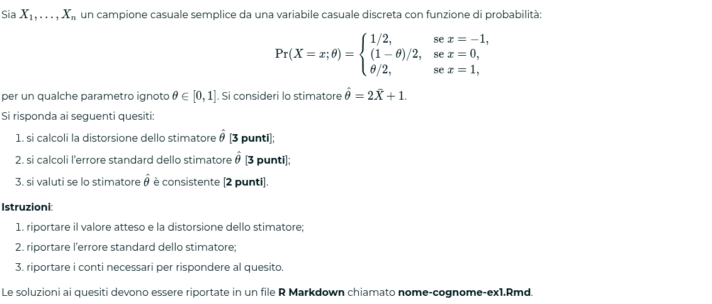
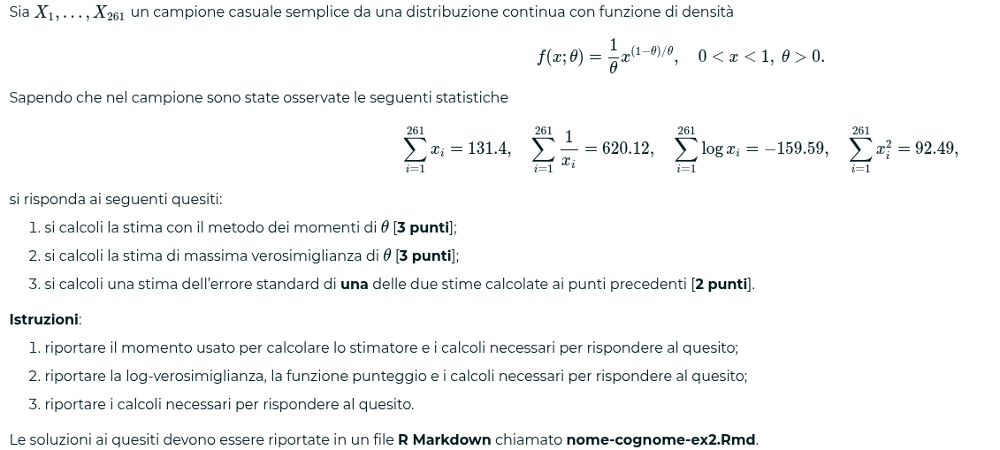
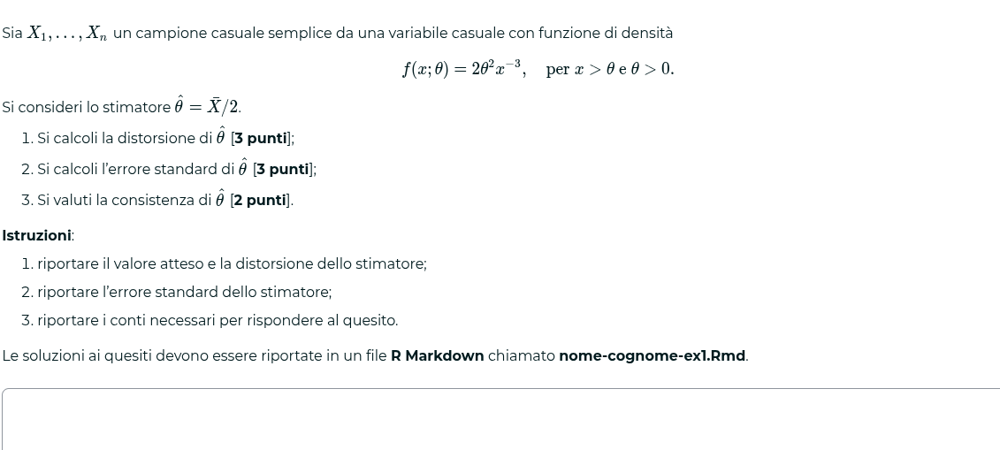
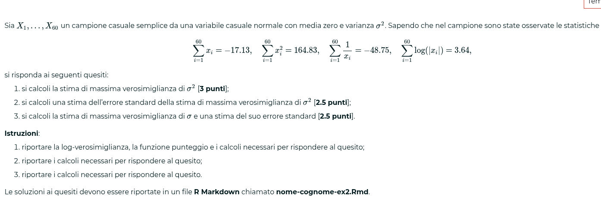

### Esercizi unità 1
1. Valore atteso == valore lineare, somma dei valori attesi
$$T = \frac{1}{n-2}\sum_{i=1}^n X_i$$

distorsione T
$$E(T) - \mu = \frac{n}{n-2}\mu - \mu = \frac{2\mu}{n - 2}$$

varianza T
$$Var(T)= Var(\frac{x_1}{n-2}+\frac{x_2}{n-2}+...+\frac{x_n}{n-2})$$

da qui si arriva a:
$$Var(T) = \frac{3n}{(n-2)^2}$$
Stimatore consistente perché:
- La distorsione converge a zero al crescere della dimensione campionaria
- La varianza converge a zero al crescere della dimensione campionaria
	- Siamo contenti perché  sparisce avente il denominatore maggiore del numeratore

2. Campione di dimensione 3
$$T_1 = \frac{1}{4}X_1+\frac{1}{2}X_2+\frac{1}{4}X_3$$
$$T_2 = \bar{X}$$

Quale dei due stimatori è preferibile?
si trovano le due varianze:
$$E(T_1) = \frac{\mu}{4}+\frac{\mu}{2}+\frac{\mu}{4}=\mu$$
$$Var(T_1) = \frac{6}{16} = \frac{3}{8}
$$
$$E(T_2) = \frac{\mu}{3}+\frac{\mu}{3}+\frac{\mu}{3}=\mu$$
$$Var(T_2) = \frac{1}{3}$$
(3 perché il testo dice varianza unitaria)

Si sceglie T2 per la sua varianza minore

3. media $\lambda > 0$ per Poisson, due stimatori di $\lambda$ :

$$T_1=\frac{2X_1+\frac{x_2}{2} + X_3}{5}$$
$$T_2=\frac{X_1+2X_2+3X_3}{4}$$
nel formulario è scritta media e varianza, fondamentali per risolvere l'esercizio
Calcolare valore atteso e varianze
$$E(T_1)=E(\frac{2}{5}\lambda+\frac{\lambda}{10}+\frac{\lambda}{5})=\frac{7}{10}\lambda$$
stesso per T2 uscendo
$$E(T_2)=\frac{3}{2}\lambda$$
basta studiare dentro le parentesi quadre per capire se è maggiore di zero
$\lambda > -\frac{0.665}{0.16}$ verrà sempre positiva perché lambda è maggiore di zero, quindi è meglio $T_1$, perché $T_2$ avrà sempre un errore quadratico medio maggiore

## Soluzione esercizio sopra

$$
E(T_1) = \frac{2}{5}E(X_1)+\frac{1}{10}E(X_2)+\frac{1}{5}E(X_3) = \frac{7}{10}\theta
$$
$$
E(T_2) = \frac{1}{4}E(X_1)+\frac{1}{2}E(X_2)+\frac{1}{4}E(X_3) = \frac{3}{2}\theta
$$
$$
Bias(T_1) = E(T_1) - \theta = \frac{7}{10}\theta - \theta = \frac{3}{10}\theta
$$
> lo stimatore è distorto

$$
Bias(T_2) = E(T_2) - \theta = \frac{3}{2}\theta - \theta = \frac{1}{2}\theta
$$

> lo stimatore è distorto

$$
Var(T_1) = \frac{2^2}{5^2}Var(X_1)+\frac{1}{10^2}Var(X_2)+\frac{1}{5^2}Var(X_3) = \frac{21}{100}\theta
$$

$$
Var(T_2) = \frac{1}{4^2}Var(X_1)+\frac{2^2}{4^2}Var(X_1)+\frac{3^2}{4^2}Var(X_1) = 
\frac{14}{16}\theta
$$

> entrambi gli stimatori sono distorti, devo utilizzare $MSE$

$$
MSE(T_1) = Bias^2(T_1) + Var(T_1) = \frac{9}{100}\theta^2 + \frac{21}{100}\theta
$$

$$
MSE(T_2) = Bias^2(T_2) + Var(T_2) = \frac{\theta^2}{4} + \frac{14}{16}\theta
$$

$$
MSE(T_2)-MSE(T_1) = \frac{\theta^2}{4} - \frac{9}{100}\theta^2 + \frac{14}{16}\theta - \frac{21}{100}\theta
$$

$$$$

