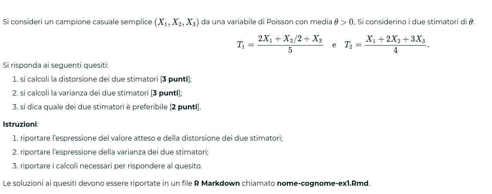
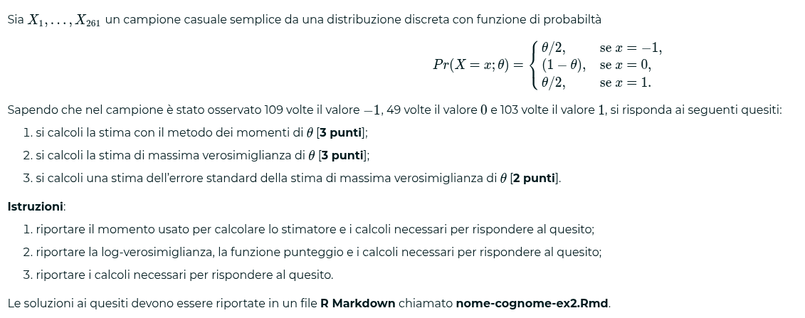
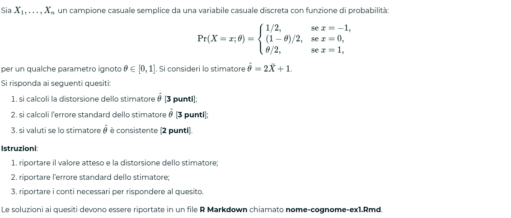
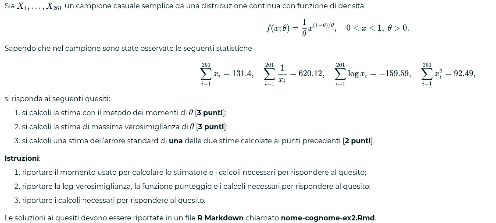
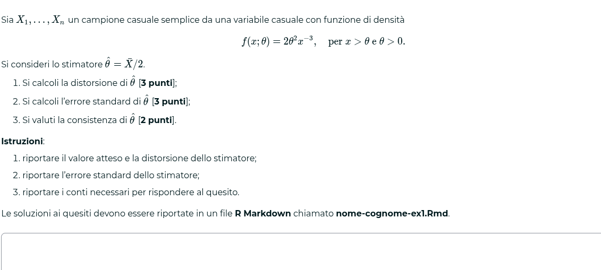
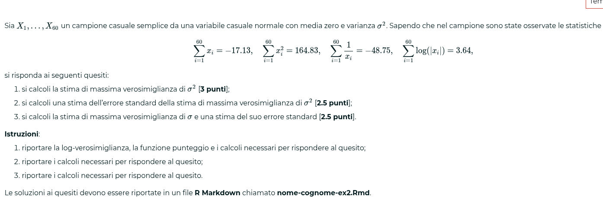

### Esercizi unità 1
1. Valore atteso == valore lineare, somma dei valori attesi
$$T = \frac{1}{n-2}\sum_{i=1}^n X_i$$

distorsione T
$$E(T) - \mu = \frac{n}{n-2}\mu - \mu = \frac{2\mu}{n - 2}$$

varianza T
$$Var(T)= Var(\frac{x_1}{n-2}+\frac{x_2}{n-2}+...+\frac{x_n}{n-2})$$

da qui si arriva a:
$$Var(T) = \frac{3n}{(n-2)^2}$$
Stimatore consistente perché:
- La distorsione converge a zero al crescere della dimensione campionaria
- La varianza converge a zero al crescere della dimensione campionaria
	- Siamo contenti perché  sparisce avente il denominatore maggiore del numeratore

2. Campione di dimensione 3
$$T_1 = \frac{1}{4}X_1+\frac{1}{2}X_2+\frac{1}{4}X_3$$
$$T_2 = \bar{X}$$

Quale dei due stimatori è preferibile?
si trovano le due varianze:
$$E(T_1) = \frac{\mu}{4}+\frac{\mu}{2}+\frac{\mu}{4}=\mu$$
$$Var(T_1) = \frac{6}{16} = \frac{3}{8}
$$
$$E(T_2) = \frac{\mu}{3}+\frac{\mu}{3}+\frac{\mu}{3}=\mu$$
$$Var(T_2) = \frac{1}{3}$$
(3 perché il testo dice varianza unitaria)

Si sceglie T2 per la sua varianza minore

3. media $\lambda > 0$ per Poisson, due stimatori di $\lambda$ :

$$T_1=\frac{2X_1+\frac{x_2}{2} + X_3}{5}$$
$$T_2=\frac{X_1+2X_2+3X_3}{4}$$
nel formulario è scritta media e varianza, fondamentali per risolvere l'esercizio
Calcolare valore atteso e varianze
$$E(T_1)=E(\frac{2}{5}\lambda+\frac{\lambda}{10}+\frac{\lambda}{5})=\frac{7}{10}\lambda$$
stesso per T2 uscendo
$$E(T_2)=\frac{3}{2}\lambda$$
basta studiare dentro le parentesi quadre per capire se è maggiore di zero
$\lambda > -\frac{0.665}{0.16}$ verrà sempre positiva perché lambda è maggiore di zero, quindi è meglio $T_1$, perché $T_2$ avrà sempre un errore quadratico medio maggiore

## Soluzione esercizio sopra

$$
E(T_1) = \frac{2}{5}E(X_1)+\frac{1}{10}E(X_2)+\frac{1}{5}E(X_3) = \frac{7}{10}\theta
$$
$$
E(T_2) = \frac{1}{4}E(X_1)+\frac{1}{2}E(X_2)+\frac{1}{4}E(X_3) = \frac{3}{2}\theta
$$
$$
Bias(T_1) = E(T_1) - \theta = \frac{7}{10}\theta - \theta = \frac{3}{10}\theta
$$
> lo stimatore è distorto

$$
Bias(T_2) = E(T_2) - \theta = \frac{3}{2}\theta - \theta = \frac{1}{2}\theta
$$

> lo stimatore è distorto

$$
Var(T_1) = \frac{2^2}{5^2}Var(X_1)+\frac{1}{10^2}Var(X_2)+\frac{1}{5^2}Var(X_3) = \frac{21}{100}\theta
$$

$$
Var(T_2) = \frac{1}{4^2}Var(X_1)+\frac{2^2}{4^2}Var(X_1)+\frac{3^2}{4^2}Var(X_1) = 
\frac{14}{16}\theta
$$

> entrambi gli stimatori sono distorti, devo utilizzare $MSE$

$$
MSE(T_1) = Bias^2(T_1) + Var(T_1) = \frac{9}{100}\theta^2 + \frac{21}{100}\theta
$$

$$
MSE(T_2) = Bias^2(T_2) + Var(T_2) = \frac{\theta^2}{4} + \frac{14}{16}\theta
$$

$$
MSE(T_2)-MSE(T_1) = \frac{\theta^2}{4} - \frac{9}{100}\theta^2 + \frac{14}{16}\theta - \frac{21}{100}\theta
$$

## Soluzione esercizio sopra

> Si chiede di calcolare la stima con metodo dei momenti e massima verosimiglianza.

> Si chiede inoltre la stima dell'errore standard della stima di massima verosimiglianza di $\theta$

**Nota bene** 
---
> L'esercizio richiede la stima, non lo stimatore. Si sta cercando un vero e proprio valore!!

$$
\text{Stima con metodo dei momenti}:

$$

## Soluzione esercizio sopra

> Il primo punto chiede di calcolare la distorsione dello stimatore, per cui dobbiamo trovare media e varianza dello stimatore
$$
T = 2\bar X + 1\\
E(T) = 1 + 2 \sum_{i=1}^n E(X_i) = \\ 2(-1\frac{1}{2} + \frac{1-\theta}{2}0 + 1\frac{\theta}{2}) +1 = \\ 2 (-\frac{1}{2} + \frac{\theta}{2}) + 1 = \\  = 1-1+ \theta = \theta
$$

> il nostro stimatore quindi non è distorto

>Calcoliamo ora invece l'errore standard del nostro stimatore

$$
SE(T) = \sqrt{Var(T)} = \sqrt{Var(2\bar X + 1)} = \text{cerco VAR} \\
VAR(T) = Var(2\bar X + 1) = 4 Var(\bar X + 1) - E[X]^2 = \text{VAR(1) = 0 quindi:} \\
Var(T) = 4(1/2 *1 + 0 + \frac{\theta}{2} * 1 - E[X]^2) = 4(\frac{1+\theta}{2} - (\frac{\theta-1}{2})^2) = \\ 4(\frac{1+\theta}{2}-\frac{\theta^2 + 1 -2\theta}{4}) = \\
4(\frac{2+2\theta - \theta^2 - 1 +2\theta}{4n}) = \frac{1 - \theta^2 +4\theta}{n}\\
\text{arrivati a questo punto calcoliamo l'SE:} \\
\sqrt(\frac{1 - \theta^2 +4\theta}{n}) = \text{errore standard stimatore}
$$

> Sottollineo che lo stimatore è consistente asintoticamente

## Soluzione esercizio sopra

> Si calcoli inizialmente $\theta$ con il metodo dei momenti

$$
\text{come primo passo troviamo $E[X]$ risolvendo l'integrale * x}
E[X] = \int_{-1}^{1} x f(x) dx = \\ \int x\frac{1}{\theta}x^{\frac{1-\theta}{\theta}}  = \\ \frac{1}{\theta} \int x^{1+\frac{1-\theta}{\theta}} dx = \\ \frac{1}{\theta} \int x^{\frac{1}{\theta}} dx = \\
\frac{1}{\frac{1}{\theta}+1} = \frac{1}{\frac{1+\theta}{\theta}}
\\
\frac{1}{\theta} \frac{1}{\frac{1+\theta}{\theta}} = \frac{1}{1+\theta} \\
\theta = \frac{1-E[X]}{E[X]} = \\
\hat \theta = \frac{1-\bar X}{\bar X} \\
\text{estraendo i dati dal testo troviamo che la stima si trova con:} \\
(1-\frac{131.4}{261})\frac{261}{131.4}\\
$$

> Si calcola ora la stima con massima verosimiglianza

## Test di Codeium

Si consideri un campione casuale semplice (X1,X2,X3)
 da una variabile di Poisson con media θ>0.
 Si considerino i due stimatori di θ
:
$T1=2X1+X2/2+X35eT2=X1+2X2+3X34.$

Si risponda ai seguenti quesiti:

si calcoli la distorsione dei due stimatori [3 punti];

$$
Bias(T_1) = E(T_1) - \theta = \frac{7}{10}\theta - \theta = \frac{3}{10}\theta

Bias(T_2) = E(T_2) - \theta = \frac{3}{2}\theta - \theta = \frac{1}{2}\theta
$$

si calcoli la varianza dei due stimatori [3 punti];

$$

Var(T_1) = \frac{2^2}{5^2}Var(X_1)+\frac{1}{10^2}Var(X_2)+\frac{1}{5^2}Var(X_3) = \frac{21}{100}\theta
$$
$$
Var(T_2) = \frac{1}{4^2}Var(X_1)+\frac{2^2}{4^2}Var(X_1)+\frac{3^2}{4^2}Var(X_1) = 
\frac{14}{16}\theta
$$

si dica quale dei due stimatori è preferibile [2 punti].

## FIne test precedente

