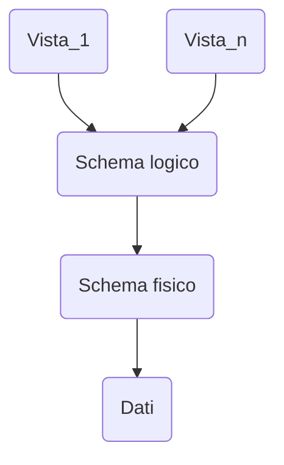
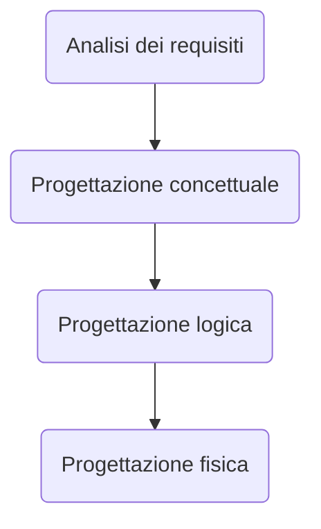
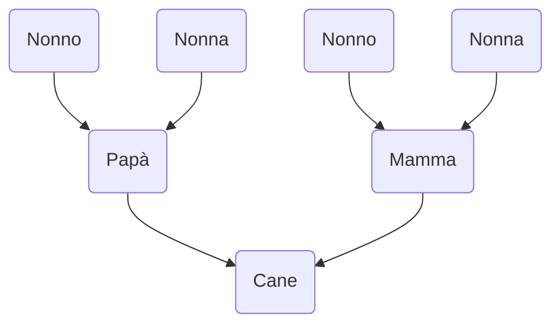

### Definizione Basi di dati
[[Triennale/Basi di Dati/1.SistemiAle.pdf|1.SistemiAle]]
Una base di dati è un insieme di dati permanenti, gestiti da un elaboratore,  suddivisi in metadati che ne definiscono la struttura,scheda del DB e i dati effettivi conformi alla struttura
### Definizione DBMS
Sistema  centralizzato o distribuito che offre linguaggi per:
- definire lo schema
- scegliere le strutture dati
- memorizzare, recuperare e modificare il dato
#### Esempi definizione DB
- Schema vuoto
```sql
CREATE DATABASE EsempioEsami;
```
- Definizione schema:
```sql
CREATE TABLE Studenti (
	Nome char(8),
	Matricola int NOT NULL,
	Città char(10),
	AnnoNascita int,
	PRIMARY KEY (Matricola)
);

CREATE TABLE ProveEsami (
	Materia char(5),
	Matricola int,
	Data char(8),
	Voto int,
	Lode char(1),
	PRIMARY KEY (Materia, Matricola)
);

ecc...
```
- Inserzione di dati
```sql
INSERT INTO ProveEsami VALUES ('BD', 71523, '28.12.06', 30, 'S');
```
- Interrogazione
```sql
SELECT Matricola
FROM ProveEsami
WHERE Materia = 'BD' AND Voto = 30;
```

### DDL
Tre diversi livelli di descrizione dei dati (schemi):
- Vista logica
- Logico
- Fisico

#### Livello Vista logica
Descrive come deve apparire la struttura della base di dati ad una certa applicazione (schema esterno o vista)
Esempio:
- InfCorsi(IdeC char(8), Titolo char(20), NumEsami int) 
```sql
CREATE VIEW InfCorsi (IdeC, Titolo, NumEsami) AS 
		SELECT IdeC, 
			  Titolo, 
			  COUNT(*) 
		FROM Corsi NATURAL JOIN Esami 
		GROUP BY IdeC, Titolo;
```
#### Livello Logico
Descrive la struttura degli insiemi di dati e delle relazioni
Esempio:
- Studenti(Matricola int, Nome char(20), Login char(8), AnnoNascita int, Reddito real ) 
- Corsi(IdeC char(8), Titolo char(20), Credito int ) 
- Esami(Matricola int, IdeC char(8), Voto int )
#### Livello fisico
Descrive lo schema fisico, ovvero come vanno organizzati fisicamente i dati e definisce strutture dati ausiliare per l'uso (es. indici)
- Studenti organizzata in modo sequenziale con indice
```sql
CREATE INDEX Indice ON Studenti(Matricola);
```
### DML
- Utenti non programmatori
	- Interfaccia grafica per accedere ai dati
	- Linguaggio di interrogazione
- Utenti programmatori
	- Linguaggio convenzionale + librerie predefinite
	- Linguaggio esteso per marcare i comandi SQL, necessita di un pre-compilatore per interpretare le query
	- Linguaggio integrato disegnato ad-hoc per usare SQL, con comandi controllati staticamente dal traduttore ed eseguiti dal DBMS
### DBMS: controllo dei dati
- Meccanismi offerti per garantire 
	- Integrità
	- Sicurezza
		- Restrizione dell'accesso ai soli utenti autorizzati
		- Limitazione delle operazioni eseguibili
	- Affidabilità
		- Protezione da interferenze dovuto ad accessi concorrenti
		- Malfunzionamenti hw e sw
### DBMS: transazioni
Una transazione è una sequenza di azioni di lettura e scrittura in memoria permanente e di elaborazioni di dati in memoria temporaneam con le seguenti proprietà:
- Atomicità ovvero terminando prematuramente vengono trattate come non fossero mai iniziate
- Serializzabilità se vengono eseguite concorrentemente più transazioni, l'effetto è quello di un'esecuzione seriale
- Persistenza Le modifiche al DB di una transazione terminata sono permanenti, non alterabili da eventuali malfunzionamenti
### DBMS: controllo dei dati
Protezione da interferenze indesiderate tra accessi concorrenti ai dati e da malfunzionamenti hw o sw, questi ultimi gestiti con journal e copie di sicurezza
### Modelli informatici
> Un **modello astratto** è la rappresentazione formale di idee e conoscenze a un fenomeno
- Aspetti di un modello
	- Il modello rappresenta certi fatti
	- Rappresentazione data con un linguaggio formale
	- Modello <-- Risultato processo di interpretazione


#### Modellazione concettuale
- Cosa si modella?
	- Conoscenza concreta (fatti)
	- Conoscenza astratta (Struttura e vincoli sulla conoscenza concreta)
	- Conoscenza procedurale (operazioni base/degli utenti)
	- Comunicazioni (Come si comunicherà con il sistema informatico)
##### Conoscenza concreta
- Fatti specifici che si vogliono rappresentare
	- Entità con le loro proprietà
		- Ciò di cui interessa rappresentare i fatti
		- Le proprietà sono fatti che interessano perché descrivono caratteristiche di determinate entità
			- **Classificazione delle proprietà**
			- atomica o strutturata 
			- univoca / multivalore
			- totale / parziale
		- Ogni entità ha un tipo che ne specifica la natura, identifica proprietà e dominio relativo
			- Es. **Antonio** ha tipo *Persona* con proprietà:
				- Nome: *string*
				- Indirizzo: *string*
	- Collezioni di entità omogenee
		- Es. **Studenti**: insieme di tutti gli studenti nel dominio del corso
		- Spesso sono organizzate in una gerarchia di specializzazione/generalizzazione (si parla anche sottoclassi e superclassi)
			- Es. Nel DB la collezione *Utenti* può essere considerata una generalizzazione di *Studenti* e *Docenti*
			- Importanti caratteristiche di una gerarchia:
				- Ereditarietà (delle proprietà)
				- Inclusione (se la collezione C1 specializza C2, gli elementi di C1 sono un sottoinsieme degli elementi di C2)
	- Associazioni fra entità
		- Un fatto che correla due o più entità, stabilendo un legame logico tra loro
			- Es. L'utente *Utente* **HA IN PRESTITO** una copia della "Divina commedia"
		- Un'associazione R(X,Y) fra due collezioni di entità X e Y è un insieme di istanze di associazione tra elementi di X e Y, che varia in generale nel tempo.Il prodotto cartesiano X\*Y è detto dominio dell'associazione
		- Possiede le seguenti proprietà:
			- molteplicità o cardinalità
				- Un'associazione R(X,Y) è **univoca da X a Y** se per ogni elemento x di X esiste al più un elemento di Y che è associato ad X; se non vale, l'associazione è **multivalore da X a Y**
				- Cardinalità:
					- R(X,Y) è (1:N) se essa è **multivalore** da X a Y ed **univoca** da Y a X
					- R(X,Y) è (N:1) se essa è **univoca** da X a Y e **multivalore** da Y a X
					- R(X,Y) è (N:M) se essa è **multivalore** da X a Y e **multivalore** da Y a X
					- R(X,Y) è (1:1): se essa è **univoca** su da X a Y e **univoca** da Y a X
				- Es. Cardinalità:
					- *Frequenta*(Studenti, Corsi) ha molteplicità (N:M) 
					- *Insegna*(Professori, Corsi) ha molteplicità (1:N)
					- *SuperatoDa*(Esami, Studenti) ha molteplicità (N:1)
					- *Dirige*(Professori, Dipartimenti) ha molteplicità (1:1)
			- totalità
				- Un'associazione R(X,Y) è **totale da X a Y** se per ogni elemento x di X esiste almeno un elemento di Y che è associato ad X; se non vale, l'associazione è **parziale da X a Y**
##### Conoscenza astratta
- Vincoli di integrità statici
	- Definiscono delle condizioni sui valori della conoscenza concreta che devono essere soddisfatte indipendentemente da come evolve l'universo del discorso
- Vincoli di integrità dinamici
	- Definiscono delle condizioni sul modo in cui la conoscenza concreta può evolvere nel tempo
- Fatti derivabili
	- Arrivano da altre fonti, come l'età di una persona, la quale si ricava per differenza fra l'anno attuale e il suo anno di nascita

#### Modello dei dati a oggetti
> Un modello dei dati è un insieme di meccanismi di astrazione per descrivere la struttura della conoscenza concreta (schema). Uno schema verrà dato usando una notazione grafica, variante dei cosiddetti diagrammi ER
> **TERMINOLOGIA**:
> - entità ==> oggetto
> - tipo entità ==> tipo oggetto
> - collezione ==> classe
> - associazione ==> associazione/relazione

- Ad ogni entità del dominio corrisponde un oggetto, composto da stato(variabili/costanti) comportamento(metodi) e identità, capace di rispondere a richieste chiamate messaggi, restituendo valori memorizzati nello stato o calcolati tramite procedura locale
- **CLASSI**: insieme di oggetti dello stesso tipo, modificabile con operatori per includere o estrarre elementi dall'insieme, associabile a vincoli di integrità ![[Pasted image 20231119103954.png]]
- Gli attributi(Nome, Cognome, ...) possono essere: 
	- Primitivi (*int, real, bool, date, string*)
	- Non primitivi
- Le associazioni:
	- Possono avere proprietà
	- Possono essere **Ricorsive**
	- Associazioni n-arie
![[Pasted image 20231119104253.png]]
- Esempio di associazione:![[Pasted image 20231119104327.png]]
- Ereditarietà:
	- Permette di definire un tipo di oggetto a partire da un altro "per differenza", come aggiunta di attributi e/o ridefinizione di attributi esistenti
	- Normalmente si usa solo per definire sottotipi
	- ![[Pasted image 20231119104721.png]]
- Questo principio di eredità si manifesta appunto anche nelle definizioni delle classi![[Pasted image 20231119104858.png]]
- Vincoli su sottoclassi:
![[Pasted image 20231119105325.png]]![[Pasted image 20231119105338.png]]

### DESCRIZIONE DI UN CASO, ESEMPIO SLIDE 2.ModelliAle
![[Pasted image 20231119105512.png]]![[Pasted image 20231119105521.png]]![[Pasted image 20231119105538.png]]![[Pasted image 20231119105635.png]]![[Pasted image 20231119105549.png]]![[Pasted image 20231119105656.png]]
#### EXTRA
![[Pasted image 20231119105825.png]]
### Progettazione Logica
- Collezioni come relazioni
- Associazioni tramite chiavi
- Vincoli di integrità
	- Chiavi
		- Superchiave (sottoinsieme di attributi)
		- Chiave (superchiave minimale)
		- Chiave primaria (una delle chiavi, lunghezza minima)
			- Relazioni a classi radice ==> attributo univoco o artificiale
			- Relazioni a sottoclassi ==> chiave della superclasse
			- Relazioni per associazioni N:M ==> concatenazione delle chiavi esterne
		- Indicate con <\<CK>>, valori non nulli
	- Chiavi esterne
		- Può essere nulla solo in caso di associazione parziale
	- Valori non nulli
		- Si possono imporre
### Schemi a oggetti -> Schemi relazionali
- Trasformazione per passi:
	- Associazioni molti a uno/uno a uno
	- Associazioni molti a molti
	- Gerarchie di inclusione
	- Identificazione chiavi primarie
	- Attributi multivalore
	- Attributi composti
![[Pasted image 20231119154238.png]]![[Pasted image 20231119154300.png]]![[Pasted image 20231119154313.png]]![[Pasted image 20231119154326.png]]![[Pasted image 20231119154400.png]]![[Pasted image 20231119154418.png]]![[Pasted image 20231119154432.png]]![[Pasted image 20231119154444.png]]![[Pasted image 20231119154514.png]]
### Algebra Relazionale


### Operatori insiemistici ed espressioni regolari
- Prestare molta attenzione al tipo, se le operazioni vengono fatte tra tipi diversi, esse non sono possibili
- Operazioni:
	- **UNION**
	- **INTERSECT**
	- **EXCEPT** (Differenza)
- Esempi:
	- **SELECT** Nome, Cognome, Matricola **FROM** Studenti **WHERE** Provincia='VE' **UNION** **SELECT** Nome, Cognome, Matricola **FROM** Studenti **JOIN** Esami **ON** Matricola=Candidato **WHERE** Voto>28
	- **SELECT** Matricola **FROM** Studenti **EXCEPT** **SELECT** Tutor **AS** Matricola **FROM** Studenti
	- Posso usare EXCEPT **ALL**, in questo modo i duplicati non vengono rimossi
	- **IS** per verificare che sia il valore **NULL**, non voglio usare l'uguale, torna unknown!!
	- **SELECT** Nome, Cognome, Matricola **FROM** Studenti **JOIN** Esami **ON** Matricola=Candidato **WHERE** Voto = 18 **INTERSECT ALL** **SELECT** Nome, Cognome, Matricola **FROM** Studenti **JOIN** Esami **ON** Matricola=Candidato **WHERE** Voto=30 
	  
	  (Restituisce il minimo tra le due **SELECT**, le due query)
	-  **SELECT DISTINCT** Nome, Cognome, Matricola **FROM** Studenti **JOIN** Esami **ON** Matricola = Candidato **JOIN** Esami **ON** Matricola = Candidato **WHERE** Voto = 18 **AND** Voto = 30 (Serve per forza la doppia join, sto usando i valori dentro la doppia condizione, non posso farlo sempre sulla stessa tabella, corrisponde ai valori doppi )
	- **SELECT** Nome, Cognome, Matricola **FROM** Studenti **WHERE** Nome **LIKE** 'A_%'
		- % = 0 o più caratteri possibili
		- _ = un carattere qualsiasi 
		- A = lettera iniziale
		- **LIKE** = operatore per eseguire il controllo a stringa
	- **SELECT** Nome, Cognome, Matricola **FROM** Studenti **WHERE** Nome **LIKE** 'A_%' **SELECT** Nome, Cognome, Matricola **FROM** Studenti **WHERE** Nome **LIKE** 'A%i' **OR** Nome **LIKE** 'A%a'

- Esempi di query
	- Studenti che vivono nella stessa provincia dello studente con matricola 71346, escluso lo studente stesso
```sql
SELECT * 
FROM Studenti 
WHERE Provincia = (SELECT Provincia 
					FROM Studenti 
					WHERE** Matricola='71346') 
	AND** Matricola <> '71346'
```

```sql
SELECT altri.* 
FROM Studenti s JOIN Studenti altri USING(Provincia) 
WHERE s.Matricola = 71346 AND
	altri.Matricola <> '71346'
```

- Query studenti con almeno un voto > 27
```sql
SELECT *
FROM Studenti s
WHERE EXISTS(SELECT 
			FROM Esami e
			WHERE e.voto > 27 AND e.Candidato = s.Matricola)
```

```sql
SELECT DISTINCT s.* --  distinct necessario per evitare ripetizioni
FROM Studenti s JOIN Esami e ON s.Matricola = e.Candidato
WHERE e.voto > 27
```

```sql
Exp Comp ANY (SottoSelect)
-- True quando un valore v restituito dalla sottoselect è in relazioni Comp con Exp
-- False se tutti i valori sono != NULL e non esiste un valore v tale che Exp Comp v sia vera
-- In particolare è false se sottoselect è vuota
-- È UNKNOWN se nella sottoselect ci sono valori NULL e per tutti i valori diversi da NULL e per tutti i valori v != NULL ExpComp è false

Exp Comp ALL (SottoSelect)
-- È true se tutti i valori della sottoselect sono != NULL e per ogni v del risultato della sottoselect Exp Comp v è vera
-- Se la sottoselect è vuota Exmp Comp rispetto ad essa è vera
-- È false se esiste un v risultato della sottoselect tale che Exp Comp v è false
-- È UNKNOWN se nella sottoselect ci sono valori NULL e per tutti i valori v != NULL Exp Comp v è true
```

- Gli Studenti che hanno preso solo 30 == Studenti dove non esiste un voto diverso da 30
```sql
SELECT *
FROM Studenti s
WHERE NOT EXISTS (SELECT *
				 FROM Esami e
				 WHERE e.Candidato = s.Matricola AND e.voto <> 30) -- diverso 30

-- Posso sostituire EXISTS con =ANY

SELECT *
FROM Studenti s
WHERE NOT(s.Matricola =ANY (SELECT *
				 FROM Esami e
				 WHERE e.voto <> 30)) -- diverso 30

SELECT *
FROM Studenti s
WHERE Matricola <> ALL(SELECT Candidato
					   FROM Esami 
					   WHERE voti <> 30)

```

- GROUP BY
```sql
SELECT s.Matricola
FROM Studenti s JOIN Esami e ON s.Matricola = e.Candidato
GROUP BY s.Matricola
HAVING MIN(e.Voto) = 30
```

- Per ogni materia, trovare il nome della materia e il voto medio degli esami in quella materia
```sql
SELECT
FROM Esami
GROUP BY Materia
HAVING Count(*) > 3
```

```sql
SELECT s.Cognome, AVG(e.Voto)
FROM Studenti s JOIn Esami e ON s.Matricola = e.Candidato
GROUP BY s.Matricola, s.Cognome
HAVING YEAR(Data) > 2006; -- non è possibile, Data non fa parte del group by
						  -- dove invece dovrebbe essere stata salvata
```

```sql
SELECT COALESCE(Tutor, "Non ha tutor"), COUNT(*)
FROM Studenti 
GROUP BY Tutor
```

```sql
CASE -- Un'espressione condizionale che può essere usata in qualsiasi contesto deve un'espressione è valida.

CASE WHEN condizione THEN risultato
	[WHEN ...]
	[ELSE risultatoDefault]
END

condizione che restituisce un booleano
```

##### Modifica dei dati
```sql 
INSERT INTO Tabella
VALUES (valoreA1, ..., valireAn),
	   (valoreB1, ..., valireBn),
	   ...

-- m può essere <del numero di attributi n (le restanti colonne o prendono il valore di default o NULL)

INSERT INTO StNomeCognome AS 
	   SELECT Nome, COgnome, FROM Studenti
```

```sql
DELETE FROM Tabella
WHERE Condizione

-- Esempio
DELETE FROM Studenti
WHERE Matricola NOT IN (SELECT Candidato
					   FROM Esami)
```

```sql
UPDATE Esami
SET voto = voto + 1
WHERE voto > 23 AND voto < 30
```

```sql
/*
1) Trovare il numero di voli internazionali che partono giovedì da Napoli
2) Cancellare gli aeroporti di cui non si conosce il numero di piste e i voli che hanno partenze o arrivi da questi aeroporti
3) Restituire le città francesi da cui partono più di venti voli alla settimana diretti in Italia
4) Restituire gli aeroporti italiani che hanno solo voli interni
	i) operatori insiemistici
	ii) sottoselect
*/

Aeroporti ( _Citt_, 
		   Nazioni, 
		   NumPiste)

Voli (_CodVolo_, 
	  _GiornoSett_, 
	  CittPart*, 
	  OraPart, 
	  CittArr*, 
	  OraArr, 
	  TipoAereo*) 
	  CittPart FK(Aeroporti) CittArr FK(Aeroporti) TipoAereoFK(Aerei)

Aerei (_TipoAereo_, 
	   NumPass, 
	   QtaMerci)

-- 1
SELECT COUNT(*)
FROM Voli v JOIN Aeroporti a ON v.CittArr = a.Citt
WHERE v.CittPArt = 'Napoli' 
	AND a.Nazione <> 'Italia' 
	AND v.GiornoSett = 'giovedì'

-- 2
-- Prima cancello voli, poi aeroporti, per evitare errori
DELETE FROM Voli
WHERE CittPart IN (SELECT Citt
				  FROM Aeroporti
				  WHERE NumPiste IS NULL)
	  OR CittArr IN (SELECT Citt
				  FROM Aeroporti
				  WHERE NumPiste IS NULL)

DELETE FROM Aeroporti
WHERE NumPiste IS NULL

-- 3
SELECT v.Citt
FROM Voli v JOIN Aeroporti p ON v.CittPart = p.Citt JOIN Aeroporti a ON v.CittArr = a.Citt
WHERE p.Nazione = 'Francia' AND a.Nazione = 'Italia'
GROUP BY v.CittPart HAVING COUNT(*) > 20

-- 4.i
SELECT Citt
FROM Aeroporti
WHERE Nazione = 'Italia'
EXCEPT
SELECT v.CittPart AS Citt -- altrimenti errore! RINOMINARE!!
FROM Voli v JOIN Aeroporti a ON v.CittArr = a.Citt
WHERE a.Nazione <> 'Italia'

-- 4.i
```

$$1)\gamma COUNT(*) (\sigma_{cittPart='Napoli \wedge GiornoSett=Giovedi--CittArr=Citt}(Voli) \bigcup \sigma_{Nazione<>'Italia'}(Aeroporti))$$

### DDL 

- SQL non è solo un linguaggio di interrogazione , ma anche un linguaggio per la definizione di basi di dati
	- Creazione della BD e della struttura logica delle tabelle
		- **CREATE SCHEMA** Nome **AUTHORIZATION** Utente
		- **CREATE TABLE/ VIEW**, con vincoli
	- vincoli di integrità
- Uno schema può essere creato con:
	- ![[Pasted image 20231204140714.png]]
- Uno schema può contenere varie tabelle delle quali esistono più tipi:
	- Tabelle base
		- I metadati appartengono allo schema
		- I dati sono fisicamente memorizzati
	- Viste
		- I metadati sono presenti nello schema
		- I dati non sono fisicamente memorizzati
- #### Creazione di una tabella
- ![[Pasted image 20231204141255.png]]
- Tipi di dati atomici:
- ![[Pasted image 20231204142004.png]]


### Viste ed Interrogazioni difficili
- 
- ![[Pasted image 20231211160647.png]]


```sql
create view StessaRazza (Idf, Padre, Madre, Razza)
as select f.Cod, p.Cod, m.Cod, f.Razza
	from Cani f join Cani m on f.Madre = m.Cod join Cani p on f.Padre = p.Cod
	where f.Razza = m.Razza and f.Razza = p.Razza 

-- devo estrapolare il nome dalla lista sopra creata
select 
from StessaRazza c join StessaRazza m on c.Madre = m.Idf join StessaRazza p on c.Padre = p.Idf join Cani ca on c.Idf = ca.Cod
```
- ![[Pasted image 20231211161712.png]]
- ![[Pasted image 20231211163207.png]]
- Facendo il maggiore, salvo solo una delle due coppie

## Esercizi fatti a lezione, query
```sql
-- trovare ordini, pizze e nome cliente senza ripetizioni in ordine descrescente
select o.nomecliente, count(*) as numeroordini, count(distinct o.codpizza) as numeroPizze  
    from ordini o  
group by o.nomecliente  
order by numeroordini desc
```

```sql
select pi.codpizza, pi.nome, pi.tempoprep  
    from pizze pi natural join ricette r  
where not exists(select *  
                     from ricette r1 natural join ingredienti i  
                     where i.nome like 'Funghi%' and pi.codpizza = r1.codpizza)  
group by pi.codpizza, pi.nome, pi.tempoprep  
having count(*) >= 4
```