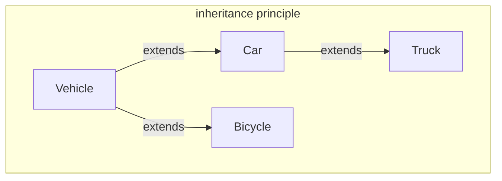

## Encapsulation

The idea behind encapsulation is to create a good organization structure behind the code of classes and methods in order to perform as well as possible without occur in issues of data access. You need to ask yourself how and where put the data that you use for your class, who use the data/methods in order to perform inside the code ecc. 
This output reports to us the type of error that occured (a NullPointerException), where (line 102 of file Car.java), and the stack of method calls (main called accelerate at line 119 of Car.java). Therefore, exceptions allow us to distinguish between different types of runtime errors. Errors are represented through standard Java classes that implement some specific functionalities.
The other concept is that in Java, which is an object oriented programming language, you shouldn't think at the code as an unique block, but as a separated smaller units, all for a better and easier maintenance of the code.

## Information Hiding
That concept follow the problem of: how can i hide the implementation of class and methods to the final user? In order to do that, you need to provide some mechanism to hide components. In that way, the user doesn't need to see how the implementation works, he needs just to watch the interface provided. This approach brings to various benefits as:
1. The dependencies between different components are minimized
2. A user can see only the components that were intended to be the interface of the piece of the software, and not its implementation details, so that he needs just to explore the interface components in order to understand how the code could be use
3. We can change the code behind the components without the need to consider how it is used.

To perform the information hiding Java provides the access modifiers:

| | same class |  same package |  subclasses | Everywhere | 
-------------:|----------------:|------------:|--------------:|--------------:|
public  | 🤝 | 🤝| 🤝| 🤝|
protected | 🤝 | 🤝| 🤝| ✋|
\<default\> | 🤝 | 🤝| ✋| ✋|
private | 🤝 | ✋| ✋| ✋|

💡 Usually the variable inside a class are all private, but it could depends by the implementation inside the code. For example:

```java
class A {
	private int private_field;
	int foo(A a){
		return this.private_field + a.private_field;
	}
}
```

Has you can see in the snipped code the private modifier is correctly executed 'cause it applies at class level

### Getters and Setters
To access at the fields inside a class, if it's private, there are hoc methods that allow to read and write fields values called Getters and Setters.
For example:

```java
class FuelTank { 
	public FuelType getFuelType() { 
		return this.type; 
	} 
	
	public double getAmount() { // Getter 
		return this.amount; 
	} 
	
	public void emptyTank() { // Setter
		this.amount = 0; 
	}
}
```


## Comments as Documentation

Java, for a better comprehension of the code, gives at programmers a special comment syntax to describe the code: as
- `@author`: to specify who wrote the class
- `@since` : to specify since which version of the software the class has been present
- `@version`: to specify the current version of the class
- `@param <name>`: to document a specific method parameter
- `@return`: to specify what a method return

- `@requires`: to specify what a method need in input in order to perform correctly
	- That is for precondition inside Design by Contract
- `@ensure`: to specify what a method should return
	-  That is for postcondition inside Design by Contract
- `@invariant`: to specify what is always true inside the class
	-  That is for object invariants inside Design by Contract

## Artifacts
An artifact is the result of the compilation and build of a program. An artifact usually encapsulates several packages together, it can be downloaded and installed. The idea of such an artifact is that a developer might load it inside his/her Java application, and use our classes as a library. The Java Development Kit for example, provides a utility (jar.exe) that allows to pack together several .class files into a unique jar archive. A jar file is nothing else than a zipped file containing all the .class file obtained by the compilation of our source code, all the resource files, and a manifest file (file with information about the code like the version of the jar, its vendor, Creator ecc.). 
## Design by Contracts

A contract in Java is the agreement between user and programmer about what the programmers has the right of receiving in input from the user, and his obligation to providing back the results of the computation as specified by the capsule APIs (e.g., method signature) and the documentation provided. 

An example could be:
```java
class Car{
	void refuel(Fueltank tank){ ... }
	void accelerate(double a){ ... }
	void fullBrake(){ ... }
	void brake(double amount){ ... }
}
```

The interface of this class establishes a contract where the client has a class Car with four methods available. each method defines what it requires and what it ensures. We might see the name of the method as a part of the contract, so for instance we might infer that after we invoke method `fullBrake` on a `Car`, the `Car` is not moving ahead anymore.

## Overriding and Overloading

difference between signature of a method and declaration of a method:
- signature contains just the name and the parameters passed with their type.
- declaration contain even return type, exception ecc.

Overloading means that the same class defines several methods with the same name but different signatures. This is possible since when calling the method the runtime environment will be able to decide exactly what method to execute.

Overloading example:

```java
public class Vehicle { 
	public void accelerate(double a) { 
		if(a>0) 
			this.speed += a; 
	} 
	
	public void accelerate(String a) { 
		if(a>0) 
			this.speed += Double.valueOf(a); 
	} 
}
```

The signatures are different, look at the parameters passed. The meaning of overloading is to have the same function with different implementation based on the source code.

we talk about override instead  when a class implements a method with the same signature of another method already implemented in a super class. Remember that overriding inside the same class is not possible, it is just between a child class and its super class.

## Abstract
In Java is a keyword that allows one to define a method without providing its implementation. However, if a class contain abstract methods cannot be instantiated, as otherwise the abstract method is invoked in the object instance of the class. Therefore, if a class contains at least one abstract method, then the class itself must be abstract. A class extending an abstract class, can either override all the abstract methods or be abstract.

Here is an example:

```java
public abstract class Vehicle { 
	protected double speed; 
	public abstract void accelerate(double a); 
} 

public class Car extends Vehicle { 
	public void accelerate(double amount) { 
		double fuelConsumed = amount*fuelType.getLitresPerKmH()); 
		if(fuelConsumed < fuel) { 
			this.speed += amount; 
			fuel = fuel - fuelConsumed; 
		} else { 
			this.speed += fuel / fuelType.getLitresPerKmH(); 
			fuel = 0; 
		} 
	}
}

public class Bicycle extends Vehicle { 
	public void accelerate(double a) { 
		if(a>0) this.speed += a;
	} 
}
```

## Final
Final is a keyword for declare a class, a field or a method without let someone change it after it's declare. In the case of methods, it doesn't let operation like overriding, while talking about classes it doesn't let a class to be extended. This is usually used in classes just when our class contains the ultimate implementation of the object we want to represent

```java
// Use of final in Java

final int numero = 10; // field

public final void accelerate(double amount) { ... } // method

public final class Bicycle extends Vehicle { ... } // class
```

## Aggregation and inheritance
  
Inheritance and aggregation are fundamental concepts in object-oriented programming (OOP) used to model relationships between objects in Java. They represent different ways to establish connections between classes. Here's a breakdown of each:

**Inheritance**

- Represents an "is-a" relationship. A subclass inherits attributes and methods from its parent class.
- Subclass becomes a specialized version of the parent class, extending its functionality.
- Follows the Liskov Substitution Principle, meaning a subclass object should be interchangeable with a parent class object without affecting program correctness.

**Aggregation**

- Represents a "has-a" relationship. A class contains an object of another class as a member variable.
- Establishes a looser coupling between objects compared to inheritance.
- The containing object can access the member object's attributes and methods.
- Lifetime of the member object is independent of the containing object in most cases (unlike composition, a stronger form of aggregation).

**Choosing Between Inheritance and Aggregation**

- Use inheritance when the subclass truly "is-a" type of the parent class and shares most functionalities.
- Use aggregation for a "has-a" relationship where the containing object can work independently of the member object.

**They can be used together:**

Inheritance and aggregation can coexist. A subclass can inherit from a parent class and also have member objects of other classes.

Here's an example:

```java
class Car {
  public void drive() {
    // ...
  }
}

class Engine {
  public void start() {
    // ...
  }
}

class SportsCar extends Car { // Inheritance
  private Engine engine; // Aggregation

  public SportsCar(Engine engine) {
    this.engine = engine;
  }

  @Override
  public void drive() {
    engine.start(); // Accessing member object's method
    super.drive(); // Calling inherited method
  }
}

```

In this example, `SportsCar` inherits from `Car` and also has an `Engine` object as a member variable. It demonstrates both inheritance ("is-a Car") and aggregation ("has-a Engine").

## Subtyping
It's the principle of have a class that provides the same components of the super classes, maybe redefining their behavior, and it potentially adds some more components.

**The substitution principle**

It simply states that if a class C1 exposes an interface that is wider than C2, then we can have instances of C1 wherever an instance of C2 is expected. For wider we mean that the interface of C1 defines all the fields and methods of C2, plus something else.

```java
public class Race { 
/** 
* 
* @param v1 the first vehicle 
* @param v2 the second vehicle 
* @param length the length of the race 
* @return the id of the winner of the race, or -1 
* 
*/ 

public static int race(Vehicle v1, Vehicle v2, double length) { 
	v1.fullBrake(); 
	v2.fullBrake(); 
	double distancev1 = 0, distancev2 = 0; 
	while(distancev1 < length && distancev2 < length) { 
		v1.accelerate(Math.random()*10.0); 
		v2.accelerate(Math.random()*10.0); 
		distancev1 += v1.getSpeed(); 
		distancev2 += v2.getSpeed(); 
	} 
	
	if(distancev1 >= length) { 
		if(distancev2 >= length) 
			return -1; 
		else 
			return 1; 
	} else 
		return 2; 
	} 
}
```

```java
Car myCar = new Car(0, new FuelType("diesel", 1.4, 0.01)); Bicycle myBicycle = new Bicycle(10); 
Truck myTruck = new Truck(0, diesel); 
myCar.refuel(new FuelTank(diesel, 2)); 
myTruck.refuel(new FuelTank(diesel, 3)); 
Race.race(myBicycle, myCar, 100); 
Race.race(myBicycle, myTruck, 100);
```

This .race() method is a perfect example of what wider means. As you can see, the methods expect as parameter two vehicles, but when we call it from the `Race` object, we pass it a `Bicycle` and a `Car/Truck`. That is possible for the principle of subtyping and inheritance.



## Polymorphism
It is defined as "the quality or state of existing in or assuming different forms". Such a concept is applied to several different areas, but in computer science, it means that the same symbol might represent different implementation based on a specific execution of a program. The subtype relation enables polymorphism, in fact when our code invockes a method, the static type checker validates that the static type of the expression used as receiver of the invocation contains the invoked method. Instead at runtime our code might receive a subclass of the static type we declared, and such subclass might override the method we are invoking, redefining its implementation and behavior

**Static and Dynamic type**

inside our programs we have two distinct types: static type, declared or inferred by the compiler, and a dynamic type, the concrete type of the expression when the program is running.
Remember that the dynamic type is always the same type or a subtype of the static type.

One might want to check the dynamic type of an expression, and cast a variable to some given types. Java supports this through
- `<expression> instanceof <type>`
- `(<type>) <expression>`

For instance, let's imagine that we want to refuel a Car before starting the race, and race methods receives two vehicles as parameter, than can be car or not. We can add this functionality as follows

```java
public static int race(Vehicle v1, Vehicle v2, double length) { 
	v1.fullBrake(); 
	v2.fullBrake(); 
	
	if(v1 instanceof Car){
		Car c = (Car) v1;
		c.refuel(new FuelTank( ... ));
	}
	
	if(v2 instanceof Car){
		Car d = (Car) v2;
		d.refuel(new FuelTank( ... ));
	}
	
	double distancev1 = 0, distancev2 = 0; 
	while(distancev1 < length && distancev2 < length) { 
		v1.accelerate(Math.random()*10.0); 
		v2.accelerate(Math.random()*10.0); 
		distancev1 += v1.getSpeed(); 
		distancev2 += v2.getSpeed(); 
	} 
	
	if(distancev1 >= length) { 
		if(distancev2 >= length) 
			return -1; 
		else 
			return 1; 
	} else 
		return 2; 
	} 
}
```

- 💡Which method would be called if the casting is `Car c = (Car) v1;` and you pass a `Car` subclass? The method `refuel` of `Car` or the overridden by the subclass would be called?
	- *Spoiler: The subclass's method*

## Interfaces
It defines a list of public method signatures without providing an implementation for them. Like classes, it is declared in a Java file, it belongs to a package, and it defines a type we can use in our program. For instance, we can define an interface called `Loadable` that contains the methods that allow us to load and unload Trucks.

```java
package it.unive.dais.po1.vehicles;

public interface Loadable {
	public void chargeLoad(double amount);
	public double unload();
}
```

Classes can implement interfaces, as much as we want, while they can extend just one class. When a class implements an interface, it needs either to implement either all the method defined in the interface, or few or none of the methods, but then it must be declared as **abstract**.

Java 8 added support for implementing a part of interfaces. In particular, implementations of methods in interfaces are called default implementations. One can define a method in an interface with the keyword default, and he/she then provides the implementation of the method. If you define a field inside an interface, it will be automatically a static and final, therefore they cannot be assigned. A solution is to use a field with methods getter and setter outside the interface, inside the class that implements the interface.

For example
```java
interface Loadable { 
	double getLoad();
	void setLoad(double l); 
	
	default public void chargeLoad(double amount) { 
		if(amount>0.0) 
			this.setLoad(this.getLoad() + amount); 
	} 
	
	default public double unload() { 
		double value = this.getLoad(); 
		this.setLoad(0.0); 
		return value; 
	}
}
```

```java
public class HorseCat extends Vehicle implements Loadable {
	private double loadedCharge;
	public double getLoad() {
		return loadedCharge;
	}
	
	public void setLoad(double l){
		this.loadedCharge = l;
	}
}

public class Truck extends Car implements Loadable {
	private double loadedCharge;
	public double getLoad() {
		return loadedCharge;
	}
	
	public void setLoad(double l){
		this.loadedCharge = l;
	}
}
```

That is not the most secure in term of code security, but is the best that we have for now. The methods getter and setter are public, and therefore external code might read and write this field.

An interface can extend other interfaces with the keyboard **extends**.

**Abstract classes or interfaces? The hard choice**

There is no general or fixed rule that can be applied to any context. The experience will show what are the benefits of one choice or the other. However, generally speaking, ***if what we are defining describes a property or some aspects of the class, then this should be an interface. If instead it represent the main entity of the class, then this should be a class*** in order to define not only the functionalities but also the state of the objects.

## Method dispatching

We need to study how we decide what implementation of the method is executed, that is, how the method call is dispatched. This is exactly the goal of this section.

**Static dispatching**

When we invoke a method, we have an expression like \<receiver\> .<\method_name\>(\<parameter\>). The code we want to execute is attached to the class of the receiver, and therefore we need to decide from which class we want to start the research of the implementation. Obviously, if the class doesn't contain the implementation, we will then look into the superclass, and so on.

If we apply static dispatching, we start by looking for the method implementation from the static type of the receiver. For instance, let's consider again the implementation of Race.race. When we invoke v1.accelerate(), we know that v1's static type is Vehicle, so will always execute the implementation of accelerate in class Vehicle despite the fact that the vehicle passed is a car, truck, bycicle, or horse chart.

That means, shortly, that the static dispatching doesn't support polymorphism; the static type is known at compile time, and it is the same for all the possible executions of the program.

**Dynamic dispatching**

In order to have a support for polymorphism, we need to apply dynamic dispatching.
this means that we start the search for the code to be executed from its dynamic type.
Going back to the race example, we execute the implementation of accelerate in class Car. Instead if we pass a Truck, we first look into class Truck, we do not find an implementation, we search into its super class Car, ant there we execute its implementation of method accelerate. If we pass Bicycle, we execute the implementation of accelerate inside Vehicle.

**What if is overloading inside the code?**
That can increase the complexity of the subtype relations inside the code, making not really clear what implementation should be executed.
```java
public class Race { 
	public static int race(Vehicle v1, Vehicle v2, double length) {...} 
	public static int race(Car v1, Car v2, double length) {...} 
	public static int race(Car v1, Vehicle v2, double length) {...} } 
```

We have now the following invocations. 

```java
Car c1 = new Car(...), c2 = new Car(...); 
Bicycle b3 = new Bicycle(...); 
Vehicle v1 = c1, v2 = c2, v3 = b3; 

Race.race(c1, c2); 
Race.race(c1, v3); 
Race.race(v1, b3); 
Race.race(v1, v2);
```

The last case compared with the first one looks very odd: we are passing exactly the same runtime value to race, but in one case we execute on implementation, in another we choose a different implementation

Java adopted dynamic dispatching on the receiver, and static dispatching on the parameters. 

Remember, static method are not polymorphic, since when we invoke them we know what implementation we will be executing at runtime.

## Generics

It's one of the coolest part in term of polymorphism. Is the ability of to run many different types passed as arguments. They can be seen as type of parameters.

An example of generics:

```java
<T> T identity(T value){
	return value;
}
```

This definition is read as follow:
- `<T>` specifies that the method receives as a parameter a 'type' T
	- 💡You can write what you want between `<...>`
- `T` specifies the return type
- `T value` specifies that the method accept as parameter a T generic type

Even classes can be parameterized on generics when they are declared, and these generics can be used as the static type of fields, parameters, and returned values.
They are widely used when defining data structures, since these aim at containing any type of object and value. For instance, let's imagine we want to implement a list that allows us to add, get and check if the list contains an element. This list will be parameterized on a generic, that is the type of the object contained in the list.

```java
public class List<V>{ // <V> specifies the use of a generic V
	private V[] elements = ...;
	
	public void add(V el){ // parameter generic
		int n = elements.length+1;
		elements = Arrays.copyOf(elements, n);
		elements[n-1]=el;
	}
	
	public boolean contains(V el){ // parameter generic
		for(int i=0; i < elements.length; i++){
			if(elements[i]==el)
				return true;
		}
		return false;
	}
	
	public V get(int i){ // return a generic
		return elements[i];
	}
}
```

If now we create an instance of `List`, we need to specify the generics we want to use.
This is done by declaring them in the new statement, as follow:

```java
List<Vehicle> v = new List<Vehicle>();
```

What if we want to parameterize a single method on a generic and not an whole class?
Java let you do it, with the following structured code

```java
public class List<V>{
	...other code...
	// that method, given a generic value, return
	// a list containing such value
	public static <T> List<T> toList(T value){
		List<T> result = new List<T>();
		result.add(value);
		return result;
	}
}
```

↪ As you can see the generic is declared after the various modifiers and before the return type. They can be used as static types of parameters, returned values, and local variables.

**Generics in Java are invariants**. This means, for instance, that we can assign only a List of vehicles to a variable whose static type is a list of vehicles, and nothing else. For instance, one might think that it should be allowed to assign a list of cars to a list of vehicles (that is, to assign a list whose generic is a subtype of the other one), since once we get a value from a list of cars we definitely get a vehicle as well. However, if we add a bicycle to a list of vehicles, this would break the fact that the list of cars (assigned to the list of vehicles) contains only cars or subtypes of cars. This is shown by the following snippet of code.

```java
List<Car> c = new List<Car>(); 
List<Vehicle> l = c; //not allowed, this raises an error 
l.add(new Bicycle(...)); //allowed, since a Bicycle is a Vehicle 
Car e = c.get(0); //here we would get a Bicycle object instead of a car 
//this shows by the second assignment is not allowed by the Java compiler
```

For bound generics and avoid type error while writing code, you can write as follow:

```java
public class Race<T extends Vehicle> { … }
```

Or even better, **Java provide wildcards**, a language structure to not exactly specify the type of the generics! It works like:

```java
List<?> l = new List<Vehicle>(); 
l.add(new Car(...)); 
Vehicle v = l.get(0);
```

But the last two lines won't work. Why? Because the compiler knows that `l` is a list of something, but it could be everything, from a Car to a String!!! However, we can bound wildcards through the `extends`  keyword as we did previously:

```java
List<? extends Vehicle> l = new List<Vehicle>(); 
l.add(new Car(...)); 
Vehicle v = l.get(0);
```

And with this restriction, the code at lines 2,3 will work properly!! With wildcards we also have a different type of bound. In particular, we can instead specify that the generic must be the same or a supertype of the given type  through the super keyword:

```java
List<? super Vehicle> l = new List<Vehicle>(); 
l.add(new Car(...)); 
Vehicle v = l1.get(0);
```

## Object: equals
This method receives an object as a parameter, and it returns true if and only if the current object is equal to the given one.
why should we rely on such a method instead of using the equality comparison $==$? Essentially, this comparison returns true if and only if the references of the objects are the same. 
However, class Object implements this method by returning the result of this comparison. Such a choice is reasonable since at a very generic level (as the one of class Object) we can only state that two objects are equal only if they are exactly the same object. On the other hand, **we can redefine the notion of equality in our classes by overriding method equals.**

```java
class FuelType { 
	public boolean equals(Object o) { 
		if (o == null || ! (o instanceof FuelType)) 
			return false; 
		FuelType f = (FuelType) o; 
		return f.costPerLiter==this.costPerLiter && f.litresPerKmH==this.litresPerKmH && this.type.equals(f.type);
	} 
}
```

## Object: clone
Another method defined by Object is `clone()`. it doesn't receive any parameter, and it returns an Object. Its semantics is to produce an Object that is identical to the current one, but it is a different object. There are two type of cloning: **deep cloning**, cloning all the objects pointed by fields, or not, **shallow cloning**. With the first one we allocate more memory avoid that the cloned object aliases some fields of the original object. In the second case, we alias the object pointed by the fields of the two object, without allocating further memory.
```java
class FuelType { 
	protected FuelType clone() { 
		return new FuelType(type, costPerLiter, litresPerKmH); 
	} 
}
```

## Object: hashCode
`hasCode()` is an public Object method does not receive parameters, and it returns an integer value. Its goal is to provide a hash code to be used by hash tables to index elements in those data structure. Therefore, in order to understand the semantics and the constraints of this method we need to understand how hash tables work (even if this is not a topic related to object oriented programming)

''A hash table uses a hash function to compute an index, also called a hash code, into an array of buckets or slots, from which the desired value can be found. During lookup, the key is hashed and the resulting hash indicates where the corresponding value is stored.''

![[Pasted image 20240531101758.png]]

Intuitively, this data structure usually is more efficient in practice, but it requires more memories than other data structures. Method hashCode is used in order to know the index where an element should be stored, or where we should lookup for a given element.

```java
// the hashCode method look like this
class FuelType { 
	public int hashCode() { 
		return type.hashCode(); 
	} 
}
```

## The core Java type hierarchy
![[Pasted image 20240531102019.png]]
Collections provide a deep and complex example that show how complex a type hierarchy can become. The figure above shows only a small part of this. The root of this hierarchy is interface `Iterable`, that provides a method returning an iterator. Collection provides many more functionalities, such as methods to add and remove elements. When we move down in the hierarchy, we add more and more functionalities as well as some implementations.

Let's focus on a small subset of the collection hierarchy, in particular on `SortedSet` and one of its implementations, `TreeSet`. 

This type of sorted collection are mostly used to obtain deterministic programs, something that you can't create without a sorted collection.

If we want to sort a collection of objects, **we need an operator that allows us to compare two objects**. Java defines the java.util.Comparable interface. This interface is parametrized on a generics T, and it defines only a method `compareTo` that, given an object of type T, returns an integer value. **This method “returns a negative integer, zero, or a positive integer as this object is less than, equal to, or greater than the specified object”**. As for `equals` and `hashCode`, we have several requirements that this method must satisfy. Since the sign of the value returned by the method indicates if the object is less than the other one, then the sign of `x.compareTo(y)` should be the opposite of `y.compareTo(x)`. In addition, if `x.compareTo(y)` returns zero, then the two objects are equals and vice versa.

```java
public class FuelType implements Comparable<FuelType> {
	//compareTo implementation inside FuelType
	public int compareTo(FuelType o) {
		if(this.equals(o)) 
			return 0; // compare if object are equals
		else if(!this.type.equals(o.type))
			return this.type.compareTo(o.type); // compare type parameter
		else (!this.litresPerKmH!=o.litresPerKmH)
			return (int) (this.litresPerKmH-o.litresPerKmH); 
		return (int) (this.costPerLiter-o.costPerLiter);
	}
}
```

That code provides you an error in the last two lines, because the value used is casted from `double` to `int`, but if the result of the difference is between 0 and 1 or 1 and -1, this return always zero, but the two object would be different, so that is an error of implementation! Let's fix that:

```java
public class FuelType implements Comparable<FuelType> {
	//compareTo implementation inside FuelType
	public int compareTo(FuelType o) {
		if(this.equals(o)) 
			return 0; // compare if object are equals
		else if(!this.type.equals(o.type))
			return this.type.compareTo(o.type); // compare type parameter
		else (!this.litresPerKmH!=o.litresPerKmH)
			return roundItUp(this.litresPerKmH-o.litresPerKmH); 
		return roundItUp(this.costPerLiter-o.costPerLiter);
	}
	
	public int roundItUp(double v){
		if(v>=0.0 && v <1.0) return 1;
		if(v<=0.0 && v>-1.0) return -1;
		return (int) v;
	}
}

```

## Exceptions
```java
class Vehicle {
	private double speed = 0;
	
	public Vehicle(double initialSpeed) {
		speed = initialSpeed;
	}
	
	public void accelerate(double amount) {
		speed = speed + amount;
	}
}

  

class FuelType {
	private final double litresPerKmH;
	
	public FuelType(double litresPerKmH) {
		this.litresPerKmH = litresPerKmH;
	}
	
	public double getLitresPerKmH() {
		return litresPerKmH;
	}
}

  

class Car extends Vehicle{
	private double fuel = 0;
	private final FuelType fuelType;
	
	public Car(double initialSpeed, FuelType f) {
		super(initialSpeed);
		fuelType = f;
	}
	
	public static double computeConsumedFuel(double amount, double litresPerKmH) {
		return amount / litresPerKmH;
	}

	@Override
	public void accelerate(double amount) {
		double f = computeConsumedFuel(amount, fuelType.getLitresPerKmH());
		
		if (f < fuel) {
			super.accelerate(amount);
			fuel = fuel - f;
		} else {
			double increaseSpeed = fuel / fuelType.getLitresPerKmH();
			super.accelerate(increaseSpeed);
			fuel = 0;
		}
	}
	  
	public static void main(String[] args) {	
		FuelType f = new FuelType(1.0);
		Car c = new Car(0, null);
		c.accelerate(10);
	}
}
```

that line, 
```java 
Car c = new Car(0, null);
```
Will generate an error in the code, making the program crash for the `null` pointer.
the output from the console would be similar to:

>Exception in thread "main" java.lang.NullPointerException at it.unive.dais.po1.vehicles.autovehicles.Car.accelerate(Car.java:102) at it.unive.dais.po1.vehicles.autovehicles.Car.main(Car.java:119)

This output reports to us the type of error that occured (a NullPointerException), where (line 102 of file Car.java), and the stack of method calls (main called accelerate at line 119 of Car.java). Therefore, exceptions allow us to distinguish between different types of runtime errors. Errors are represented through standard Java classes that implement some specific functionalities.

![[Pasted image 20240531111031.png]]

the figure illustrates the main families of errors we might have and some specific types that are widely adopted by the Java libraries and runtime environment.

## Reflection
The Java static type system and compiler guarantees that all these statements are well formed (i.e., fields and methods exist and they are accessible). While the program might still crash during the execution for many different good reasons (from logical errors in the executed code to irrecoverable issues in the Java Virtual Machine), the compiler guarantees us that the components our code accesses exist. However, there is another way to access those components, that is, by reflection. Reflection is the ability of a program to access programmatically (aka, through code) information about its structure, such as classes, fields, methods and constructors. This ability is needed to “accommodate applications such as debuggers, interpreters, object inspectors, class browsers, and services such as Object Serialization and JavaBeans that need access to either the public members of a target object (based on its runtime class) or the members declared by a given class” . Indeed, nowadays it is widely used by frameworks (aka, libraries that provide a specific execution model) such as JUnit in order to decide what components execute and how.

The entry point of reflection is the java.lang.Class class.

```java
import java.lang.reflect.Constructor;
import java.lang.reflect.Method;
import java.lang.reflect.Field;


class Vehicle {
	private double speed = 0;
	
	public Vehicle(double initialSpeed) {
		speed = initialSpeed;
	}

...snip...
  

class Car extends Vehicle{
	private double fuel = 0;
	private final FuelType fuelType;
	
	public Car(double initialSpeed, FuelType f) {
		super(initialSpeed);
		fuelType = f;
	}

...snip...
	  
	public static void main(String[] args) {	
		FuelType f = new FuelType(1.0);
		Car c = new Car(0, f);
		c.accelerate(10);
		// reflection constructor, field, method
		Class<Car> cls = Car.class;
		for(Constructor<?> t: cls.getDeclaredConstructors()) {
			System.out.println(t);
		}
		for(Field t: cls.getDeclaredFields()) {
			System.out.println(t);
		}
		for(Method t: cls.getDeclaredMethods()) {
			System.out.println(t);
		}
		
		System.out.println("The class name is: " + cls.getName());
		// superclass method reflection
		System.out.println("The superclass is: " + cls.getSuperclass());
		for(Method t: cls.getSuperclass().getDeclaredMethods()) {
			System.out.println(t);
		}
		System.err.println("The package is: " + cls.getPackage());
	}
}
```


## Annotations
Annotations can be attached to all the major components of our OO program. they always start with a character `@` followed by the name of the annotation.
The annotation must always precede the component it annotates.
- `@Override`
- `@Deprecated`
- `@SuppressWarnings("unused")`
And we can create our own Annotations
```java
public @interface Speed {
	String type() default "kmh";
	boolean forward();
}

public abstract class Vehicle {
	@Speed(forward=true) private double speed;
	@Speed(forward=true, type="kph") public double getSpeed(){ ... }
}
```

We can annotate our annotation using `@Target ({list})` to specify to what components it is applicable. (in the example the annotation can't be annotate classes).

```java
@Target ({
	ElementType.METHOD,
	ElementType.FIELD,
	ElementType.PARAMETER,
})

public @interface Speed {
	String type() default "kmh";
	boolean forward();
}
```

We can decide 'where' the annotation will be visible between source, runtime, class using the `@Retention`

```java
@Retention (RetentionPolicy.SOURCE) // .RUNTIME, .CLASS

@Target ({
	ElementType.METHOD,
	ElementType.FIELD,
	ElementType.PARAMETER,
})

public @interface Speed {
	String type() default "kmh";
	boolean forward();
}
```

## Library
Versioning Numbers:
- **30.0.1**
	- .1 bug fix release
	- .0. minor release
	- major release
- **Point or bug fixes**, where the external interface of the library is untouched (not even adding more functionalities or changing the semantics of some components), and therefore we might only fix errors or optimize our components; 
- **Minor**, where the changes are interface compatible, thus backward compatibility is preserved; and 
- **Major**, where the external interface is modified and therefore backward compatibility is not guaranteed.