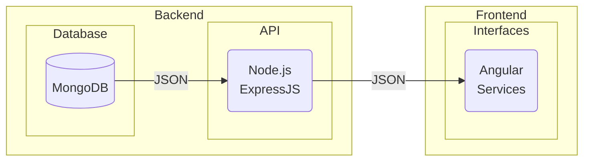
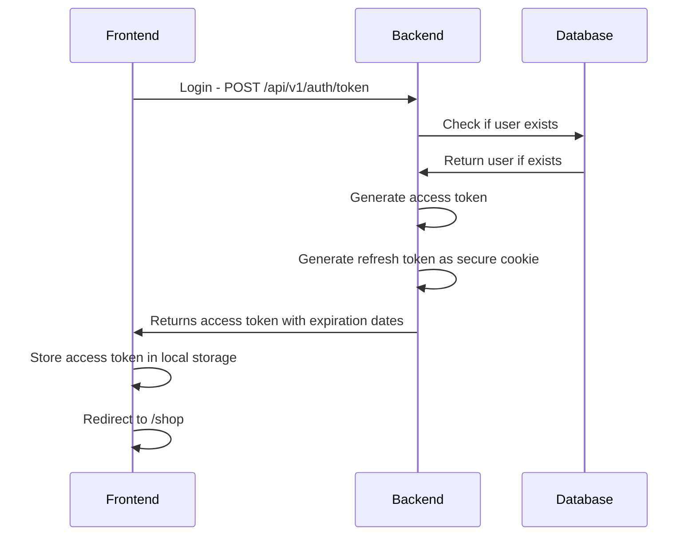
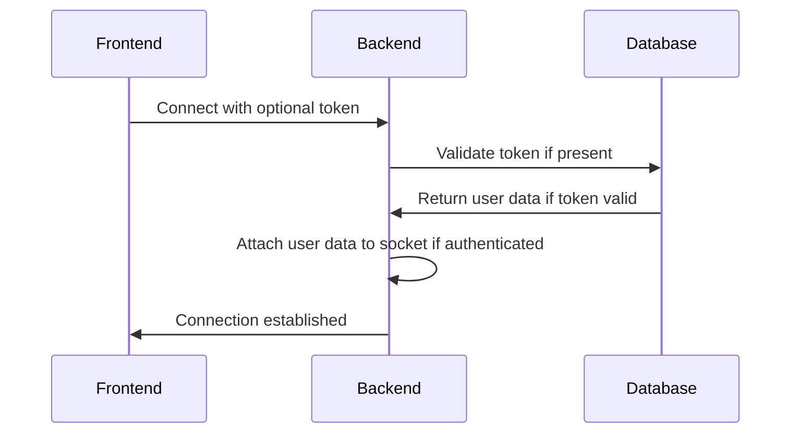
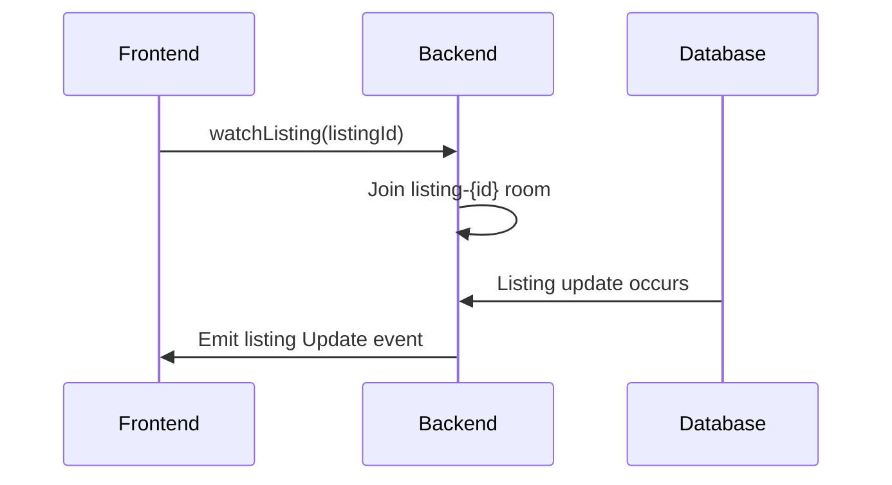
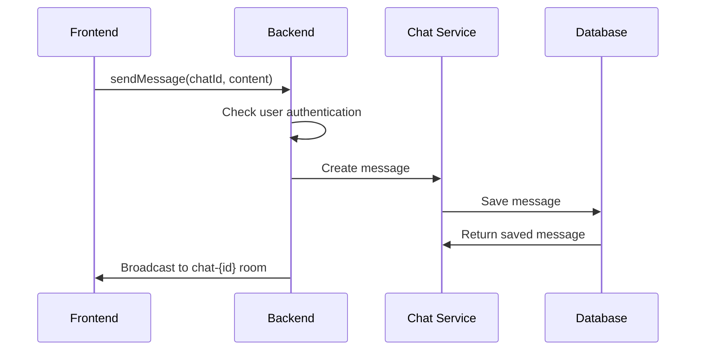
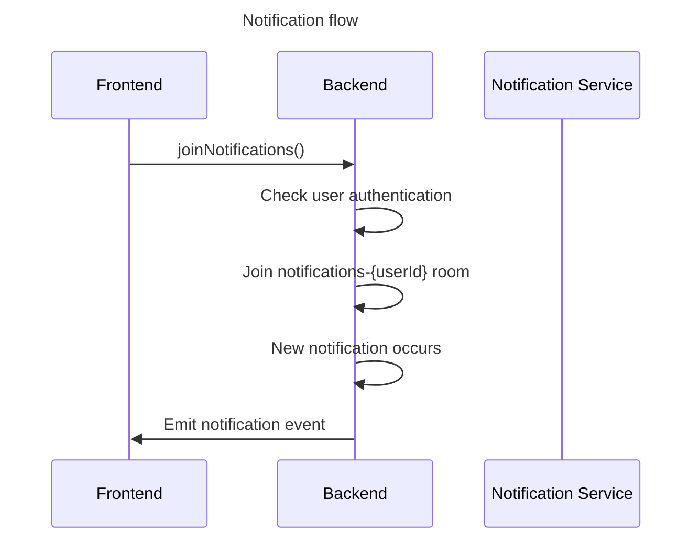
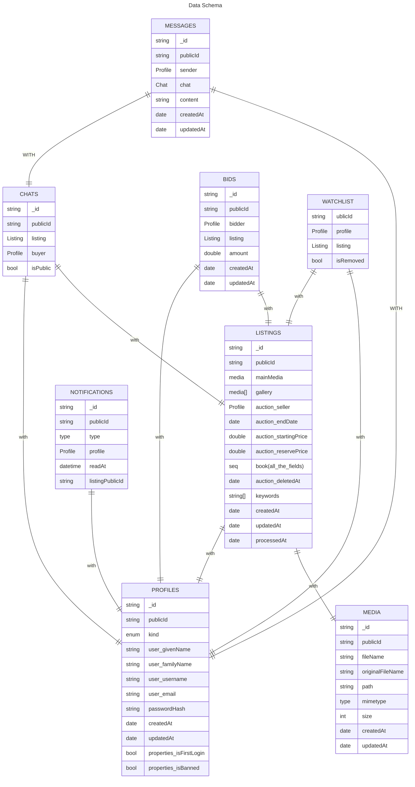

# Book Shop Report General
- **Student**:  Alberto Campagnolo
- **Student code**: 897569
- **Group**: Diego Caspi, Marco Mihai Condrache, Alberto Campagnolo
- **Email**: 897569@stud.unive.it
- **Application Deadline**: 31/02/2025
- **Project Link**: https://github.com/marcocondrache/tw-project
- **Primary Skill Achieved**:
	- Good Understanding of Angular development environment
	- How to use a component library
	- Interact with a back-end using Angular services and component

&nbsp;
&nbsp;
&nbsp;
&nbsp;
&nbsp;
&nbsp;
&nbsp;
&nbsp;

# 1. Introduction
- **Project Description**: 
	- [This project](https://github.com/marcocondrache/tw-project)🔗 implements a modern academic book auction platform using a sophisticated technology stack and following industry best practices. The system is built as a monorepo using Nx for efficient workspace management and better code organization.
- **Key Responsibilities**: 
	- Support the creation of the front-end project structure
	- Develop front-end component with logic to correctly share data with the back-end
	- Correct use of the [Taiga UI](https://taiga-ui.dev/v3/)🔗 Angular component library concurrently with Tailwindcss 


---
# 2. Project Architecture
The project has been built using **Nx** as a **monorepo** organization **tool**, providing several key advantages for development and maintenance:
- **Shared Code**: Common utilities and components can be easily reused across applications
- **Consistent Tooling**: Development experience remains uniform across the entire project
- **Atomic Changes**: Updates affecting multiple packages can be tested and deployed together
- **Simplified Dependencies**: Better management of internal dependencies between packages
## 2.1 Monorepo Structure
The project follow this pattern:
```
📁 apps/
├──📁 frontend/
├──📁 backend/
📁 libs/
├──📁 api/
├──📁 core/
├──📁 domain/
```

**Key Feature**:
- `📁 frontend/`: Angular 18 client application
- `📁 backend/`: Express JS server application
- `📁 api/:` Shared API interfaces and related types
- `📁 core/`: Common utilities and patterns
- `📁domain/`: Business logic and models

&nbsp;
&nbsp;
&nbsp;
&nbsp;
**Application WorkFlow**:

&nbsp;
&nbsp;
&nbsp;
&nbsp;
## 2.2 Libraries
The project follows a modular architecture using a library-based approach, all organized under the `libs/` directory, divided based on their purposes inside the project. All the modules are reachable inside the code using the `@shared/{folder name}` import.
### Core Library
The Core library serves as the foundation for shared utilities and patterns across the entire application. It provides essential functionality that supports the entire system’s operation like:
- `📁 json-patch/`:
	- **JSON Patch Operations** : Standardized way to describe changes to JSON documents following the `RFC 6902`

```json
[
	{ "op": "replace", "path": "/book/title", "value": "New Title" },
	{ "op": "remove", "path": "/book/oldField" }
]
```

- `📁lhs/`:
	- **Left-hand Side Operations**: module use to enable flexibility inside the API filtering structures using a standardized query parameter syntax

```javascript
// Example filters:
book.price[gt]=50
// Books with price greater than 50
book.university[eq]=Ca Foscari // Books from Ca' Foscari
auction.endDate[lt]=2024-04-01 // Auctions ending before April 1st
```

- `📁 errors/`:
	- **Error Handling**: comprehensive approach to error management across the application. The following code represents the structure adopted

&nbsp;
&nbsp;
```json
{
	"message": "string",
	"status": 401,
	"traceId": "5cbd8075-48e6-4801-bced-f8fd16f7b357"
}
```
-  `📁 pagination/`:
	- **Pagination**: pagination mechanism used the application the create an ideal approach for common use cases. The following code represents a p.o.c

```json
{
	"list": [
	...
	],
	"metadata": {
		"totalItems": 100,
		"page": 4,
		"totalPages": 10
	}
}
```

Is good to mention even the `sort` module that provides a simple way to sort the results from a paginated request using a parameter called *sort*. This parameter is a string that contains the field to sort, prefixed by the direction of the sort represented by a `+` or `-`.
### Domain Library
The Domain library serves as the cornerstone of our application’s data architecture, encapsulating all core business **models** and **schemas** while ensuring type safety throughout the entire system.  

The library is structured around two fundamental components with the goal of maintain data integrity across the application stack. The first one, housed in the`api/` directory, leverages the `zod` library to define our API schemas. These schemas act as a contract between frontend and backend services, providing **runtime type validation** while simultaneously **generating TypeScript types**. 

>⚠ This approach not only ensures type safety during development but also automatically generates OpenAPI documentation, keeping our API documentation perpetually synchronized with the actual implementation. 

The following code provide an example of schema validation:

```javascript
export const ApiAuctionCreationSchema = ApiAuctionSchema.omit({
	seller: true,
	winningBid: true,
})
	.refine(data => data.startingPrice < data.reservePrice, {
		message: "Starting price must be less than reserve price",
		path: ["startingPrice"],
	});
```

Meanwhile the `db/` directory contains our **database schemas** implemented using `typegoose` . This sophisticated **ODM** (Object Document Mapper) brings the
power of TypeScript to MongoDB operations, offering type safe database interactions.
 These models handle the basic schema structure and incorporate sophisticated features such as **middleware** hooks for pre and post **database** **operations**, index definitions, and **relationship** **mappings** between collections.
This architectural decision significantly **reduces** the **likelihood** of **runtime** **errors** while  improving the developer experience.
### API Library
This library establishes a robust contract between the frontend and backend services, ensuring type safety and consistency across the entire application, providing simultaneously a comprehensive framework for defining and managing API interactions. The corner of this system is the `Endpoint` type, which serves to ensuring that the API endpoints contain necessary information for both runtime and development time type checking.
The following code provide an example of what an `Endpoint` object looks like:

```javascript
export const getListingsEndpoint = endpoint({
	path: "/v1/listings",
	method: "get",
	lhs: ["book.university", "book.course", "auction.startingPrice"],
	paramsSchema: PaginationRequestSchema.innerType(),
	responseSchema: PaginatedResponseSchemaOf(ApiListingSchema),
	config: {
		authentication: false,
		tags: ["Listing"],
		summary: "Get all listings",
		description: "Get all listings with pagination",
	},
});
```


&nbsp;
&nbsp;
&nbsp;
&nbsp;
&nbsp;
&nbsp;
&nbsp;
&nbsp;

# 3. Deep Dive Into Backend Workflow


All generated **tokens** are **JSON Web Tokens**. They are signed with a **secret key** stored inside the environment variables.

Each token contains the following information inside its payload:
- `sub`: Public Id user's profile
- `username`: User's username
- `email`: User's username
- `type`: Set to *access* for access token, *refresh* for refresh token
- `scope`: Either *user* or *admin* indicating the user's role
- `exp`: Expiration timestamp in milliseconds


To implement the real-time experience between users, providing them with a real-time chat, we've implemented websocket connections through the `socket.io` library.
Above the diagram provide a good view of how the user is authenticated to use the websocket.

The following sequence diagrams provide the flow to update listings, messaging through the chats, update the notifications.







&nbsp;
&nbsp;
&nbsp;
&nbsp;
&nbsp;
&nbsp;
# 4. Deep Dive Into Frontend Application
The frontend application is built using **Angular 18** and follows a **feature first** architecture pattern, where the application is organized into distinct feature modules that encapsulate related functionality. The application is structured into two main sections: 
- The public shop interface 
- The administrative dashboard
Each one with its own layout and routing configuration.
## Component State Management
The **UI** is built using **Taiga UI v3** components, we choose v3 instead of v4 for better components stability and performance, enhanced with **Tailwind CSS** for styling, with the scope of create a better  and more modern look.

The **application state management** is provided by the `rxjs` library, making easy manage both state and data flow. In fact, thanks to the library, all the state are managed as `Observable / Subscription` converted to Angular `Signals` to provide an **easy to use interface**.
## Routing And Server communication
Inside the frontend root directory, all the paths of the application are managed by the `app.routes.ts` file, **which contains all the routes** organized into sections, each one with is **personal layout** and **routing configuration**.

```javascript
{
	path: "admin",
	component: AdminLayoutComponent,
	canActivate: [AdminGuard],
	title: "Admin",
	children: [
		{ 
			path: "", 
			redirectTo: "dashboard", 
			pathMatch: "full" 
		},
		{ path: "dashboard", component: DashboardComponent, title: "Dashboard - Admin" },
		{ path: "users", component: UsersComponent, title: "Users - Admin" },
		{ path: "listings", component: ListingsComponent, title: "Listings - Admin" },
		{ path: "create", component: AdminCreationComponent, title: "Create admin - Admin" },
	
	],

},
```

In order to provide an easy and adapted interface for the server communication, we’ve implemented the **ApiService** class, which is a **wrapper around the HttpClient** service. 

This service takes care of all the necessary operations defined in the endpoints declared in the
`@shared/api` library, providing an interface for the frontend components.

From a developer perspective, when integrating a new endpoint, it’s just necessary to call the **ApiService** method with the endpoint we want to use and the **body/params** **we want** to send
to the server, the **ApiService** will take care of the rest.

The following code show an example of API service
```javascript
manageUserBan(publicIds: string[], action: "ban" | "unban") {
	const body = { publicIds, action };
	return this.apiService.request(
		userBanEndpoint, 
		{ body }
	).subscribe();
}
```

## UI customization
In **Taiga UI v3**, color and text patterns **cannot be modified** using standard CSS directly, as they are predefined within the framework. This limitation led us to **override** the default variables to give the project more personality and make it more visually appealing. To achieve this, we defined custom values in a file called `styles.css`, allowing us to adapt the **UI** to better match our design vision.

The following code demonstrates this concept in practice. By making these adjustments in a structured and maintainable way, we ensure that future modifications can be implemented efficiently and without disrupting the overall design consistency.

```css
--tui-font-text: 'Geist', sans-serif !important;
--tui-font-heading: 'Geist', sans-serif !important;
/* Primary brand color (warm gold) */
--tui-primary: #E6BF48 !important;
--tui-primary-hover: #D4AF37 !important;
--tui-primary-active: #C4A136 !important;

/* Base colors - warm neutral background */
--tui-base-01: #FFFFFF !important;
--tui-base-02: #F8F7F4 !important;
--tui-base-03: #F0EDE6 !important;
--tui-base-04: #E5E1D8 !important;
--tui-base-05: #C7C2B7 !important;
--tui-base-06: #A19E96 !important;
--tui-base-07: #7C7972 !important;
--tui-base-08: #5C5952 !important;
--tui-base-09: #3E3C37 !important;
```
&nbsp;
&nbsp;
&nbsp;
&nbsp;
&nbsp;
&nbsp;
&nbsp;
&nbsp;
&nbsp;
&nbsp;

# Database Schema



&nbsp;
&nbsp;
&nbsp;
&nbsp;
&nbsp;
&nbsp;
&nbsp;
&nbsp;
# 5. Screenshot of the application

![[Pasted image 20250131185002.png]]![[Pasted image 20250131185639.png]]
![[Pasted image 20250131185859.png]]
![[Pasted image 20250131185911.png]]
![[Pasted image 20250131185734.png]]
![[Pasted image 20250131185800.png]]
![[Pasted image 20250131185831.png]]
&nbsp;
&nbsp;
&nbsp;
&nbsp;
&nbsp;
&nbsp;
&nbsp;
&nbsp;
&nbsp;
&nbsp;
# 6. API Documentation
&nbsp;
&nbsp;
&nbsp;
&nbsp;
&nbsp;
&nbsp;
&nbsp;
&nbsp;
&nbsp;
&nbsp;
&nbsp;
&nbsp;
&nbsp;
&nbsp;
&nbsp;
&nbsp;
&nbsp;
&nbsp;

# 7. Deployment
The project uses `nx` and `docker`
to manage how to **build** and **deployment** of the application.
Each part of the application has its own **Dockerfile**, providing a specialize build configuration, in particular the frontend application is built using the **nginx** **image**, while the backend application
is built using the **node:lts-alpine image**.
To build the app image through `nx` the following command will be used to build the applications and after that the docker image:
```bash 
nx run-many --target=docker-build --all
```

This command will build the applications using **esbuild** for both the **frontend** and the
**backend**, then it will build the **docker images** including the built artifacts.
In order **to improve** the **security** of the containers, a **multi stage build** is used.

&nbsp;
&nbsp;
&nbsp;
&nbsp;
&nbsp;
&nbsp;
&nbsp;
&nbsp;
# 8. Conclusions
I want to thank my two teammates for this course project, as working with them has given me the opportunity to witness the creation of a finished product, discover new tools for managing repositories across different projects, increase my knowledge about containers, learn new Git functionalities, understand models and concepts useful for maintaining and making code reusable, and expand my horizons toward some of the most widely used frameworks in today's tech industry.